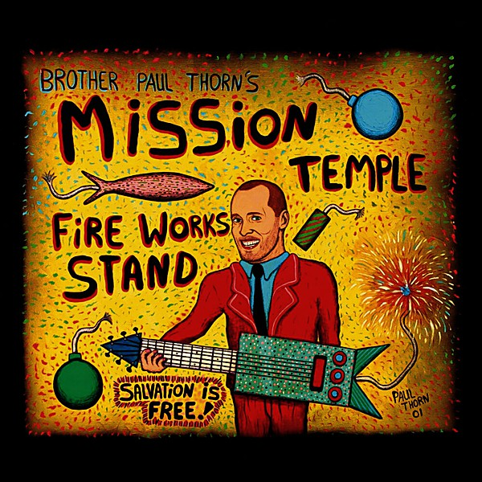

# Mission Temple Fireworks Stand

By **Paul Thorn**

## Album Data

- **Catalog:** Beets
- **Format:** Digital, Album
- **Album:** Mission Temple Fireworks Stand
- **Artist:** Paul Thorn
- **Albumartist:** Paul Thorn
- **Genre:** Blue-Eyed Soul
- **MusicBrainz Album Artist ID:** [f560cffe-c225-4b91-8511-403219819200](https://musicbrainz.org/artist/f560cffe-c225-4b91-8511-403219819200)
- **MusicBrainz Album ID:** [16c74879-919b-4a09-ac77-b891bff1da67](https://musicbrainz.org/release/16c74879-919b-4a09-ac77-b891bff1da67)
- **MusicBrainz Release Group ID:** [b99f6325-5df6-4eb7-9876-f3433452ab47](https://musicbrainz.org/release-group/b99f6325-5df6-4eb7-9876-f3433452ab47)
- **Year:** 2002
- **Catalog #:** POR20059
- **Label:** Thirty Tigers
- **Total Tracks:** 16

## Album Tracks

### Track 01 - Heart With 4 Wheel Drive

- **Artist:** Paul Thorn
- **Format:** ALAC
- **Genre:** Blue-Eyed Soul
- **Length:** 4:04
- **MusicBrainz Track ID:** [dfa89853-505b-432a-87cb-8d55768f1b3d](https://musicbrainz.org/recording/dfa89853-505b-432a-87cb-8d55768f1b3d)
- **Title:** Heart With 4 Wheel Drive
- **Track:** 01
- **Year:** 2006

### Track 02 - Lover's Vacation

- **Artist:** Paul Thorn
- **Format:** ALAC
- **Genre:** Blue-Eyed Soul
- **Length:** 3:47
- **MusicBrainz Track ID:** [5c313efc-68c2-4348-95be-ccbf48047505](https://musicbrainz.org/recording/5c313efc-68c2-4348-95be-ccbf48047505)
- **Title:** Lover's Vacation
- **Track:** 02
- **Year:** 2006

### Track 03 - Burn Down The Trailer Park

- **Artist:** Paul Thorn
- **Format:** ALAC
- **Genre:** Blues
- **Length:** 3:12
- **MusicBrainz Track ID:** [3272d253-d44a-4ed9-bae4-c75db001ad30](https://musicbrainz.org/recording/3272d253-d44a-4ed9-bae4-c75db001ad30)
- **Title:** Burn Down The Trailer Park
- **Track:** 03
- **Year:** 2006

### Track 04 - Every Little Bit Hurts

- **Artist:** Paul Thorn
- **Format:** ALAC
- **Genre:** Rock
- **Length:** 5:01
- **MusicBrainz Track ID:** [f466e53c-13a1-49f7-8328-ac187b8cbd53](https://musicbrainz.org/recording/f466e53c-13a1-49f7-8328-ac187b8cbd53)
- **Title:** Every Little Bit Hurts
- **Track:** 04
- **Year:** 2006

### Track 05 - That's All I Know Right Now

- **Artist:** Paul Thorn
- **Format:** ALAC
- **Genre:** Blue-Eyed Soul
- **Length:** 3:13
- **MusicBrainz Track ID:** [a1d7ac44-5629-4503-8062-c2e1a18b0c34](https://musicbrainz.org/recording/a1d7ac44-5629-4503-8062-c2e1a18b0c34)
- **Title:** That's All I Know Right Now
- **Track:** 05
- **Year:** 2006

### Track 06 - Mood Ring

- **Artist:** Paul Thorn
- **Format:** ALAC
- **Genre:** Blue-Eyed Soul
- **Length:** 5:15
- **MusicBrainz Track ID:** [968fa320-185b-4a13-859a-eb1c501a95aa](https://musicbrainz.org/recording/968fa320-185b-4a13-859a-eb1c501a95aa)
- **Title:** Mood Ring
- **Track:** 06
- **Year:** 2006

### Track 07 - That's A Lie

- **Artist:** Paul Thorn
- **Format:** ALAC
- **Genre:** Blue-Eyed Soul
- **Length:** 4:53
- **MusicBrainz Track ID:** [abcfcf44-374b-4eee-ac38-4f7131c5b6fe](https://musicbrainz.org/recording/abcfcf44-374b-4eee-ac38-4f7131c5b6fe)
- **Title:** That's A Lie
- **Track:** 07
- **Year:** 2006

### Track 08 - A Lot Of Good Reasons

- **Artist:** Paul Thorn
- **Format:** ALAC
- **Genre:** Blue-Eyed Soul
- **Length:** 4:11
- **MusicBrainz Track ID:** [053e02ae-a87e-40da-acbf-b58f7db96755](https://musicbrainz.org/recording/053e02ae-a87e-40da-acbf-b58f7db96755)
- **Title:** A Lot Of Good Reasons
- **Track:** 08
- **Year:** 2006

### Track 09 - I Have A Good Day

- **Artist:** Paul Thorn
- **Format:** ALAC
- **Genre:** Blue-Eyed Soul
- **Length:** 5:25
- **MusicBrainz Track ID:** [c3769d66-e12f-494d-ae6d-b4c1c6dea2ae](https://musicbrainz.org/recording/c3769d66-e12f-494d-ae6d-b4c1c6dea2ae)
- **Title:** I Have A Good Day
- **Track:** 09
- **Year:** 2006

### Track 10 - I'd Rather Be A Hammer Than A Nail

- **Artist:** Paul Thorn
- **Format:** ALAC
- **Genre:** Rock
- **Length:** 3:10
- **MusicBrainz Track ID:** [04d3e90e-f2c0-453e-994e-8eea8547e4c2](https://musicbrainz.org/recording/04d3e90e-f2c0-453e-994e-8eea8547e4c2)
- **Title:** I'd Rather Be A Hammer Than A Nail
- **Track:** 10
- **Year:** 2006

### Track 11 - Rise Up

- **Artist:** Paul Thorn
- **Format:** ALAC
- **Genre:** Alternative Country
- **Length:** 4:13
- **MusicBrainz Track ID:** [e7c9dfe8-95f3-4fcc-b3c4-67338d557d64](https://musicbrainz.org/recording/e7c9dfe8-95f3-4fcc-b3c4-67338d557d64)
- **Title:** Rise Up
- **Track:** 11
- **Year:** 2006

### Track 12 - High

- **Artist:** Paul Thorn
- **Format:** ALAC
- **Genre:** Blue-Eyed Soul
- **Length:** 4:01
- **MusicBrainz Track ID:** [72361ea6-eb7b-441f-9636-f84908777589](https://musicbrainz.org/recording/72361ea6-eb7b-441f-9636-f84908777589)
- **Title:** High
- **Track:** 12
- **Year:** 2006

### Track 13 - Ain't Love Strange

- **Artist:** Paul Thorn
- **Format:** ALAC
- **Genre:** Country Rock
- **Length:** 5:39
- **MusicBrainz Track ID:** [05513c02-cf00-400a-8ee1-e7228a5c94c5](https://musicbrainz.org/recording/05513c02-cf00-400a-8ee1-e7228a5c94c5)
- **Title:** Ain't Love Strange
- **Track:** 13
- **Year:** 2006

### Track 14 - Mission Temple Fireworks Stand

- **Artist:** Paul Thorn
- **Format:** ALAC
- **Genre:** Blues
- **Length:** 4:31
- **MusicBrainz Track ID:** [8af81d56-5e6c-459d-93ba-fa27cd00b069](https://musicbrainz.org/recording/8af81d56-5e6c-459d-93ba-fa27cd00b069)
- **Title:** Mission Temple Fireworks Stand
- **Track:** 14
- **Year:** 2006

### Track 15 - Something Out There

- **Artist:** Paul Thorn
- **Format:** ALAC
- **Genre:** Blue-Eyed Soul
- **Length:** 3:20
- **MusicBrainz Track ID:** [d3c6f272-b0a0-46d7-b2c6-655d540b7c31](https://musicbrainz.org/recording/d3c6f272-b0a0-46d7-b2c6-655d540b7c31)
- **Title:** Something Out There
- **Track:** 15
- **Year:** 2006

### Track 16 - Will The Circle Be Unbroken

- **Artist:** Paul Thorn
- **Format:** ALAC
- **Genre:** Texas Blues
- **Length:** 6:41
- **MusicBrainz Track ID:** [58b720ba-03f7-42ba-bcd7-ca4675ae31c0](https://musicbrainz.org/recording/58b720ba-03f7-42ba-bcd7-ca4675ae31c0)
- **Title:** Will The Circle Be Unbroken
- **Track:** 16
- **Year:** 2006

## See also

- [Ain't Love Strange](Aint_Love_Strange.md)
- [A Long Way From Tupelo](A_Long_Way_From_Tupelo_2.md)
- [A Long Way From Tupelo](A_Long_Way_From_Tupelo.md)
- [Are You With Me](Are_You_With_Me.md)
- [Hammer and Nail](Hammer_and_Nail.md)
- [Paul Thorn - Live](Paul_Thorn_-_Live.md)
- [So Far So Good Live](So_Far_So_Good_Live.md)
- [Too Blessed to Be Stressed](Too_Blessed_to_Be_Stressed.md)
- [Roon: Aint Love Strange](../../Roon/Paul_Thorn/Aint_Love_Strange.md)
- [Roon: Hammer & Nail Live (Live)](../../Roon/Paul_Thorn/Hammer_and_Nail_Live_Live.md)
- [Roon: Hammer & Nail](../../Roon/Paul_Thorn/Hammer_and_Nail.md)
- [Roon: Mission Temple Fireworks Stand](../../Roon/Paul_Thorn/Mission_Temple_Fireworks_Stand.md)
- [Roon: Pimps & Preachers](../../Roon/Paul_Thorn/Pimps_and_Preachers.md)
- [Roon: So Far so Good](../../Roon/Paul_Thorn/So_Far_so_Good-_The_Best_of_Paul_Thorn_Band_Live.md)
- [Vinyl: ](../../Vinyl/Paul_Thorn/Paul_Thorn.md)
- [Vinyl: Too Blessed To Be Stressed](../../Vinyl/Paul_Thorn/Too_Blessed_To_Be_Stressed.md)
