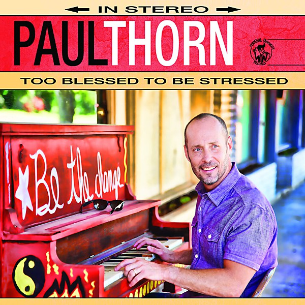

# Too Blessed to Be Stressed

By **Paul Thorn**

## Album Data

- **Catalog:** Beets
- **Format:** Digital, Album
- **Album:** Too Blessed to Be Stressed
- **Artist:** Paul Thorn
- **Albumartist:** Paul Thorn
- **Genre:** Blue-Eyed Soul
- **MusicBrainz Album Artist ID:** [f560cffe-c225-4b91-8511-403219819200](https://musicbrainz.org/artist/f560cffe-c225-4b91-8511-403219819200)
- **MusicBrainz Album ID:** [b274f6d5-4f63-4188-9a1f-12d43f1cbfeb](https://musicbrainz.org/release/b274f6d5-4f63-4188-9a1f-12d43f1cbfeb)
- **MusicBrainz Release Group ID:** [0499debf-c337-4b47-993d-32ec7f6f98c1](https://musicbrainz.org/release-group/0499debf-c337-4b47-993d-32ec7f6f98c1)
- **Year:** 2014
- **Catalog #:** 
- **Label:** Perpetual Obscurity Records
- **Total Tracks:** 11

## Album Tracks

### Track 01 - Everything's Gonna Be Alright

- **Artist:** Paul Thorn
- **Format:** MP3
- **Genre:** Blue-Eyed Soul
- **Length:** 4:44
- **MusicBrainz Track ID:** [03ff4fc3-edfe-42a8-8a99-cfcb410146b6](https://musicbrainz.org/recording/03ff4fc3-edfe-42a8-8a99-cfcb410146b6)
- **Title:** Everything's Gonna Be Alright
- **Track:** 01
- **Year:** 2014

### Track 02 - Too Blessed to Be Stressed

- **Artist:** Paul Thorn
- **Format:** MP3
- **Genre:** Blue-Eyed Soul
- **Length:** 3:53
- **MusicBrainz Track ID:** [617a6447-c2e5-4996-b7d5-cd966d701751](https://musicbrainz.org/recording/617a6447-c2e5-4996-b7d5-cd966d701751)
- **Title:** Too Blessed to Be Stressed
- **Track:** 02
- **Year:** 2014

### Track 03 - Everybody Needs Somebody

- **Artist:** Paul Thorn
- **Format:** MP3
- **Genre:** Blue-Eyed Soul
- **Length:** 4:29
- **MusicBrainz Track ID:** [f8f42757-ac84-4094-a025-e3c3dc2ab021](https://musicbrainz.org/recording/f8f42757-ac84-4094-a025-e3c3dc2ab021)
- **Title:** Everybody Needs Somebody
- **Track:** 03
- **Year:** 2014

### Track 04 - I Backslide On Friday

- **Artist:** Paul Thorn
- **Format:** MP3
- **Genre:** Blue-Eyed Soul
- **Length:** 3:34
- **MusicBrainz Track ID:** [6f35fa35-15fb-4d6e-b2d5-90b85d2d95e6](https://musicbrainz.org/recording/6f35fa35-15fb-4d6e-b2d5-90b85d2d95e6)
- **Title:** I Backslide On Friday
- **Track:** 04
- **Year:** 2014

### Track 05 - This Is a Real Goodbye

- **Artist:** Paul Thorn
- **Format:** MP3
- **Genre:** Blues
- **Length:** 3:46
- **MusicBrainz Track ID:** [9a0257e1-5549-45ae-9e5d-6543a08271ca](https://musicbrainz.org/recording/9a0257e1-5549-45ae-9e5d-6543a08271ca)
- **Title:** This Is a Real Goodbye
- **Track:** 05
- **Year:** 2014

### Track 06 - Mediocrity Is King

- **Artist:** Paul Thorn
- **Format:** MP3
- **Genre:** Blue-Eyed Soul
- **Length:** 3:34
- **MusicBrainz Track ID:** [62b0b8d8-e184-4da2-a6b0-93e0a2e20e11](https://musicbrainz.org/recording/62b0b8d8-e184-4da2-a6b0-93e0a2e20e11)
- **Title:** Mediocrity Is King
- **Track:** 06
- **Year:** 2014

### Track 07 - Don't Let Nobody Rob You of Your Joy

- **Artist:** Paul Thorn
- **Format:** MP3
- **Genre:** Blue-Eyed Soul
- **Length:** 4:22
- **MusicBrainz Track ID:** [4ecdf5e7-a2ec-459b-80d3-3ddf2211b70b](https://musicbrainz.org/recording/4ecdf5e7-a2ec-459b-80d3-3ddf2211b70b)
- **Title:** Don't Let Nobody Rob You of Your Joy
- **Track:** 07
- **Year:** 2014

### Track 08 - Get You a Healin'

- **Artist:** Paul Thorn
- **Format:** MP3
- **Genre:** Blue-Eyed Soul
- **Length:** 3:29
- **MusicBrainz Track ID:** [91519458-6d06-4922-9434-f3719aac48c5](https://musicbrainz.org/recording/91519458-6d06-4922-9434-f3719aac48c5)
- **Title:** Get You a Healin'
- **Track:** 08
- **Year:** 2014

### Track 09 - Old Stray Dogs & Jesus

- **Artist:** Paul Thorn
- **Format:** MP3
- **Genre:** Blues
- **Length:** 4:43
- **MusicBrainz Track ID:** [edb88e2a-c302-4657-859f-ad0dac0076ac](https://musicbrainz.org/recording/edb88e2a-c302-4657-859f-ad0dac0076ac)
- **Title:** Old Stray Dogs & Jesus
- **Track:** 09
- **Year:** 2014

### Track 10 - What Kind of Roof Do You Live Under

- **Artist:** Paul Thorn
- **Format:** MP3
- **Genre:** Blue-Eyed Soul
- **Length:** 3:02
- **MusicBrainz Track ID:** [c891c81e-308e-492a-b22e-7ccaa16d3d9d](https://musicbrainz.org/recording/c891c81e-308e-492a-b22e-7ccaa16d3d9d)
- **Title:** What Kind of Roof Do You Live Under
- **Track:** 10
- **Year:** 2014

### Track 11 - No Place I'd Rather Be

- **Artist:** Paul Thorn
- **Format:** MP3
- **Genre:** Blue-Eyed Soul
- **Length:** 3:34
- **MusicBrainz Track ID:** [34d1655e-74cd-4a27-ab0b-983bae6941d9](https://musicbrainz.org/recording/34d1655e-74cd-4a27-ab0b-983bae6941d9)
- **Title:** No Place I'd Rather Be
- **Track:** 11
- **Year:** 2014

## See also

- [Ain't Love Strange](Aint_Love_Strange.md)
- [A Long Way From Tupelo](A_Long_Way_From_Tupelo_2.md)
- [A Long Way From Tupelo](A_Long_Way_From_Tupelo.md)
- [Are You With Me](Are_You_With_Me.md)
- [Hammer and Nail](Hammer_and_Nail.md)
- [Mission Temple Fireworks Stand](Mission_Temple_Fireworks_Stand.md)
- [Paul Thorn - Live](Paul_Thorn_-_Live.md)
- [So Far So Good Live](So_Far_So_Good_Live.md)
- [Roon: Aint Love Strange](../../Roon/Paul_Thorn/Aint_Love_Strange.md)
- [Roon: Hammer & Nail Live (Live)](../../Roon/Paul_Thorn/Hammer_and_Nail_Live_Live.md)
- [Roon: Hammer & Nail](../../Roon/Paul_Thorn/Hammer_and_Nail.md)
- [Roon: Mission Temple Fireworks Stand](../../Roon/Paul_Thorn/Mission_Temple_Fireworks_Stand.md)
- [Roon: Pimps & Preachers](../../Roon/Paul_Thorn/Pimps_and_Preachers.md)
- [Roon: So Far so Good](../../Roon/Paul_Thorn/So_Far_so_Good-_The_Best_of_Paul_Thorn_Band_Live.md)
- [Vinyl: ](../../Vinyl/Paul_Thorn/Paul_Thorn.md)
- [Vinyl: Too Blessed To Be Stressed](../../Vinyl/Paul_Thorn/Too_Blessed_To_Be_Stressed.md)
