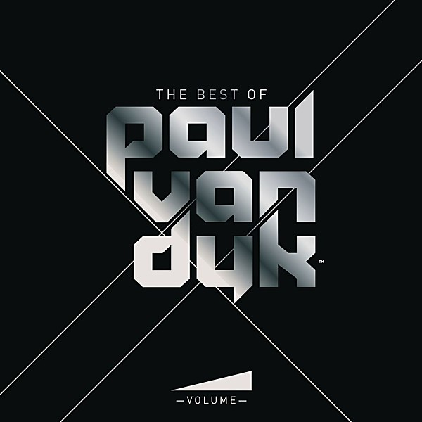

# Volume

By **Paul Van Dyk**

## Album Data

- **Catalog:** Beets
- **Format:** Digital, Album
- **Album:** Volume
- **Artist:** Paul Van Dyk
- **Albumartist:** Paul Van Dyk
- **Genre:** Trance
- **MusicBrainz Album Artist ID:** 
- **MusicBrainz Album ID:** 
- **MusicBrainz Release Group ID:** 
- **Year:** 2009
- **Catalog #:** 
- **Label:** 
- **Total Tracks:** 24

## Album Tracks

### Track 02 - Home (PvD Club Mix)

- **Artist:** Paul van Dyk feat. Johnny McDaid
- **Format:** MP3
- **Genre:** Uplifting Trance
- **Length:** 6:00
- **MusicBrainz Track ID:** 
- **Title:** Home (PvD Club Mix)
- **Track:** 02
- **Year:** 2009

