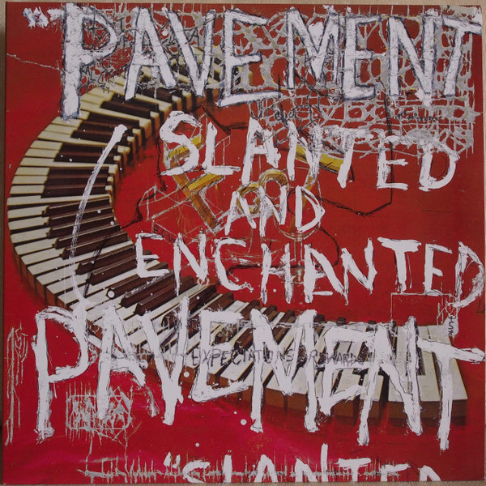

# Slanted & Enchanted

By **Pavement**

## Album Data

- **Catalog:** Beets
- **Format:** Digital, Album
- **Album:** Slanted & Enchanted
- **Artist:** Pavement
- **Albumartist:** Pavement
- **Genre:** Noise Rock
- **MusicBrainz Album Artist ID:** 
- **MusicBrainz Album ID:** 
- **MusicBrainz Release Group ID:** 
- **Year:** 0000
- **Catalog #:** 
- **Label:** 
- **Total Tracks:** 00

## Album Tracks

### Track 01 - Summer Babe (Winter Version)

- **Artist:** Pavement
- **Format:** AAC
- **Genre:** Indie Rock
- **Length:** 3:18
- **MusicBrainz Track ID:** 
- **Title:** Summer Babe (Winter Version)
- **Track:** 01
- **Year:** 0000

## See also

- [Roon: Crooked Rain, Crooked Rain](../../Roon/Pavement/Crooked_Rain__Crooked_Rain-_LAs_Desert_Origins.md)
- [Roon: Slanted & Enchanted](../../Roon/Pavement/Slanted_and_Enchanted-_Luxe_and_Reduxe.md)
- [Roon: Wowee Zowee (Sordid Sentinels Edition)](../../Roon/Pavement/Wowee_Zowee_Sordid_Sentinels_Edition.md)
