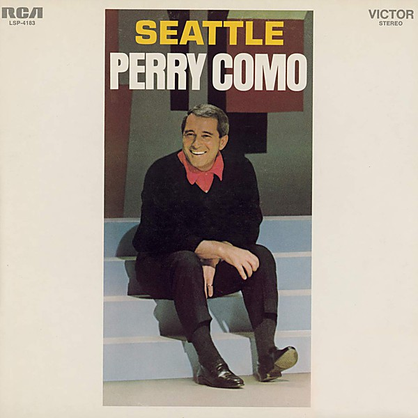

# Unknown Album

By **Perry Como**

## Album Data

- **Catalog:** Beets
- **Format:** Digital, Album
- **Album:** Unknown Album
- **Artist:** Perry Como
- **Albumartist:** Perry Como
- **Genre:** Swing
- **MusicBrainz Album Artist ID:** 
- **MusicBrainz Album ID:** 
- **MusicBrainz Release Group ID:** 
- **Year:** 1958
- **Catalog #:** 
- **Label:** 
- **Total Tracks:** 00

## Album Tracks

### Track 00 - Catch a Falling Star

- **Artist:** Perry Como
- **Format:** MP3
- **Genre:** Swing
- **Length:** 2:30
- **MusicBrainz Track ID:** 
- **Title:** Catch a Falling Star
- **Track:** 00
- **Year:** 1958

### Track 00 - Wanted

- **Artist:** Perry Como
- **Format:** AAC
- **Genre:** Pop
- **Length:** 3:04
- **MusicBrainz Track ID:** 
- **Title:** Wanted
- **Track:** 00
- **Year:** 0000

### Track 00 - If I Loved You

- **Artist:** Perry Como
- **Format:** AAC
- **Genre:** Swing
- **Length:** 3:18
- **MusicBrainz Track ID:** 
- **Title:** If I Loved You
- **Track:** 00
- **Year:** 0000

## See also

- [Vinyl: I'll Be Home For Christmas / That Christmas Feeling](../../Vinyl/Perry_Como/Ill_Be_Home_For_Christmas_-_That_Christmas_Feeling.md)
- [Vinyl: ](../../Vinyl/Perry_Como/Perry_Como.md)
