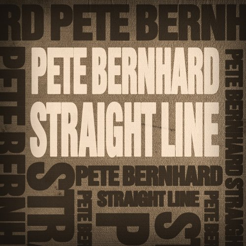

# Straight Line

By **Pete Bernhard**

## Album Data

- **Catalog:** Beets
- **Format:** Digital, Album
- **Album:** Straight Line
- **Artist:** Pete Bernhard
- **Albumartist:** Pete Bernhard
- **Genre:** Americana
- **MusicBrainz Album Artist ID:** [e97de6e4-e67c-4518-a3c6-7d1ab2239a8a](https://musicbrainz.org/artist/e97de6e4-e67c-4518-a3c6-7d1ab2239a8a)
- **MusicBrainz Album ID:** [9de49d26-260b-443d-8c1b-735fc60bfec4](https://musicbrainz.org/release/9de49d26-260b-443d-8c1b-735fc60bfec4)
- **MusicBrainz Release Group ID:** [341e0947-77b9-4d92-8174-60cfea330e5f](https://musicbrainz.org/release-group/341e0947-77b9-4d92-8174-60cfea330e5f)
- **Year:** 2009
- **Catalog #:** 
- **Label:** 
- **Total Tracks:** 08

## Album Tracks

### Track 01 - Ashville Blues

- **Artist:** Pete Bernhard
- **Format:** AAC
- **Genre:** Americana
- **Length:** 3:17
- **MusicBrainz Track ID:** [d7456df7-42b9-482e-8348-57f5c2d7b248](https://musicbrainz.org/recording/d7456df7-42b9-482e-8348-57f5c2d7b248)
- **Title:** Ashville Blues
- **Track:** 01
- **Year:** 2006

### Track 02 - Streetlight

- **Artist:** Pete Bernhard
- **Format:** AAC
- **Genre:** Americana
- **Length:** 4:00
- **MusicBrainz Track ID:** [a3db517a-d93b-45fe-81ea-65b62e402419](https://musicbrainz.org/recording/a3db517a-d93b-45fe-81ea-65b62e402419)
- **Title:** Streetlight
- **Track:** 02
- **Year:** 2006

### Track 03 - Snowin

- **Artist:** Pete Bernhard
- **Format:** AAC
- **Genre:** Americana
- **Length:** 3:17
- **MusicBrainz Track ID:** [ccf983f2-8454-4dbb-8625-c03d9982dbc9](https://musicbrainz.org/recording/ccf983f2-8454-4dbb-8625-c03d9982dbc9)
- **Title:** Snowin
- **Track:** 03
- **Year:** 2006

### Track 04 - Heaven

- **Artist:** Pete Bernhard
- **Format:** AAC
- **Genre:** Americana
- **Length:** 4:20
- **MusicBrainz Track ID:** [0889bada-3f48-43c3-b177-5320984e6730](https://musicbrainz.org/recording/0889bada-3f48-43c3-b177-5320984e6730)
- **Title:** Heaven
- **Track:** 04
- **Year:** 2006

### Track 05 - Straight Line

- **Artist:** Pete Bernhard
- **Format:** AAC
- **Genre:** Americana
- **Length:** 5:20
- **MusicBrainz Track ID:** [fc399ea9-cb18-43ad-bf7e-5d37e5aa5b53](https://musicbrainz.org/recording/fc399ea9-cb18-43ad-bf7e-5d37e5aa5b53)
- **Title:** Straight Line
- **Track:** 05
- **Year:** 2006

### Track 06 - Fix It Up

- **Artist:** Pete Bernhard
- **Format:** AAC
- **Genre:** Americana
- **Length:** 3:12
- **MusicBrainz Track ID:** [992b40fa-aa9b-4864-924e-909ecc9e1861](https://musicbrainz.org/recording/992b40fa-aa9b-4864-924e-909ecc9e1861)
- **Title:** Fix It Up
- **Track:** 06
- **Year:** 2006

### Track 07 - Left Behind

- **Artist:** Pete Bernhard
- **Format:** AAC
- **Genre:** Americana
- **Length:** 4:00
- **MusicBrainz Track ID:** [2d488192-3fab-44e3-9a24-96beb5a372df](https://musicbrainz.org/recording/2d488192-3fab-44e3-9a24-96beb5a372df)
- **Title:** Left Behind
- **Track:** 07
- **Year:** 2006

### Track 08 - Carpenter

- **Artist:** Pete Bernhard
- **Format:** AAC
- **Genre:** Americana
- **Length:** 3:19
- **MusicBrainz Track ID:** [c8eee43d-89d1-4992-ad90-e3de24405e84](https://musicbrainz.org/recording/c8eee43d-89d1-4992-ad90-e3de24405e84)
- **Title:** Carpenter
- **Track:** 08
- **Year:** 2006

## See also

- [Things I Left Behind](Things_I_Left_Behind.md)
- [Roon: Things I Left Behind](../../Roon/Pete_Bernhard/Things_I_Left_Behind.md)
