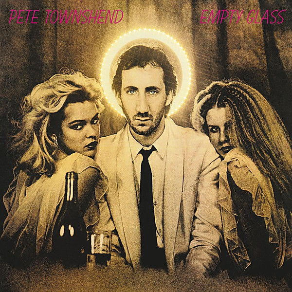

# Empty Glass

By **Pete Townshend**

## Album Data

- **Catalog:** Beets
- **Format:** Digital, Album
- **Album:** Empty Glass
- **Artist:** Pete Townshend
- **Albumartist:** Pete Townshend
- **Genre:** Progressive Rock
- **MusicBrainz Album Artist ID:** [fb147b8f-0144-4418-acaa-90b2d9779840](https://musicbrainz.org/artist/fb147b8f-0144-4418-acaa-90b2d9779840)
- **MusicBrainz Album ID:** [0ba9a0a1-05b1-3705-8c20-fc83721341aa](https://musicbrainz.org/release/0ba9a0a1-05b1-3705-8c20-fc83721341aa)
- **MusicBrainz Release Group ID:** [1e99465c-4099-3800-b07e-35062392d39c](https://musicbrainz.org/release-group/1e99465c-4099-3800-b07e-35062392d39c)
- **Year:** 1980
- **Catalog #:** SD 32-100
- **Label:** ATCO Records
- **Total Tracks:** 10

## Album Tracks

### Track 01 - Rough Boys

- **Artist:** Pete Townshend
- **Format:** MP3
- **Genre:** Hard Rock
- **Length:** 4:02
- **MusicBrainz Track ID:** [809da677-7984-4a20-a78f-7524115535d4](https://musicbrainz.org/recording/809da677-7984-4a20-a78f-7524115535d4)
- **Title:** Rough Boys
- **Track:** 01
- **Year:** 1980

### Track 02 - I Am an Animal

- **Artist:** Pete Townshend
- **Format:** MP3
- **Genre:** Psychedelic Rock
- **Length:** 3:49
- **MusicBrainz Track ID:** [2b1d4925-a23d-4c5d-9e43-b4e2a8f682a9](https://musicbrainz.org/recording/2b1d4925-a23d-4c5d-9e43-b4e2a8f682a9)
- **Title:** I Am an Animal
- **Track:** 02
- **Year:** 1980

### Track 03 - And I Moved

- **Artist:** Pete Townshend
- **Format:** MP3
- **Genre:** Psychedelic Rock
- **Length:** 3:23
- **MusicBrainz Track ID:** [5da59b2f-d50d-46a8-8c2e-48d6ef32d9ad](https://musicbrainz.org/recording/5da59b2f-d50d-46a8-8c2e-48d6ef32d9ad)
- **Title:** And I Moved
- **Track:** 03
- **Year:** 1980

### Track 04 - Let My Love Open the Door

- **Artist:** Pete Townshend
- **Format:** MP3
- **Genre:** Rock
- **Length:** 2:45
- **MusicBrainz Track ID:** [580d0f33-90e3-422a-a254-f0c821b7c50d](https://musicbrainz.org/recording/580d0f33-90e3-422a-a254-f0c821b7c50d)
- **Title:** Let My Love Open the Door
- **Track:** 04
- **Year:** 1980

### Track 05 - Jools and Jim

- **Artist:** Pete Townshend
- **Format:** MP3
- **Genre:** Psychedelic Rock
- **Length:** 2:35
- **MusicBrainz Track ID:** [805fa3c7-582e-47dc-9c56-427253c98372](https://musicbrainz.org/recording/805fa3c7-582e-47dc-9c56-427253c98372)
- **Title:** Jools and Jim
- **Track:** 05
- **Year:** 1980

### Track 06 - Keep On Working

- **Artist:** Pete Townshend
- **Format:** MP3
- **Genre:** Psychedelic Rock
- **Length:** 3:24
- **MusicBrainz Track ID:** [c28d0945-48ee-4585-9e04-070bb7f0b834](https://musicbrainz.org/recording/c28d0945-48ee-4585-9e04-070bb7f0b834)
- **Title:** Keep On Working
- **Track:** 06
- **Year:** 1980

### Track 07 - Cat’s in the Cupboard

- **Artist:** Pete Townshend
- **Format:** MP3
- **Genre:** Progressive Rock
- **Length:** 3:34
- **MusicBrainz Track ID:** [d91ad391-3076-42fd-a301-7902b2963a8d](https://musicbrainz.org/recording/d91ad391-3076-42fd-a301-7902b2963a8d)
- **Title:** Cat’s in the Cupboard
- **Track:** 07
- **Year:** 1980

### Track 08 - A Little Is Enough

- **Artist:** Pete Townshend
- **Format:** MP3
- **Genre:** Psychedelic Rock
- **Length:** 4:43
- **MusicBrainz Track ID:** [a1315ebd-2d6e-4ae7-b5aa-ccc52b0b4843](https://musicbrainz.org/recording/a1315ebd-2d6e-4ae7-b5aa-ccc52b0b4843)
- **Title:** A Little Is Enough
- **Track:** 08
- **Year:** 1980

### Track 09 - Empty Glass

- **Artist:** Pete Townshend
- **Format:** MP3
- **Genre:** Psychedelic Rock
- **Length:** 5:24
- **MusicBrainz Track ID:** [d63c8ea2-09c3-4d2f-9610-6ffaeebc39bd](https://musicbrainz.org/recording/d63c8ea2-09c3-4d2f-9610-6ffaeebc39bd)
- **Title:** Empty Glass
- **Track:** 09
- **Year:** 1980

### Track 10 - Gonna Get Ya

- **Artist:** Pete Townshend
- **Format:** MP3
- **Genre:** Psychedelic Rock
- **Length:** 6:23
- **MusicBrainz Track ID:** [d2ace62b-dfb0-477c-b473-8fc435e7bb8f](https://musicbrainz.org/recording/d2ace62b-dfb0-477c-b473-8fc435e7bb8f)
- **Title:** Gonna Get Ya
- **Track:** 10
- **Year:** 1980

## See also

- [Vinyl: Empty Glass](../../Vinyl/Pete_Townshend/Empty_Glass.md)
- [Vinyl: ](../../Vinyl/Pete_Townshend/Pete_Townshend.md)
