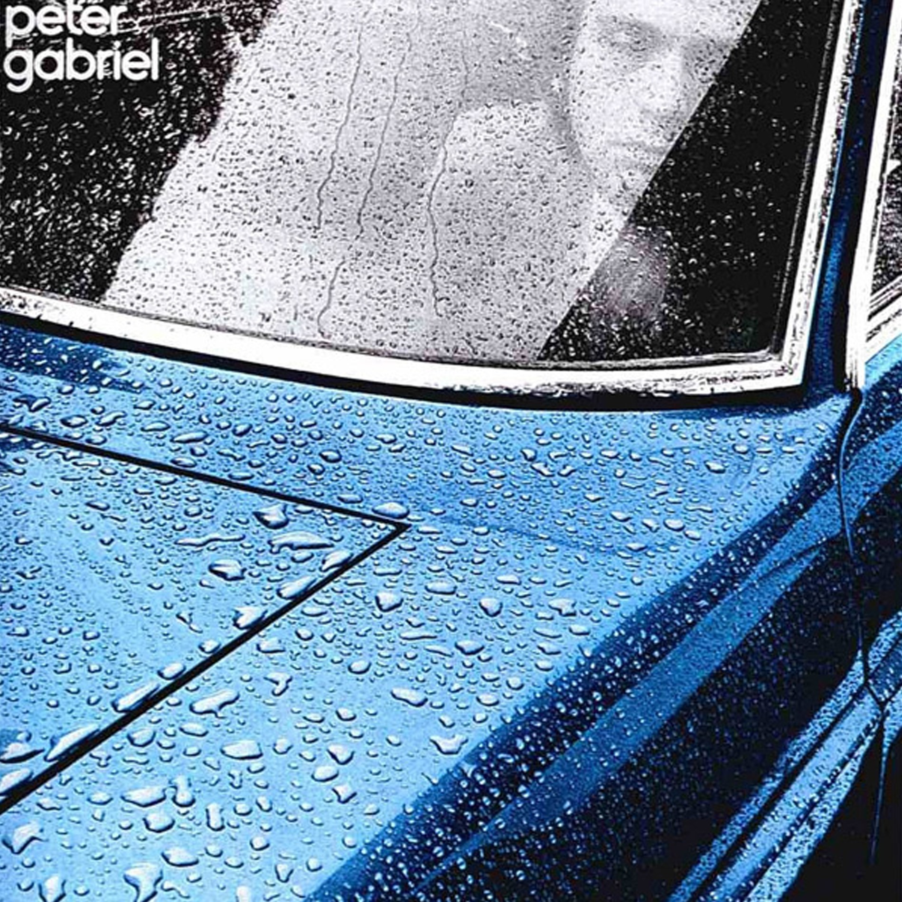

# Peter Gabriel

By **Peter Gabriel**

## Album Data

- **Catalog:** Beets
- **Format:** Digital, Album
- **Album:** Peter Gabriel
- **Artist:** Peter Gabriel
- **Albumartist:** Peter Gabriel
- **Genre:** Progressive Rock
- **MusicBrainz Album Artist ID:** [8e66ea2b-b57b-47d9-8df0-df4630aeb8e5](https://musicbrainz.org/artist/8e66ea2b-b57b-47d9-8df0-df4630aeb8e5)
- **MusicBrainz Album ID:** [1dc8f734-223d-4ca1-8246-749db0644928](https://musicbrainz.org/release/1dc8f734-223d-4ca1-8246-749db0644928)
- **MusicBrainz Release Group ID:** [4e6f2a81-ec6d-378c-a824-0cd0538bbb21](https://musicbrainz.org/release-group/4e6f2a81-ec6d-378c-a824-0cd0538bbb21)
- **Year:** 1977
- **Catalog #:** SD 36-147
- **Label:** ATCO Records
- **Total Tracks:** 09

## Album Tracks

### Track 01 - Moribund the Burgermeister

- **Artist:** Peter Gabriel
- **Format:** MP3
- **Genre:** Progressive Rock
- **Length:** 4:18
- **MusicBrainz Track ID:** [30dccf84-c29f-4474-902b-15efdb368b92](https://musicbrainz.org/recording/30dccf84-c29f-4474-902b-15efdb368b92)
- **Title:** Moribund the Burgermeister
- **Track:** 01
- **Year:** 1977

### Track 02 - Solsbury Hill

- **Artist:** Peter Gabriel
- **Format:** MP3
- **Genre:** Progressive Rock
- **Length:** 4:21
- **MusicBrainz Track ID:** [84f5e49f-e1f8-4d97-b313-32aac570eb66](https://musicbrainz.org/recording/84f5e49f-e1f8-4d97-b313-32aac570eb66)
- **Title:** Solsbury Hill
- **Track:** 02
- **Year:** 1977

### Track 03 - Modern Love

- **Artist:** Peter Gabriel
- **Format:** MP3
- **Genre:** Progressive Rock
- **Length:** 3:35
- **MusicBrainz Track ID:** [530dfc71-7689-46b4-9de2-584e517176c8](https://musicbrainz.org/recording/530dfc71-7689-46b4-9de2-584e517176c8)
- **Title:** Modern Love
- **Track:** 03
- **Year:** 1977

### Track 04 - Excuse Me

- **Artist:** Peter Gabriel
- **Format:** MP3
- **Genre:** Rockabilly
- **Length:** 3:22
- **MusicBrainz Track ID:** [76f916b1-5891-42a4-ba2c-3cfab8c75fe1](https://musicbrainz.org/recording/76f916b1-5891-42a4-ba2c-3cfab8c75fe1)
- **Title:** Excuse Me
- **Track:** 04
- **Year:** 1977

### Track 05 - Humdrum

- **Artist:** Peter Gabriel
- **Format:** MP3
- **Genre:** Progressive Rock
- **Length:** 3:23
- **MusicBrainz Track ID:** [f6b08c3c-76ca-4643-870c-a2bc0334537a](https://musicbrainz.org/recording/f6b08c3c-76ca-4643-870c-a2bc0334537a)
- **Title:** Humdrum
- **Track:** 05
- **Year:** 1977

### Track 06 - Slowburn

- **Artist:** Peter Gabriel
- **Format:** MP3
- **Genre:** Soft Rock
- **Length:** 4:42
- **MusicBrainz Track ID:** [ce76fd05-fcb4-45c9-a651-845903a6061d](https://musicbrainz.org/recording/ce76fd05-fcb4-45c9-a651-845903a6061d)
- **Title:** Slowburn
- **Track:** 06
- **Year:** 1977

### Track 07 - Waiting for the Big One

- **Artist:** Peter Gabriel
- **Format:** MP3
- **Genre:** Progressive Rock
- **Length:** 7:12
- **MusicBrainz Track ID:** [f27e4477-d8eb-4678-9bad-4f2bf98bc561](https://musicbrainz.org/recording/f27e4477-d8eb-4678-9bad-4f2bf98bc561)
- **Title:** Waiting for the Big One
- **Track:** 07
- **Year:** 1977

### Track 08 - Down the Dolce Vita

- **Artist:** Peter Gabriel
- **Format:** MP3
- **Genre:** Progressive Rock
- **Length:** 5:01
- **MusicBrainz Track ID:** [38cee900-2d3c-47c0-81ab-081e9bc7ae8f](https://musicbrainz.org/recording/38cee900-2d3c-47c0-81ab-081e9bc7ae8f)
- **Title:** Down the Dolce Vita
- **Track:** 08
- **Year:** 1977

### Track 09 - Here Comes the Flood

- **Artist:** Peter Gabriel
- **Format:** MP3
- **Genre:** Progressive Rock
- **Length:** 5:33
- **MusicBrainz Track ID:** [61228565-685b-4f9d-81fc-88b518011dcc](https://musicbrainz.org/recording/61228565-685b-4f9d-81fc-88b518011dcc)
- **Title:** Here Comes the Flood
- **Track:** 09
- **Year:** 1977

## See also

- [Roon: So (2012 Remastered)](../../Roon/Peter_Gabriel/So_2012_Remastered.md)
