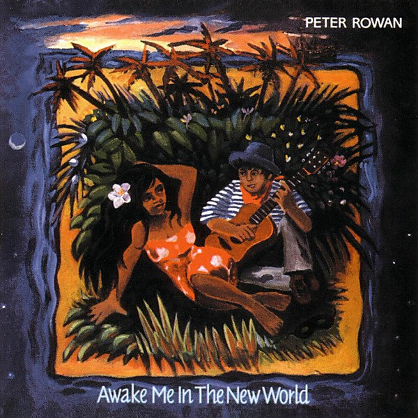

# Awake Me in the New World

By **Peter Rowan**

## Album Data

- **Catalog:** Beets
- **Format:** Digital, Album
- **Album:** Awake Me in the New World
- **Artist:** Peter Rowan
- **Albumartist:** Peter Rowan
- **Genre:** Bluegrass
- **MusicBrainz Album Artist ID:** [1d1488a5-71c0-40ef-9b79-8451a18635ec](https://musicbrainz.org/artist/1d1488a5-71c0-40ef-9b79-8451a18635ec)
- **MusicBrainz Album ID:** [e14195d8-bb0a-4c7b-9451-d7d3e4098ca6](https://musicbrainz.org/release/e14195d8-bb0a-4c7b-9451-d7d3e4098ca6)
- **MusicBrainz Release Group ID:** [ad09781a-221e-3082-b87f-29ad13548f61](https://musicbrainz.org/release-group/ad09781a-221e-3082-b87f-29ad13548f61)
- **Year:** 1993
- **Catalog #:** SH-CD-3781
- **Label:** Sugar Hill Records
- **Total Tracks:** 12

## Album Tracks

### Track 01 - Dust Bowl Children

- **Artist:** Peter Rowan
- **Format:** ALAC
- **Genre:** Country
- **Length:** 3:50
- **MusicBrainz Track ID:** [a593bae8-c285-4e64-8cf3-21f8b8d29a46](https://musicbrainz.org/recording/a593bae8-c285-4e64-8cf3-21f8b8d29a46)
- **Title:** Dust Bowl Children
- **Track:** 01
- **Year:** 1990

### Track 02 - Before the Streets Were Paved

- **Artist:** Peter Rowan
- **Format:** ALAC
- **Genre:** Bluegrass
- **Length:** 2:41
- **MusicBrainz Track ID:** [3411fa66-cb4d-4cf6-bdb3-461441f06fd3](https://musicbrainz.org/recording/3411fa66-cb4d-4cf6-bdb3-461441f06fd3)
- **Title:** Before the Streets Were Paved
- **Track:** 02
- **Year:** 1990

### Track 03 - Electric Blanket

- **Artist:** Peter Rowan
- **Format:** ALAC
- **Genre:** Bluegrass
- **Length:** 2:12
- **MusicBrainz Track ID:** [e682bc52-6051-49a9-8705-7a0324b7f2e3](https://musicbrainz.org/recording/e682bc52-6051-49a9-8705-7a0324b7f2e3)
- **Title:** Electric Blanket
- **Track:** 03
- **Year:** 1990

### Track 04 - Little Mother

- **Artist:** Peter Rowan
- **Format:** ALAC
- **Genre:** Bluegrass
- **Length:** 3:02
- **MusicBrainz Track ID:** [c5ebd23e-d08b-43da-9259-94ba9ddcad52](https://musicbrainz.org/recording/c5ebd23e-d08b-43da-9259-94ba9ddcad52)
- **Title:** Little Mother
- **Track:** 04
- **Year:** 1990

### Track 05 - Barefoot Country Road

- **Artist:** Peter Rowan
- **Format:** ALAC
- **Genre:** Bluegrass
- **Length:** 6:44
- **MusicBrainz Track ID:** [5ab5988c-bb41-45d2-8daa-a600a7e92ff8](https://musicbrainz.org/recording/5ab5988c-bb41-45d2-8daa-a600a7e92ff8)
- **Title:** Barefoot Country Road
- **Track:** 05
- **Year:** 1990

### Track 06 - Seeds My Daddy Sowed

- **Artist:** Peter Rowan
- **Format:** ALAC
- **Genre:** Bluegrass
- **Length:** 2:07
- **MusicBrainz Track ID:** [7d12374e-dccf-493f-9aa5-0acf29d77dc1](https://musicbrainz.org/recording/7d12374e-dccf-493f-9aa5-0acf29d77dc1)
- **Title:** Seeds My Daddy Sowed
- **Track:** 06
- **Year:** 1990

### Track 07 - Tumbleweed

- **Artist:** Peter Rowan
- **Format:** ALAC
- **Genre:** Bluegrass
- **Length:** 4:19
- **MusicBrainz Track ID:** [3a922e9a-4a88-48ae-930d-a811864cdfbe](https://musicbrainz.org/recording/3a922e9a-4a88-48ae-930d-a811864cdfbe)
- **Title:** Tumbleweed
- **Track:** 07
- **Year:** 1990

### Track 08 - Dream of a Home

- **Artist:** Peter Rowan
- **Format:** ALAC
- **Genre:** Bluegrass
- **Length:** 2:16
- **MusicBrainz Track ID:** [d5fc37a8-262b-4655-a8a3-498377acedf9](https://musicbrainz.org/recording/d5fc37a8-262b-4655-a8a3-498377acedf9)
- **Title:** Dream of a Home
- **Track:** 08
- **Year:** 1990

### Track 09 - Rainmaker

- **Artist:** Peter Rowan
- **Format:** ALAC
- **Genre:** Bluegrass
- **Length:** 4:26
- **MusicBrainz Track ID:** [2ef8a4f8-995f-4ca6-972e-96a9c1b48303](https://musicbrainz.org/recording/2ef8a4f8-995f-4ca6-972e-96a9c1b48303)
- **Title:** Rainmaker
- **Track:** 09
- **Year:** 1990

### Track 10 - Forest for the Trees

- **Artist:** Peter Rowan
- **Format:** ALAC
- **Genre:** Bluegrass
- **Length:** 4:48
- **MusicBrainz Track ID:** [f4c2f218-3602-45ae-8dd9-c995060d2d94](https://musicbrainz.org/recording/f4c2f218-3602-45ae-8dd9-c995060d2d94)
- **Title:** Forest for the Trees
- **Track:** 10
- **Year:** 1990

### Track 11 - The Harvest

- **Artist:** Peter Rowan
- **Format:** ALAC
- **Genre:** Bluegrass
- **Length:** 3:49
- **MusicBrainz Track ID:** [5909101e-5bf6-440e-b5d1-91c7030b3bac](https://musicbrainz.org/recording/5909101e-5bf6-440e-b5d1-91c7030b3bac)
- **Title:** The Harvest
- **Track:** 11
- **Year:** 1990

### Track 12 - Wings of Horses

- **Artist:** Peter Rowan
- **Format:** ALAC
- **Genre:** Bluegrass
- **Length:** 3:16
- **MusicBrainz Track ID:** [ff4685b7-faa3-4f95-9e54-067abc6856a8](https://musicbrainz.org/recording/ff4685b7-faa3-4f95-9e54-067abc6856a8)
- **Title:** Wings of Horses
- **Track:** 12
- **Year:** 1990

## See also

- [Dust Bowl Children](Dust_Bowl_Children.md)
- [CD: Dust Bowl Children](../../CD/Peter_Rowan/Dust_Bowl_Children.md)
- [CD: ](../../CD/Peter_Rowan/Peter_Rowan.md)
- [Roon: Awake Me In The New World](../../Roon/Peter_Rowan/Awake_Me_In_The_New_World.md)
- [Roon: Dharma Blues](../../Roon/Peter_Rowan/Dharma_Blues.md)
- [Roon: Dust Bowl Children](../../Roon/Peter_Rowan/Dust_Bowl_Children.md)
- [Roon: Peter Rowan](../../Roon/Peter_Rowan/Peter_Rowan.md)
- [Roon: Quartet](../../Roon/Peter_Rowan/Quartet.md)
- [Roon: Texican Badman](../../Roon/Peter_Rowan/Texican_Badman.md)
- [Roon: The Walls Of Time](../../Roon/Peter_Rowan/The_Walls_Of_Time.md)
- [Roon: Tree On A Hill](../../Roon/Peter_Rowan/Tree_On_A_Hill.md)
