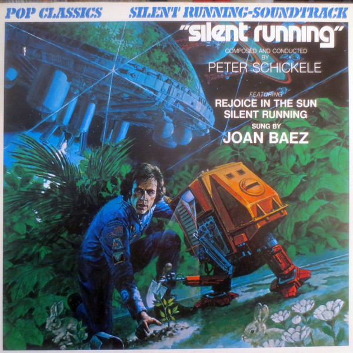

# Silent Running

By **Peter Schickele**

## Album Data

- **Catalog:** Beets
- **Format:** Digital, Album
- **Album:** Silent Running
- **Artist:** Peter Schickele
- **Albumartist:** Peter Schickele
- **Genre:** Electronic
- **MusicBrainz Album Artist ID:** 
- **MusicBrainz Album ID:** 
- **MusicBrainz Release Group ID:** 
- **Year:** 1971
- **Catalog #:** 
- **Label:** 
- **Total Tracks:** 00

## Album Tracks

### Track 46 - Rejoice in the Sun

- **Artist:** Peter Schickele
- **Format:** MP3
- **Genre:** Electronic
- **Length:** 2:11
- **MusicBrainz Track ID:** 
- **Title:** Rejoice in the Sun
- **Track:** 46
- **Year:** 1971

### Track 46 - Silent Running

- **Artist:** Peter Schickele
- **Format:** MP3
- **Genre:** Electronic
- **Length:** 2:04
- **MusicBrainz Track ID:** 
- **Title:** Silent Running
- **Track:** 46
- **Year:** 1971

