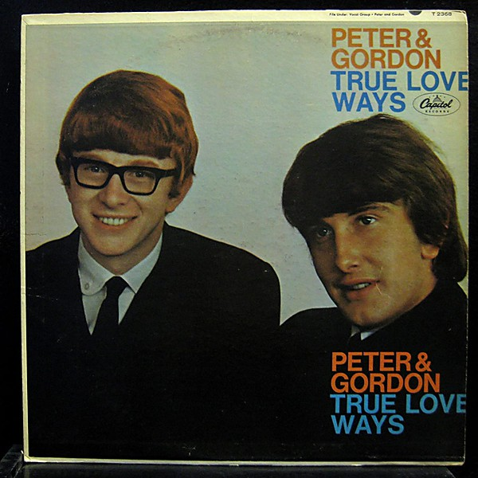

# True Love Ways

By **Peter & Gordon**

## Album Data

- **Catalog:** Beets
- **Format:** Digital, Album
- **Album:** True Love Ways
- **Artist:** Peter & Gordon
- **Albumartist:** Peter & Gordon
- **Genre:** Rock
- **MusicBrainz Album Artist ID:** [cf1573d6-b9e3-4e93-ae74-7c18886acf06](https://musicbrainz.org/artist/cf1573d6-b9e3-4e93-ae74-7c18886acf06)
- **MusicBrainz Album ID:** [be8c7e7c-7eab-439c-8124-16bb70b6f046](https://musicbrainz.org/release/be8c7e7c-7eab-439c-8124-16bb70b6f046)
- **MusicBrainz Release Group ID:** [2b5e9fb1-38bf-43da-97ab-8dadd144b590](https://musicbrainz.org/release-group/2b5e9fb1-38bf-43da-97ab-8dadd144b590)
- **Year:** 1965
- **Catalog #:** 
- **Label:** 
- **Total Tracks:** 00

## Album Tracks

### Track 00 - World Without Love

- **Artist:** Peter & Gordon
- **Format:** AAC
- **Genre:** Rock
- **Length:** 2:40
- **MusicBrainz Track ID:** 
- **Title:** World Without Love
- **Track:** 00
- **Year:** 0000

## See also

- [Unknown Album](Unknown_Album.md)
