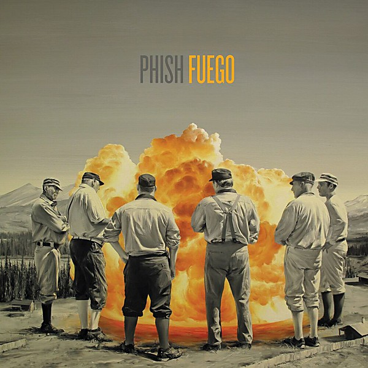

# Fuego

By **Phish**

## Album Data

- **Catalog:** Beets
- **Format:** Digital, Album
- **Album:** Fuego
- **Artist:** Phish
- **Albumartist:** Phish
- **Genre:** Rock
- **MusicBrainz Album Artist ID:** [e01646f2-2a04-450d-8bf2-0d993082e058](https://musicbrainz.org/artist/e01646f2-2a04-450d-8bf2-0d993082e058)
- **MusicBrainz Album ID:** [6c268c74-7a02-4218-a2a9-d2efe0075b54](https://musicbrainz.org/release/6c268c74-7a02-4218-a2a9-d2efe0075b54)
- **MusicBrainz Release Group ID:** [98982e44-87af-4126-bfe3-77ef277deab3](https://musicbrainz.org/release-group/98982e44-87af-4126-bfe3-77ef277deab3)
- **Year:** 2014
- **Catalog #:** 
- **Label:** 
- **Total Tracks:** 00

## Album Tracks

### Track 00 - Morrison, CO

- **Artist:** Phish
- **Format:** MP3
- **Genre:** Psychedelic Rock
- **Length:** 40:52
- **MusicBrainz Track ID:** 
- **Title:** Morrison, CO
- **Track:** 00
- **Year:** 1994

## See also

- [3.22.93 Set 1 Side 1](32293_Set_1_Side_1.md)
- [3.22.93 Set 1 Side 2](32293_Set_1_Side_2.md)
- [7.2.95 Set 1 Side 2](7295_Set_1_Side_2.md)
- [Red Rocks 11.June.94](Red_Rocks_11June94.md)
- [Roon: A Picture of Nectar](../../Roon/Phish/A_Picture_of_Nectar.md)
- [Roon: Hampton/Winston-Salem '97](../../Roon/Phish/Hampton-Winston-Salem_97.md)
