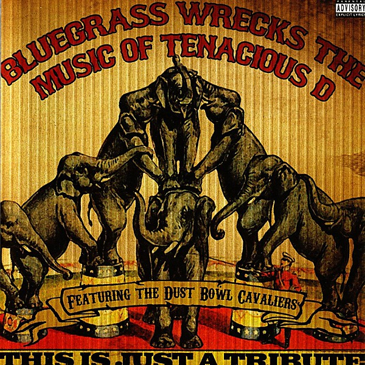

# This Is Just A Tribute

By **Pickin' On Series**

## Album Data

- **Catalog:** Beets
- **Format:** Digital, Album
- **Album:** This Is Just A Tribute
- **Artist:** Pickin' On Series
- **Albumartist:** Pickin' On Series
- **Genre:** Bluegrass
- **MusicBrainz Album Artist ID:** 
- **MusicBrainz Album ID:** 
- **MusicBrainz Release Group ID:** 
- **Year:** 2006
- **Catalog #:** 
- **Label:** 
- **Total Tracks:** 11

## Album Tracks

### Track 01 - The History of Tenacious D [Explicit]

- **Artist:** Pickin' On Series
- **Format:** AAC
- **Genre:** Bluegrass
- **Length:** 2:45
- **MusicBrainz Track ID:** 
- **Title:** The History of Tenacious D [Explicit]
- **Track:** 01
- **Year:** 2006

### Track 02 - Fuck Her Gently [Explicit]

- **Artist:** Pickin' On Series
- **Format:** AAC
- **Genre:** Bluegrass
- **Length:** 3:48
- **MusicBrainz Track ID:** 
- **Title:** Fuck Her Gently [Explicit]
- **Track:** 02
- **Year:** 2006

### Track 03 - Kielbasa [Explicit]

- **Artist:** Pickin' On Series
- **Format:** AAC
- **Genre:** Bluegrass
- **Length:** 4:23
- **MusicBrainz Track ID:** 
- **Title:** Kielbasa [Explicit]
- **Track:** 03
- **Year:** 2006

### Track 04 - Double Team [Explicit]

- **Artist:** Pickin' On Series
- **Format:** AAC
- **Genre:** Bluegrass
- **Length:** 3:18
- **MusicBrainz Track ID:** 
- **Title:** Double Team [Explicit]
- **Track:** 04
- **Year:** 2006

### Track 05 - Karate [Explicit]

- **Artist:** Pickin' On Series
- **Format:** AAC
- **Genre:** Bluegrass
- **Length:** 3:29
- **MusicBrainz Track ID:** 
- **Title:** Karate [Explicit]
- **Track:** 05
- **Year:** 2006

### Track 06 - Kyle Quit the Band [Explicit]

- **Artist:** Pickin' On Series
- **Format:** AAC
- **Genre:** Bluegrass
- **Length:** 3:06
- **MusicBrainz Track ID:** 
- **Title:** Kyle Quit the Band [Explicit]
- **Track:** 06
- **Year:** 2006

### Track 07 - Wonderboy [Explicit]

- **Artist:** Pickin' On Series
- **Format:** AAC
- **Genre:** Bluegrass
- **Length:** 3:12
- **MusicBrainz Track ID:** 
- **Title:** Wonderboy [Explicit]
- **Track:** 07
- **Year:** 2006

### Track 08 - Explosivo [Explicit]

- **Artist:** Pickin' On Series
- **Format:** AAC
- **Genre:** Bluegrass
- **Length:** 3:22
- **MusicBrainz Track ID:** 
- **Title:** Explosivo [Explicit]
- **Track:** 08
- **Year:** 2006

### Track 09 - Jesus Ranch [Explicit]

- **Artist:** Pickin' On Series
- **Format:** AAC
- **Genre:** Bluegrass
- **Length:** 3:48
- **MusicBrainz Track ID:** 
- **Title:** Jesus Ranch [Explicit]
- **Track:** 09
- **Year:** 2006

### Track 10 - Sasquatch [Explicit]

- **Artist:** Pickin' On Series
- **Format:** AAC
- **Genre:** Bluegrass
- **Length:** 3:10
- **MusicBrainz Track ID:** 
- **Title:** Sasquatch [Explicit]
- **Track:** 10
- **Year:** 2006

### Track 11 - Tribute [Explicit]

- **Artist:** Pickin' On Series
- **Format:** AAC
- **Genre:** Bluegrass
- **Length:** 3:46
- **MusicBrainz Track ID:** 
- **Title:** Tribute [Explicit]
- **Track:** 11
- **Year:** 2006

