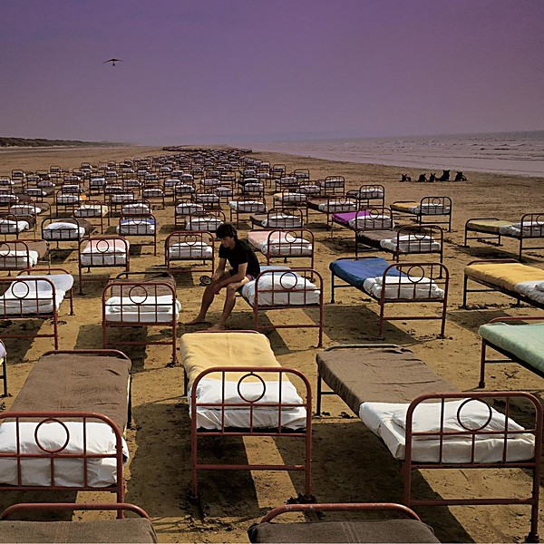

# A Momentary Lapse of Reason

By **Pink Floyd**

## Album Data

- **Catalog:** Beets
- **Format:** Digital, Album
- **Album:** A Momentary Lapse of Reason
- **Artist:** Pink Floyd
- **Albumartist:** Pink Floyd
- **Genre:** Psychedelic Rock
- **MusicBrainz Album Artist ID:** [83d91898-7763-47d7-b03b-b92132375c47](https://musicbrainz.org/artist/83d91898-7763-47d7-b03b-b92132375c47)
- **MusicBrainz Album ID:** [89886f7e-8a1c-34ff-8241-a41061f12c52](https://musicbrainz.org/release/89886f7e-8a1c-34ff-8241-a41061f12c52)
- **MusicBrainz Release Group ID:** [4940b8aa-898b-3e60-9992-94e073bab6f6](https://musicbrainz.org/release-group/4940b8aa-898b-3e60-9992-94e073bab6f6)
- **Year:** 1987
- **Catalog #:** 
- **Label:** EMI
- **Total Tracks:** 07

## Album Tracks

### Track 01 - Let There Be More Light

- **Artist:** Pink Floyd
- **Format:** ALAC
- **Genre:** Space Rock
- **Length:** 5:38
- **MusicBrainz Track ID:** [daaa9828-702a-4e14-8f3f-af9f24171c52](https://musicbrainz.org/recording/daaa9828-702a-4e14-8f3f-af9f24171c52)
- **Title:** Let There Be More Light
- **Track:** 01
- **Year:** 2011

### Track 02 - Remember a Day

- **Artist:** Pink Floyd
- **Format:** ALAC
- **Genre:** Space Rock
- **Length:** 4:32
- **MusicBrainz Track ID:** [819f4310-f15c-498c-b6db-f62cd6e0fcc7](https://musicbrainz.org/recording/819f4310-f15c-498c-b6db-f62cd6e0fcc7)
- **Title:** Remember a Day
- **Track:** 02
- **Year:** 2011

### Track 03 - Set the Controls for the Heart of the Sun

- **Artist:** Pink Floyd
- **Format:** ALAC
- **Genre:** Space Rock
- **Length:** 5:27
- **MusicBrainz Track ID:** [ccbb51ad-20b2-477f-a6a2-d3ca9cba2986](https://musicbrainz.org/recording/ccbb51ad-20b2-477f-a6a2-d3ca9cba2986)
- **Title:** Set the Controls for the Heart of the Sun
- **Track:** 03
- **Year:** 2011

### Track 04 - Corporal Clegg

- **Artist:** Pink Floyd
- **Format:** ALAC
- **Genre:** Psychedelic Rock
- **Length:** 4:12
- **MusicBrainz Track ID:** [eeeea119-2c33-4c79-9728-96acec22ed6b](https://musicbrainz.org/recording/eeeea119-2c33-4c79-9728-96acec22ed6b)
- **Title:** Corporal Clegg
- **Track:** 04
- **Year:** 2011

### Track 05 - A Saucerful of Secrets

- **Artist:** Pink Floyd
- **Format:** ALAC
- **Genre:** Space Rock
- **Length:** 11:56
- **MusicBrainz Track ID:** [610b11cf-ecb0-41a9-a3f2-3d40c74f9d6b](https://musicbrainz.org/recording/610b11cf-ecb0-41a9-a3f2-3d40c74f9d6b)
- **Title:** A Saucerful of Secrets
- **Track:** 05
- **Year:** 2011

### Track 06 - See‐Saw

- **Artist:** Pink Floyd
- **Format:** ALAC
- **Genre:** Space Rock
- **Length:** 4:36
- **MusicBrainz Track ID:** [e83cf779-6547-4947-be4f-fe46c5b98592](https://musicbrainz.org/recording/e83cf779-6547-4947-be4f-fe46c5b98592)
- **Title:** See‐Saw
- **Track:** 06
- **Year:** 2011

### Track 07 - Jugband Blues

- **Artist:** Pink Floyd
- **Format:** ALAC
- **Genre:** Psychedelic Rock
- **Length:** 3:00
- **MusicBrainz Track ID:** [f56c98a4-ed4b-4afc-8306-cdc8e07cd03d](https://musicbrainz.org/recording/f56c98a4-ed4b-4afc-8306-cdc8e07cd03d)
- **Title:** Jugband Blues
- **Track:** 07
- **Year:** 2011

## See also

- [Animals](Animals.md)
- [A Saucerful of Secrets](A_Saucerful_of_Secrets.md)
- [Echoes](Echoes_2.md)
- [Echoes](Echoes.md)
- [Is there anybody out there?](Is_there_anybody_out_there.md)
- [Meddle](Meddle.md)
- [Rome 6.5.1968 VPRO](Rome_651968_VPRO.md)
- [The Dark Side Of The Moon [Live] [Disc 2] [Remaster]](The_Dark_Side_Of_The_Moon_[Live]_[Disc_2]_[Remaster].md)
- [The Dark Side of the Moon](The_Dark_Side_of_the_Moon.md)
- [The Dark Side Of The Moon [Remaster]](The_Dark_Side_Of_The_Moon_[Remaster].md)
- [The Division Bell](The_Division_Bell.md)
- [The Endless River](The_Endless_River.md)
- [The Piper at the Gates of Dawn](The_Piper_at_the_Gates_of_Dawn.md)
- [The Wall [Remaster] [Disc 1]](The_Wall_[Remaster]_[Disc_1].md)
- [The Wall [Remaster] [Disc 2]](The_Wall_[Remaster]_[Disc_2].md)
- [Ummagumma](Ummagumma.md)
- [Wish You Were Here](Wish_You_Were_Here.md)
- [CD: Animals [2011 Remaster]](../../CD/Pink_Floyd/Animals_[2011_Remaster].md)
- [CD: A Saucerful Of Secrets](../../CD/Pink_Floyd/A_Saucerful_Of_Secrets.md)
- [CD: Meddle](../../CD/Pink_Floyd/Meddle.md)
- [CD: ](../../CD/Pink_Floyd/Pink_Floyd.md)
- [CD: The Dark Side Of The Moon - Immersion Box Set (Disc 1)](../../CD/Pink_Floyd/The_Dark_Side_Of_The_Moon_-_Immersion_Box_Set_Disc_1.md)
- [CD: The Division Bell](../../CD/Pink_Floyd/The_Division_Bell.md)
- [CD: The Wall (Disc 1)](../../CD/Pink_Floyd/The_Wall_Disc_1.md)
- [CD: The Wall (Disc 2)](../../CD/Pink_Floyd/The_Wall_Disc_2.md)
- [CD: Wish You Were Here](../../CD/Pink_Floyd/Wish_You_Were_Here.md)
- [Roon: A Momentary Lapse of Reason](../../Roon/Pink_Floyd/A_Momentary_Lapse_of_Reason.md)
- [Roon: Animals](../../Roon/Pink_Floyd/Animals.md)
- [Roon: Meddle](../../Roon/Pink_Floyd/Meddle.md)
- [Roon: The Dark Side of the Moon](../../Roon/Pink_Floyd/The_Dark_Side_of_the_Moon.md)
- [Roon: The Division Bell](../../Roon/Pink_Floyd/The_Division_Bell.md)
- [Roon: The Wall (Remastered 2011 Version)](../../Roon/Pink_Floyd/The_Wall_Remastered_2011_Version.md)
- [Roon: Wish You Were Here](../../Roon/Pink_Floyd/Wish_You_Were_Here.md)
- [Vinyl: A Momentary Lapse Of Reason](../../Vinyl/Pink_Floyd/A_Momentary_Lapse_Of_Reason.md)
- [Vinyl: Animals](../../Vinyl/Pink_Floyd/Animals.md)
- [Vinyl: Interstellar Overdrive](../../Vinyl/Pink_Floyd/Interstellar_Overdrive.md)
- [Vinyl: Meddle](../../Vinyl/Pink_Floyd/Meddle.md)
- [Vinyl: ](../../Vinyl/Pink_Floyd/Pink_Floyd.md)
- [Vinyl: The Dark Side Of The Moon](../../Vinyl/Pink_Floyd/The_Dark_Side_Of_The_Moon.md)
- [Vinyl: Wish You Were Here](../../Vinyl/Pink_Floyd/Wish_You_Were_Here.md)
