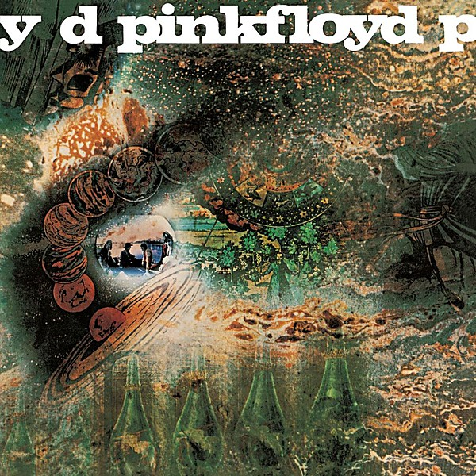

# A Saucerful of Secrets

By **Pink Floyd**

## Album Data

- **Catalog:** Beets
- **Format:** Digital, Album
- **Album:** A Saucerful of Secrets
- **Artist:** Pink Floyd
- **Albumartist:** Pink Floyd
- **Genre:** Space Rock
- **MusicBrainz Album Artist ID:** [83d91898-7763-47d7-b03b-b92132375c47](https://musicbrainz.org/artist/83d91898-7763-47d7-b03b-b92132375c47)
- **MusicBrainz Album ID:** [cd6058cc-be79-47c0-b14a-5875890df74c](https://musicbrainz.org/release/cd6058cc-be79-47c0-b14a-5875890df74c)
- **MusicBrainz Release Group ID:** [8a9caa40-b7c6-33eb-a13c-6c15f09b1c44](https://musicbrainz.org/release-group/8a9caa40-b7c6-33eb-a13c-6c15f09b1c44)
- **Year:** 2011
- **Catalog #:** 
- **Label:** EMI
- **Total Tracks:** 05

## Album Tracks

### Track 01 - Pigs on the Wing, Pt. 1

- **Artist:** Pink Floyd
- **Format:** ALAC
- **Genre:** Psychedelic Rock
- **Length:** 1:25
- **MusicBrainz Track ID:** [aca2620e-eee7-416c-bb3b-b881b7d68780](https://musicbrainz.org/recording/aca2620e-eee7-416c-bb3b-b881b7d68780)
- **Title:** Pigs on the Wing, Pt. 1
- **Track:** 01
- **Year:** 2011

### Track 02 - Dogs

- **Artist:** Pink Floyd
- **Format:** ALAC
- **Genre:** Psychedelic Rock
- **Length:** 17:05
- **MusicBrainz Track ID:** [93972412-fe18-4656-98ed-82995598d8df](https://musicbrainz.org/recording/93972412-fe18-4656-98ed-82995598d8df)
- **Title:** Dogs
- **Track:** 02
- **Year:** 2011

### Track 03 - Pigs (Three Different Ones)

- **Artist:** Pink Floyd
- **Format:** ALAC
- **Genre:** Psychedelic Rock
- **Length:** 11:26
- **MusicBrainz Track ID:** [ebe902f4-c982-4cb6-83e6-6441691e1376](https://musicbrainz.org/recording/ebe902f4-c982-4cb6-83e6-6441691e1376)
- **Title:** Pigs (Three Different Ones)
- **Track:** 03
- **Year:** 2011

### Track 04 - Sheep

- **Artist:** Pink Floyd
- **Format:** ALAC
- **Genre:** Psychedelic Rock
- **Length:** 10:18
- **MusicBrainz Track ID:** [dc014ebe-f3ae-444f-bdec-791e9614eadd](https://musicbrainz.org/recording/dc014ebe-f3ae-444f-bdec-791e9614eadd)
- **Title:** Sheep
- **Track:** 04
- **Year:** 2011

### Track 05 - Pigs on the Wing, Pt. 2

- **Artist:** Pink Floyd
- **Format:** ALAC
- **Genre:** Psychedelic Rock
- **Length:** 1:28
- **MusicBrainz Track ID:** [60031bed-f45b-43d7-af19-126f158fa3ed](https://musicbrainz.org/recording/60031bed-f45b-43d7-af19-126f158fa3ed)
- **Title:** Pigs on the Wing, Pt. 2
- **Track:** 05
- **Year:** 2011

## See also

- [A Momentary Lapse of Reason](A_Momentary_Lapse_of_Reason.md)
- [Animals](Animals.md)
- [Echoes](Echoes_2.md)
- [Echoes](Echoes.md)
- [Is there anybody out there?](Is_there_anybody_out_there.md)
- [Meddle](Meddle.md)
- [Rome 6.5.1968 VPRO](Rome_651968_VPRO.md)
- [The Dark Side Of The Moon [Live] [Disc 2] [Remaster]](The_Dark_Side_Of_The_Moon_[Live]_[Disc_2]_[Remaster].md)
- [The Dark Side of the Moon](The_Dark_Side_of_the_Moon.md)
- [The Dark Side Of The Moon [Remaster]](The_Dark_Side_Of_The_Moon_[Remaster].md)
- [The Division Bell](The_Division_Bell.md)
- [The Endless River](The_Endless_River.md)
- [The Piper at the Gates of Dawn](The_Piper_at_the_Gates_of_Dawn.md)
- [The Wall [Remaster] [Disc 1]](The_Wall_[Remaster]_[Disc_1].md)
- [The Wall [Remaster] [Disc 2]](The_Wall_[Remaster]_[Disc_2].md)
- [Ummagumma](Ummagumma.md)
- [Wish You Were Here](Wish_You_Were_Here.md)
- [CD: Animals [2011 Remaster]](../../CD/Pink_Floyd/Animals_[2011_Remaster].md)
- [CD: A Saucerful Of Secrets](../../CD/Pink_Floyd/A_Saucerful_Of_Secrets.md)
- [CD: Meddle](../../CD/Pink_Floyd/Meddle.md)
- [CD: ](../../CD/Pink_Floyd/Pink_Floyd.md)
- [CD: The Dark Side Of The Moon - Immersion Box Set (Disc 1)](../../CD/Pink_Floyd/The_Dark_Side_Of_The_Moon_-_Immersion_Box_Set_Disc_1.md)
- [CD: The Division Bell](../../CD/Pink_Floyd/The_Division_Bell.md)
- [CD: The Wall (Disc 1)](../../CD/Pink_Floyd/The_Wall_Disc_1.md)
- [CD: The Wall (Disc 2)](../../CD/Pink_Floyd/The_Wall_Disc_2.md)
- [CD: Wish You Were Here](../../CD/Pink_Floyd/Wish_You_Were_Here.md)
- [Roon: A Momentary Lapse of Reason](../../Roon/Pink_Floyd/A_Momentary_Lapse_of_Reason.md)
- [Roon: Animals](../../Roon/Pink_Floyd/Animals.md)
- [Roon: Meddle](../../Roon/Pink_Floyd/Meddle.md)
- [Roon: The Dark Side of the Moon](../../Roon/Pink_Floyd/The_Dark_Side_of_the_Moon.md)
- [Roon: The Division Bell](../../Roon/Pink_Floyd/The_Division_Bell.md)
- [Roon: The Wall (Remastered 2011 Version)](../../Roon/Pink_Floyd/The_Wall_Remastered_2011_Version.md)
- [Roon: Wish You Were Here](../../Roon/Pink_Floyd/Wish_You_Were_Here.md)
- [Vinyl: A Momentary Lapse Of Reason](../../Vinyl/Pink_Floyd/A_Momentary_Lapse_Of_Reason.md)
- [Vinyl: Animals](../../Vinyl/Pink_Floyd/Animals.md)
- [Vinyl: Interstellar Overdrive](../../Vinyl/Pink_Floyd/Interstellar_Overdrive.md)
- [Vinyl: Meddle](../../Vinyl/Pink_Floyd/Meddle.md)
- [Vinyl: ](../../Vinyl/Pink_Floyd/Pink_Floyd.md)
- [Vinyl: The Dark Side Of The Moon](../../Vinyl/Pink_Floyd/The_Dark_Side_Of_The_Moon.md)
- [Vinyl: Wish You Were Here](../../Vinyl/Pink_Floyd/Wish_You_Were_Here.md)
