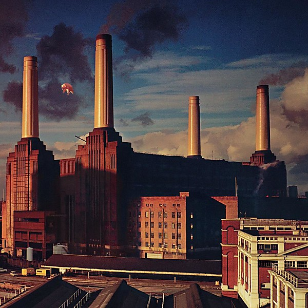

# Animals

By **Pink Floyd**

## Album Data

- **Catalog:** Beets
- **Format:** Digital, Album
- **Album:** Animals
- **Artist:** Pink Floyd
- **Albumartist:** Pink Floyd
- **Genre:** Psychedelic Rock
- **MusicBrainz Album Artist ID:** [83d91898-7763-47d7-b03b-b92132375c47](https://musicbrainz.org/artist/83d91898-7763-47d7-b03b-b92132375c47)
- **MusicBrainz Album ID:** [da270afb-4e5f-418e-bc5e-c03092234ee4](https://musicbrainz.org/release/da270afb-4e5f-418e-bc5e-c03092234ee4)
- **MusicBrainz Release Group ID:** [20c77fb4-1c9f-33c8-9d7e-c4977f11e847](https://musicbrainz.org/release-group/20c77fb4-1c9f-33c8-9d7e-c4977f11e847)
- **Year:** 2011
- **Catalog #:** 
- **Label:** 
- **Total Tracks:** 13

## Album Tracks

### Track 01 - Astronomy Domine

- **Artist:** Pink Floyd
- **Format:** ALAC
- **Genre:** Space Rock
- **Length:** 4:10
- **MusicBrainz Track ID:** 
- **Title:** Astronomy Domine
- **Track:** 01
- **Year:** 1967

### Track 02 - See Emily Play

- **Artist:** Pink Floyd
- **Format:** ALAC
- **Genre:** Psychedelic Rock
- **Length:** 2:47
- **MusicBrainz Track ID:** 
- **Title:** See Emily Play
- **Track:** 02
- **Year:** 1967

### Track 03 - The Happiest Days Of Our Lives

- **Artist:** Pink Floyd
- **Format:** ALAC
- **Genre:** Psychedelic Rock
- **Length:** 1:38
- **MusicBrainz Track ID:** 
- **Title:** The Happiest Days Of Our Lives
- **Track:** 03
- **Year:** 1979

### Track 04 - Another Brick In The Wall (Part 2)

- **Artist:** Pink Floyd
- **Format:** ALAC
- **Genre:** Psychedelic Rock
- **Length:** 4:01
- **MusicBrainz Track ID:** 
- **Title:** Another Brick In The Wall (Part 2)
- **Track:** 04
- **Year:** 1979

### Track 05 - Echoes

- **Artist:** Pink Floyd
- **Format:** ALAC
- **Genre:** Space Rock
- **Length:** 16:30
- **MusicBrainz Track ID:** 
- **Title:** Echoes
- **Track:** 05
- **Year:** 1971

### Track 06 - Hey You

- **Artist:** Pink Floyd
- **Format:** ALAC
- **Genre:** Psychedelic Rock
- **Length:** 4:39
- **MusicBrainz Track ID:** 
- **Title:** Hey You
- **Track:** 06
- **Year:** 1979

### Track 07 - Marooned

- **Artist:** Pink Floyd
- **Format:** ALAC
- **Genre:** Space Rock
- **Length:** 2:02
- **MusicBrainz Track ID:** 
- **Title:** Marooned
- **Track:** 07
- **Year:** 1994

### Track 08 - The Great Gig In The Sky

- **Artist:** Pink Floyd
- **Format:** ALAC
- **Genre:** Psychedelic Rock
- **Length:** 4:40
- **MusicBrainz Track ID:** 
- **Title:** The Great Gig In The Sky
- **Track:** 08
- **Year:** 1973

### Track 09 - Set The Controls For The Heart Of The Sun

- **Artist:** Pink Floyd
- **Format:** ALAC
- **Genre:** Space Rock
- **Length:** 5:20
- **MusicBrainz Track ID:** 
- **Title:** Set The Controls For The Heart Of The Sun
- **Track:** 09
- **Year:** 1968

### Track 10 - Money

- **Artist:** Pink Floyd
- **Format:** ALAC
- **Genre:** Psychedelic Rock
- **Length:** 6:29
- **MusicBrainz Track ID:** 
- **Title:** Money
- **Track:** 10
- **Year:** 1973

### Track 11 - Keep Talking

- **Artist:** Pink Floyd
- **Format:** ALAC
- **Genre:** Psychedelic Rock
- **Length:** 5:57
- **MusicBrainz Track ID:** 
- **Title:** Keep Talking
- **Track:** 11
- **Year:** 1994

### Track 12 - Sheep

- **Artist:** Pink Floyd
- **Format:** ALAC
- **Genre:** Psychedelic Rock
- **Length:** 9:46
- **MusicBrainz Track ID:** 
- **Title:** Sheep
- **Track:** 12
- **Year:** 1977

### Track 13 - Sorrow

- **Artist:** Pink Floyd
- **Format:** ALAC
- **Genre:** Psychedelic Rock
- **Length:** 8:45
- **MusicBrainz Track ID:** 
- **Title:** Sorrow
- **Track:** 13
- **Year:** 1987

## See also

- [A Momentary Lapse of Reason](A_Momentary_Lapse_of_Reason.md)
- [A Saucerful of Secrets](A_Saucerful_of_Secrets.md)
- [Echoes](Echoes_2.md)
- [Echoes](Echoes.md)
- [Is there anybody out there?](Is_there_anybody_out_there.md)
- [Meddle](Meddle.md)
- [Rome 6.5.1968 VPRO](Rome_651968_VPRO.md)
- [The Dark Side Of The Moon [Live] [Disc 2] [Remaster]](The_Dark_Side_Of_The_Moon_[Live]_[Disc_2]_[Remaster].md)
- [The Dark Side of the Moon](The_Dark_Side_of_the_Moon.md)
- [The Dark Side Of The Moon [Remaster]](The_Dark_Side_Of_The_Moon_[Remaster].md)
- [The Division Bell](The_Division_Bell.md)
- [The Endless River](The_Endless_River.md)
- [The Piper at the Gates of Dawn](The_Piper_at_the_Gates_of_Dawn.md)
- [The Wall [Remaster] [Disc 1]](The_Wall_[Remaster]_[Disc_1].md)
- [The Wall [Remaster] [Disc 2]](The_Wall_[Remaster]_[Disc_2].md)
- [Ummagumma](Ummagumma.md)
- [Wish You Were Here](Wish_You_Were_Here.md)
- [CD: Animals [2011 Remaster]](../../CD/Pink_Floyd/Animals_[2011_Remaster].md)
- [CD: A Saucerful Of Secrets](../../CD/Pink_Floyd/A_Saucerful_Of_Secrets.md)
- [CD: Meddle](../../CD/Pink_Floyd/Meddle.md)
- [CD: ](../../CD/Pink_Floyd/Pink_Floyd.md)
- [CD: The Dark Side Of The Moon - Immersion Box Set (Disc 1)](../../CD/Pink_Floyd/The_Dark_Side_Of_The_Moon_-_Immersion_Box_Set_Disc_1.md)
- [CD: The Division Bell](../../CD/Pink_Floyd/The_Division_Bell.md)
- [CD: The Wall (Disc 1)](../../CD/Pink_Floyd/The_Wall_Disc_1.md)
- [CD: The Wall (Disc 2)](../../CD/Pink_Floyd/The_Wall_Disc_2.md)
- [CD: Wish You Were Here](../../CD/Pink_Floyd/Wish_You_Were_Here.md)
- [Roon: A Momentary Lapse of Reason](../../Roon/Pink_Floyd/A_Momentary_Lapse_of_Reason.md)
- [Roon: Animals](../../Roon/Pink_Floyd/Animals.md)
- [Roon: Meddle](../../Roon/Pink_Floyd/Meddle.md)
- [Roon: The Dark Side of the Moon](../../Roon/Pink_Floyd/The_Dark_Side_of_the_Moon.md)
- [Roon: The Division Bell](../../Roon/Pink_Floyd/The_Division_Bell.md)
- [Roon: The Wall (Remastered 2011 Version)](../../Roon/Pink_Floyd/The_Wall_Remastered_2011_Version.md)
- [Roon: Wish You Were Here](../../Roon/Pink_Floyd/Wish_You_Were_Here.md)
- [Vinyl: A Momentary Lapse Of Reason](../../Vinyl/Pink_Floyd/A_Momentary_Lapse_Of_Reason.md)
- [Vinyl: Animals](../../Vinyl/Pink_Floyd/Animals.md)
- [Vinyl: Interstellar Overdrive](../../Vinyl/Pink_Floyd/Interstellar_Overdrive.md)
- [Vinyl: Meddle](../../Vinyl/Pink_Floyd/Meddle.md)
- [Vinyl: ](../../Vinyl/Pink_Floyd/Pink_Floyd.md)
- [Vinyl: The Dark Side Of The Moon](../../Vinyl/Pink_Floyd/The_Dark_Side_Of_The_Moon.md)
- [Vinyl: Wish You Were Here](../../Vinyl/Pink_Floyd/Wish_You_Were_Here.md)
