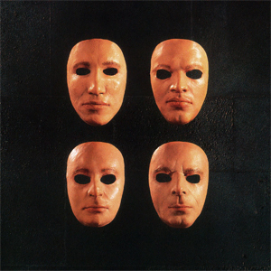

# Is there anybody out there?

By **Pink Floyd**

## Album Data

- **Catalog:** Beets
- **Format:** Digital, Album
- **Album:** Is there anybody out there?
- **Artist:** Pink Floyd
- **Albumartist:** Pink Floyd
- **Genre:** Progressive Rock
- **MusicBrainz Album Artist ID:** 
- **MusicBrainz Album ID:** 
- **MusicBrainz Release Group ID:** 
- **Year:** 2000
- **Catalog #:** 
- **Label:** 
- **Total Tracks:** 00

## Album Tracks

### Track 06 - Echoes

- **Artist:** Pink Floyd
- **Format:** ALAC
- **Genre:** Space Rock
- **Length:** 23:34
- **MusicBrainz Track ID:** 
- **Title:** Echoes
- **Track:** 06
- **Year:** 1971

### Track 06 - Echoes

- **Artist:** Pink Floyd
- **Format:** MP3
- **Genre:** Space Rock
- **Length:** 23:31
- **MusicBrainz Track ID:** 
- **Title:** Echoes
- **Track:** 06
- **Year:** 1971

### Track 01 - One Of These Days

- **Artist:** Pink Floyd
- **Format:** ALAC
- **Genre:** Psychedelic Rock
- **Length:** 5:55
- **MusicBrainz Track ID:** 
- **Title:** One Of These Days
- **Track:** 01
- **Year:** 1971

### Track 02 - A Pillow Of Winds

- **Artist:** Pink Floyd
- **Format:** ALAC
- **Genre:** Psychedelic Rock
- **Length:** 5:12
- **MusicBrainz Track ID:** 
- **Title:** A Pillow Of Winds
- **Track:** 02
- **Year:** 1971

### Track 03 - Fearless

- **Artist:** Pink Floyd
- **Format:** ALAC
- **Genre:** Psychedelic Rock
- **Length:** 6:08
- **MusicBrainz Track ID:** 
- **Title:** Fearless
- **Track:** 03
- **Year:** 1971

### Track 04 - San Tropez

- **Artist:** Pink Floyd
- **Format:** ALAC
- **Genre:** Psychedelic Rock
- **Length:** 3:43
- **MusicBrainz Track ID:** 
- **Title:** San Tropez
- **Track:** 04
- **Year:** 1971

### Track 05 - Seamus

- **Artist:** Pink Floyd
- **Format:** ALAC
- **Genre:** Psychedelic Rock
- **Length:** 2:14
- **MusicBrainz Track ID:** 
- **Title:** Seamus
- **Track:** 05
- **Year:** 1971

