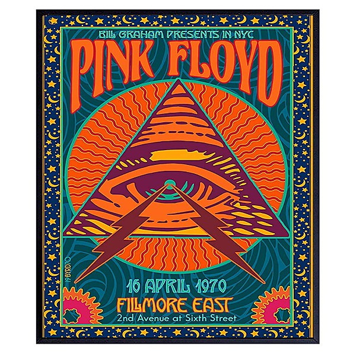

# Rome 6.5.1968 VPRO

By **Pink Floyd**

## Album Data

- **Catalog:** Beets
- **Format:** Digital, Album
- **Album:** Rome 6.5.1968 VPRO
- **Artist:** Pink Floyd
- **Albumartist:** Pink Floyd
- **Genre:** Psychedelic Rock
- **MusicBrainz Album Artist ID:** 
- **MusicBrainz Album ID:** 
- **MusicBrainz Release Group ID:** 
- **Year:** 1968
- **Catalog #:** Q4SHVL 804
- **Label:** Harvest
- **Total Tracks:** 10

## Album Tracks

### Track 01 - Speak to Me

- **Artist:** Pink Floyd
- **Format:** MP3
- **Genre:** Psychedelic Rock
- **Length:** 1:05
- **MusicBrainz Track ID:** [ad73f933-e8b5-4a1d-b589-6ed1625acd11](https://musicbrainz.org/recording/ad73f933-e8b5-4a1d-b589-6ed1625acd11)
- **Title:** Speak to Me
- **Track:** 01
- **Year:** 1973

### Track 02 - Breathe

- **Artist:** Pink Floyd
- **Format:** MP3
- **Genre:** Psychedelic Rock
- **Length:** 2:49
- **MusicBrainz Track ID:** [1e0b788d-f682-486c-8f68-b228741af5e5](https://musicbrainz.org/recording/1e0b788d-f682-486c-8f68-b228741af5e5)
- **Title:** Breathe
- **Track:** 02
- **Year:** 1973

### Track 03 - On the Run

- **Artist:** Pink Floyd
- **Format:** MP3
- **Genre:** Psychedelic Rock
- **Length:** 3:45
- **MusicBrainz Track ID:** [73e7e4f4-4600-47b7-b3ec-541f235f6273](https://musicbrainz.org/recording/73e7e4f4-4600-47b7-b3ec-541f235f6273)
- **Title:** On the Run
- **Track:** 03
- **Year:** 1973

### Track 04 - Time

- **Artist:** Pink Floyd
- **Format:** MP3
- **Genre:** Psychedelic Rock
- **Length:** 6:53
- **MusicBrainz Track ID:** [11a9d4ca-8487-428e-ab93-4a2fecf7f8ee](https://musicbrainz.org/recording/11a9d4ca-8487-428e-ab93-4a2fecf7f8ee)
- **Title:** Time
- **Track:** 04
- **Year:** 1973

### Track 05 - The Great Gig in the Sky

- **Artist:** Pink Floyd
- **Format:** MP3
- **Genre:** Psychedelic Rock
- **Length:** 4:43
- **MusicBrainz Track ID:** [86642c06-ec51-4d42-97fd-f9ab5967fda2](https://musicbrainz.org/recording/86642c06-ec51-4d42-97fd-f9ab5967fda2)
- **Title:** The Great Gig in the Sky
- **Track:** 05
- **Year:** 1973

### Track 06 - Money

- **Artist:** Pink Floyd
- **Format:** MP3
- **Genre:** Psychedelic Rock
- **Length:** 6:22
- **MusicBrainz Track ID:** [b1068d35-7534-4ecb-b4f3-149c9b8aecd8](https://musicbrainz.org/recording/b1068d35-7534-4ecb-b4f3-149c9b8aecd8)
- **Title:** Money
- **Track:** 06
- **Year:** 1973

### Track 07 - Us and Them

- **Artist:** Pink Floyd
- **Format:** MP3
- **Genre:** Psychedelic Rock
- **Length:** 7:49
- **MusicBrainz Track ID:** [3a91f241-cd73-4572-8a5d-4d46bf0d994d](https://musicbrainz.org/recording/3a91f241-cd73-4572-8a5d-4d46bf0d994d)
- **Title:** Us and Them
- **Track:** 07
- **Year:** 1973

### Track 08 - Any Colour You Like

- **Artist:** Pink Floyd
- **Format:** MP3
- **Genre:** Space Rock
- **Length:** 3:26
- **MusicBrainz Track ID:** [5b811333-df84-4680-b4a3-6d01122ba9f7](https://musicbrainz.org/recording/5b811333-df84-4680-b4a3-6d01122ba9f7)
- **Title:** Any Colour You Like
- **Track:** 08
- **Year:** 1973

### Track 09 - Brain Damage

- **Artist:** Pink Floyd
- **Format:** MP3
- **Genre:** Psychedelic Rock
- **Length:** 3:46
- **MusicBrainz Track ID:** [cdef11f1-3097-427d-9d3f-6e35651dcf9d](https://musicbrainz.org/recording/cdef11f1-3097-427d-9d3f-6e35651dcf9d)
- **Title:** Brain Damage
- **Track:** 09
- **Year:** 1973

### Track 10 - Eclipse

- **Artist:** Pink Floyd
- **Format:** MP3
- **Genre:** Psychedelic Rock
- **Length:** 2:10
- **MusicBrainz Track ID:** [d4542e2f-b561-4694-8a67-a44606d0afb4](https://musicbrainz.org/recording/d4542e2f-b561-4694-8a67-a44606d0afb4)
- **Title:** Eclipse
- **Track:** 10
- **Year:** 1973

