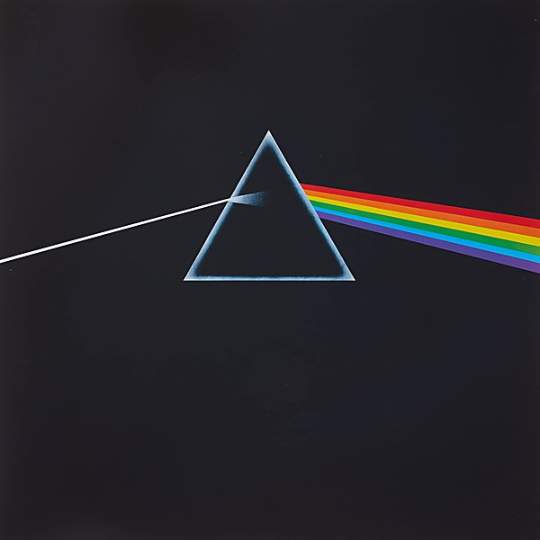

# The Dark Side Of The Moon [Remaster]

By **Pink Floyd**

## Album Data

- **Catalog:** Beets
- **Format:** Digital, Album
- **Album:** The Dark Side Of The Moon [Remaster]
- **Artist:** Pink Floyd
- **Albumartist:** Pink Floyd
- **Genre:** Psychedelic Rock
- **MusicBrainz Album Artist ID:** 
- **MusicBrainz Album ID:** 
- **MusicBrainz Release Group ID:** 
- **Year:** 2011
- **Catalog #:** 7243 8 28984 2 9
- **Label:** EMI United Kingdom
- **Total Tracks:** 11

## Album Tracks

### Track 01 - Cluster One

- **Artist:** Pink Floyd
- **Format:** ALAC
- **Genre:** Space Rock
- **Length:** 5:58
- **MusicBrainz Track ID:** [a155873d-0d25-437a-9da3-d78b2f4efbe9](https://musicbrainz.org/recording/a155873d-0d25-437a-9da3-d78b2f4efbe9)
- **Title:** Cluster One
- **Track:** 01
- **Year:** 1994

### Track 02 - What Do You Want From Me

- **Artist:** Pink Floyd
- **Format:** ALAC
- **Genre:** Psychedelic Rock
- **Length:** 4:21
- **MusicBrainz Track ID:** [48c10127-0fcd-44f0-9a65-4432667e52e9](https://musicbrainz.org/recording/48c10127-0fcd-44f0-9a65-4432667e52e9)
- **Title:** What Do You Want From Me
- **Track:** 02
- **Year:** 1994

### Track 03 - Poles Apart

- **Artist:** Pink Floyd
- **Format:** ALAC
- **Genre:** Psychedelic Rock
- **Length:** 7:04
- **MusicBrainz Track ID:** [c50d3988-0c48-4b9c-ab44-ebdc4f465088](https://musicbrainz.org/recording/c50d3988-0c48-4b9c-ab44-ebdc4f465088)
- **Title:** Poles Apart
- **Track:** 03
- **Year:** 1994

### Track 04 - Marooned

- **Artist:** Pink Floyd
- **Format:** ALAC
- **Genre:** Space Rock
- **Length:** 5:28
- **MusicBrainz Track ID:** [1e55b30d-74ad-446a-af99-2f8d069de8af](https://musicbrainz.org/recording/1e55b30d-74ad-446a-af99-2f8d069de8af)
- **Title:** Marooned
- **Track:** 04
- **Year:** 1994

### Track 05 - A Great Day for Freedom

- **Artist:** Pink Floyd
- **Format:** ALAC
- **Genre:** Psychedelic Rock
- **Length:** 4:18
- **MusicBrainz Track ID:** [295e74ce-bf10-49d0-a72e-0d525ec4baee](https://musicbrainz.org/recording/295e74ce-bf10-49d0-a72e-0d525ec4baee)
- **Title:** A Great Day for Freedom
- **Track:** 05
- **Year:** 1994

### Track 06 - Wearing the Inside Out

- **Artist:** Pink Floyd
- **Format:** ALAC
- **Genre:** Psychedelic Rock
- **Length:** 6:49
- **MusicBrainz Track ID:** [d6e578ac-bfc0-4a2e-9e08-d68e2c633536](https://musicbrainz.org/recording/d6e578ac-bfc0-4a2e-9e08-d68e2c633536)
- **Title:** Wearing the Inside Out
- **Track:** 06
- **Year:** 1994

### Track 07 - Take It Back

- **Artist:** Pink Floyd
- **Format:** ALAC
- **Genre:** Psychedelic Rock
- **Length:** 6:12
- **MusicBrainz Track ID:** [a38a3114-859a-40c2-8e95-b1cf6273ca65](https://musicbrainz.org/recording/a38a3114-859a-40c2-8e95-b1cf6273ca65)
- **Title:** Take It Back
- **Track:** 07
- **Year:** 1994

### Track 08 - Coming Back to Life

- **Artist:** Pink Floyd
- **Format:** ALAC
- **Genre:** Psychedelic Rock
- **Length:** 6:19
- **MusicBrainz Track ID:** [0e1029f5-6be8-4cbb-ac73-2323d240558e](https://musicbrainz.org/recording/0e1029f5-6be8-4cbb-ac73-2323d240558e)
- **Title:** Coming Back to Life
- **Track:** 08
- **Year:** 1994

### Track 09 - Keep Talking

- **Artist:** Pink Floyd
- **Format:** ALAC
- **Genre:** Psychedelic Rock
- **Length:** 6:11
- **MusicBrainz Track ID:** [81ce11c1-21b7-4d88-b5b7-9458101fc423](https://musicbrainz.org/recording/81ce11c1-21b7-4d88-b5b7-9458101fc423)
- **Title:** Keep Talking
- **Track:** 09
- **Year:** 1994

### Track 10 - Lost for Words

- **Artist:** Pink Floyd
- **Format:** ALAC
- **Genre:** Psychedelic Rock
- **Length:** 5:15
- **MusicBrainz Track ID:** [1ec5ea31-99ec-4c12-851a-058749ad8319](https://musicbrainz.org/recording/1ec5ea31-99ec-4c12-851a-058749ad8319)
- **Title:** Lost for Words
- **Track:** 10
- **Year:** 1994

### Track 11 - High Hopes

- **Artist:** Pink Floyd
- **Format:** ALAC
- **Genre:** Psychedelic Rock
- **Length:** 8:32
- **MusicBrainz Track ID:** [4e0d8649-1f89-44f3-91af-4c0dbee81f28](https://musicbrainz.org/recording/4e0d8649-1f89-44f3-91af-4c0dbee81f28)
- **Title:** High Hopes
- **Track:** 11
- **Year:** 1994

## See also

- [A Momentary Lapse of Reason](A_Momentary_Lapse_of_Reason.md)
- [Animals](Animals.md)
- [A Saucerful of Secrets](A_Saucerful_of_Secrets.md)
- [Echoes](Echoes_2.md)
- [Echoes](Echoes.md)
- [Is there anybody out there?](Is_there_anybody_out_there.md)
- [Meddle](Meddle.md)
- [Rome 6.5.1968 VPRO](Rome_651968_VPRO.md)
- [The Dark Side Of The Moon [Live] [Disc 2] [Remaster]](The_Dark_Side_Of_The_Moon_[Live]_[Disc_2]_[Remaster].md)
- [The Dark Side of the Moon](The_Dark_Side_of_the_Moon.md)
- [The Division Bell](The_Division_Bell.md)
- [The Endless River](The_Endless_River.md)
- [The Piper at the Gates of Dawn](The_Piper_at_the_Gates_of_Dawn.md)
- [The Wall [Remaster] [Disc 1]](The_Wall_[Remaster]_[Disc_1].md)
- [The Wall [Remaster] [Disc 2]](The_Wall_[Remaster]_[Disc_2].md)
- [Ummagumma](Ummagumma.md)
- [Wish You Were Here](Wish_You_Were_Here.md)
- [CD: Animals [2011 Remaster]](../../CD/Pink_Floyd/Animals_[2011_Remaster].md)
- [CD: A Saucerful Of Secrets](../../CD/Pink_Floyd/A_Saucerful_Of_Secrets.md)
- [CD: Meddle](../../CD/Pink_Floyd/Meddle.md)
- [CD: ](../../CD/Pink_Floyd/Pink_Floyd.md)
- [CD: The Dark Side Of The Moon - Immersion Box Set (Disc 1)](../../CD/Pink_Floyd/The_Dark_Side_Of_The_Moon_-_Immersion_Box_Set_Disc_1.md)
- [CD: The Division Bell](../../CD/Pink_Floyd/The_Division_Bell.md)
- [CD: The Wall (Disc 1)](../../CD/Pink_Floyd/The_Wall_Disc_1.md)
- [CD: The Wall (Disc 2)](../../CD/Pink_Floyd/The_Wall_Disc_2.md)
- [CD: Wish You Were Here](../../CD/Pink_Floyd/Wish_You_Were_Here.md)
- [Roon: A Momentary Lapse of Reason](../../Roon/Pink_Floyd/A_Momentary_Lapse_of_Reason.md)
- [Roon: Animals](../../Roon/Pink_Floyd/Animals.md)
- [Roon: Meddle](../../Roon/Pink_Floyd/Meddle.md)
- [Roon: The Dark Side of the Moon](../../Roon/Pink_Floyd/The_Dark_Side_of_the_Moon.md)
- [Roon: The Division Bell](../../Roon/Pink_Floyd/The_Division_Bell.md)
- [Roon: The Wall (Remastered 2011 Version)](../../Roon/Pink_Floyd/The_Wall_Remastered_2011_Version.md)
- [Roon: Wish You Were Here](../../Roon/Pink_Floyd/Wish_You_Were_Here.md)
- [Vinyl: A Momentary Lapse Of Reason](../../Vinyl/Pink_Floyd/A_Momentary_Lapse_Of_Reason.md)
- [Vinyl: Animals](../../Vinyl/Pink_Floyd/Animals.md)
- [Vinyl: Interstellar Overdrive](../../Vinyl/Pink_Floyd/Interstellar_Overdrive.md)
- [Vinyl: Meddle](../../Vinyl/Pink_Floyd/Meddle.md)
- [Vinyl: ](../../Vinyl/Pink_Floyd/Pink_Floyd.md)
- [Vinyl: The Dark Side Of The Moon](../../Vinyl/Pink_Floyd/The_Dark_Side_Of_The_Moon.md)
- [Vinyl: Wish You Were Here](../../Vinyl/Pink_Floyd/Wish_You_Were_Here.md)
