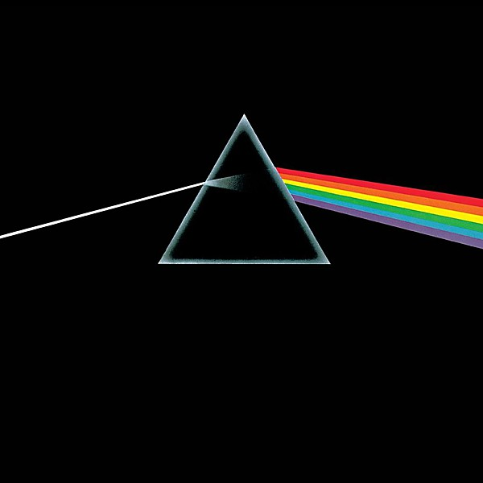

# The Dark Side of the Moon

By **Pink Floyd**

## Album Data

- **Catalog:** Beets
- **Format:** Digital, Album
- **Album:** The Dark Side of the Moon
- **Artist:** Pink Floyd
- **Albumartist:** Pink Floyd
- **Genre:** Psychedelic Rock
- **MusicBrainz Album Artist ID:** [83d91898-7763-47d7-b03b-b92132375c47](https://musicbrainz.org/artist/83d91898-7763-47d7-b03b-b92132375c47)
- **MusicBrainz Album ID:** [b8ee4313-2915-40f1-913d-ac0315b4ba3d](https://musicbrainz.org/release/b8ee4313-2915-40f1-913d-ac0315b4ba3d)
- **MusicBrainz Release Group ID:** [f5093c06-23e3-404f-aeaa-40f72885ee3a](https://musicbrainz.org/release-group/f5093c06-23e3-404f-aeaa-40f72885ee3a)
- **Year:** 1973
- **Catalog #:** 
- **Label:** 
- **Total Tracks:** 10

## Album Tracks

### Track 01 - Speak To Me [Live]

- **Artist:** Pink Floyd
- **Format:** ALAC
- **Genre:** Psychedelic Rock
- **Length:** 2:45
- **MusicBrainz Track ID:** 
- **Title:** Speak To Me [Live]
- **Track:** 01
- **Year:** 1974

### Track 02 - Breathe (In The Air) [Live]

- **Artist:** Pink Floyd
- **Format:** ALAC
- **Genre:** Psychedelic Rock
- **Length:** 2:50
- **MusicBrainz Track ID:** 
- **Title:** Breathe (In The Air) [Live]
- **Track:** 02
- **Year:** 1974

### Track 03 - On The Run [Live]

- **Artist:** Pink Floyd
- **Format:** ALAC
- **Genre:** Psychedelic Rock
- **Length:** 5:08
- **MusicBrainz Track ID:** 
- **Title:** On The Run [Live]
- **Track:** 03
- **Year:** 1974

### Track 04 - Time [Live]

- **Artist:** Pink Floyd
- **Format:** ALAC
- **Genre:** Psychedelic Rock
- **Length:** 6:31
- **MusicBrainz Track ID:** 
- **Title:** Time [Live]
- **Track:** 04
- **Year:** 1974

### Track 05 - The Great Gig In The Sky [Live]

- **Artist:** Pink Floyd
- **Format:** ALAC
- **Genre:** Psychedelic Rock
- **Length:** 6:50
- **MusicBrainz Track ID:** 
- **Title:** The Great Gig In The Sky [Live]
- **Track:** 05
- **Year:** 1974

### Track 06 - Money [Live]

- **Artist:** Pink Floyd
- **Format:** ALAC
- **Genre:** Psychedelic Rock
- **Length:** 8:41
- **MusicBrainz Track ID:** 
- **Title:** Money [Live]
- **Track:** 06
- **Year:** 1974

### Track 07 - Us And Them [Live]

- **Artist:** Pink Floyd
- **Format:** ALAC
- **Genre:** Psychedelic Rock
- **Length:** 8:09
- **MusicBrainz Track ID:** 
- **Title:** Us And Them [Live]
- **Track:** 07
- **Year:** 1974

### Track 08 - Any Colour You Like [Live]

- **Artist:** Pink Floyd
- **Format:** ALAC
- **Genre:** Psychedelic Rock
- **Length:** 8:10
- **MusicBrainz Track ID:** 
- **Title:** Any Colour You Like [Live]
- **Track:** 08
- **Year:** 1974

### Track 09 - Brain Damage [Live]

- **Artist:** Pink Floyd
- **Format:** ALAC
- **Genre:** Psychedelic Rock
- **Length:** 3:43
- **MusicBrainz Track ID:** 
- **Title:** Brain Damage [Live]
- **Track:** 09
- **Year:** 1974

### Track 10 - Eclipse [Live]

- **Artist:** Pink Floyd
- **Format:** ALAC
- **Genre:** Psychedelic Rock
- **Length:** 2:19
- **MusicBrainz Track ID:** 
- **Title:** Eclipse [Live]
- **Track:** 10
- **Year:** 1974

## See also

- [A Momentary Lapse of Reason](A_Momentary_Lapse_of_Reason.md)
- [Animals](Animals.md)
- [A Saucerful of Secrets](A_Saucerful_of_Secrets.md)
- [Echoes](Echoes_2.md)
- [Echoes](Echoes.md)
- [Is there anybody out there?](Is_there_anybody_out_there.md)
- [Meddle](Meddle.md)
- [Rome 6.5.1968 VPRO](Rome_651968_VPRO.md)
- [The Dark Side Of The Moon [Live] [Disc 2] [Remaster]](The_Dark_Side_Of_The_Moon_[Live]_[Disc_2]_[Remaster].md)
- [The Dark Side Of The Moon [Remaster]](The_Dark_Side_Of_The_Moon_[Remaster].md)
- [The Division Bell](The_Division_Bell.md)
- [The Endless River](The_Endless_River.md)
- [The Piper at the Gates of Dawn](The_Piper_at_the_Gates_of_Dawn.md)
- [The Wall [Remaster] [Disc 1]](The_Wall_[Remaster]_[Disc_1].md)
- [The Wall [Remaster] [Disc 2]](The_Wall_[Remaster]_[Disc_2].md)
- [Ummagumma](Ummagumma.md)
- [Wish You Were Here](Wish_You_Were_Here.md)
- [CD: Animals [2011 Remaster]](../../CD/Pink_Floyd/Animals_[2011_Remaster].md)
- [CD: A Saucerful Of Secrets](../../CD/Pink_Floyd/A_Saucerful_Of_Secrets.md)
- [CD: Meddle](../../CD/Pink_Floyd/Meddle.md)
- [CD: ](../../CD/Pink_Floyd/Pink_Floyd.md)
- [CD: The Dark Side Of The Moon - Immersion Box Set (Disc 1)](../../CD/Pink_Floyd/The_Dark_Side_Of_The_Moon_-_Immersion_Box_Set_Disc_1.md)
- [CD: The Division Bell](../../CD/Pink_Floyd/The_Division_Bell.md)
- [CD: The Wall (Disc 1)](../../CD/Pink_Floyd/The_Wall_Disc_1.md)
- [CD: The Wall (Disc 2)](../../CD/Pink_Floyd/The_Wall_Disc_2.md)
- [CD: Wish You Were Here](../../CD/Pink_Floyd/Wish_You_Were_Here.md)
- [Roon: A Momentary Lapse of Reason](../../Roon/Pink_Floyd/A_Momentary_Lapse_of_Reason.md)
- [Roon: Animals](../../Roon/Pink_Floyd/Animals.md)
- [Roon: Meddle](../../Roon/Pink_Floyd/Meddle.md)
- [Roon: The Dark Side of the Moon](../../Roon/Pink_Floyd/The_Dark_Side_of_the_Moon.md)
- [Roon: The Division Bell](../../Roon/Pink_Floyd/The_Division_Bell.md)
- [Roon: The Wall (Remastered 2011 Version)](../../Roon/Pink_Floyd/The_Wall_Remastered_2011_Version.md)
- [Roon: Wish You Were Here](../../Roon/Pink_Floyd/Wish_You_Were_Here.md)
- [Vinyl: A Momentary Lapse Of Reason](../../Vinyl/Pink_Floyd/A_Momentary_Lapse_Of_Reason.md)
- [Vinyl: Animals](../../Vinyl/Pink_Floyd/Animals.md)
- [Vinyl: Interstellar Overdrive](../../Vinyl/Pink_Floyd/Interstellar_Overdrive.md)
- [Vinyl: Meddle](../../Vinyl/Pink_Floyd/Meddle.md)
- [Vinyl: ](../../Vinyl/Pink_Floyd/Pink_Floyd.md)
- [Vinyl: The Dark Side Of The Moon](../../Vinyl/Pink_Floyd/The_Dark_Side_Of_The_Moon.md)
- [Vinyl: Wish You Were Here](../../Vinyl/Pink_Floyd/Wish_You_Were_Here.md)
