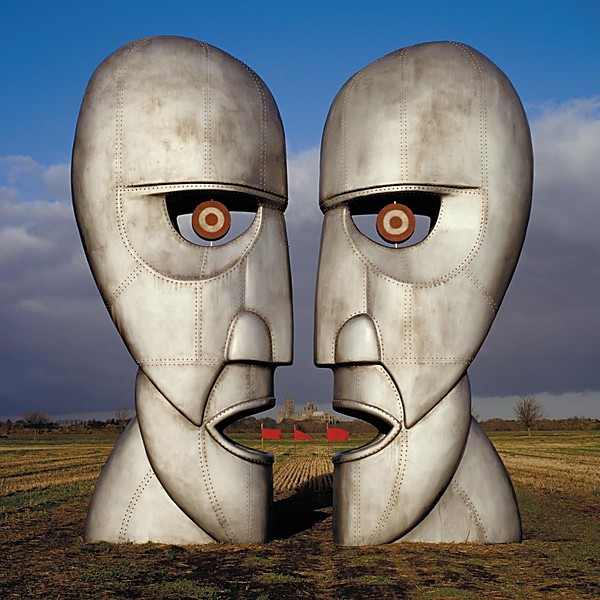

# The Division Bell

By **Pink Floyd**

## Album Data

- **Catalog:** Beets
- **Format:** Digital, Album
- **Album:** The Division Bell
- **Artist:** Pink Floyd
- **Albumartist:** Pink Floyd
- **Genre:** Psychedelic Rock
- **MusicBrainz Album Artist ID:** [83d91898-7763-47d7-b03b-b92132375c47](https://musicbrainz.org/artist/83d91898-7763-47d7-b03b-b92132375c47)
- **MusicBrainz Album ID:** [12eb7e4c-29a1-46d2-a971-f852655c7587](https://musicbrainz.org/release/12eb7e4c-29a1-46d2-a971-f852655c7587)
- **MusicBrainz Release Group ID:** [90878b63-f639-3c8b-aefb-190bdf3d1790](https://musicbrainz.org/release-group/90878b63-f639-3c8b-aefb-190bdf3d1790)
- **Year:** 1994
- **Catalog #:** 88875007882
- **Label:** Columbia
- **Total Tracks:** 18

## Album Tracks

### Track 01 - Things Left Unsaid

- **Artist:** Pink Floyd
- **Format:** ALAC
- **Genre:** Space Rock
- **Length:** 4:26
- **MusicBrainz Track ID:** [291c2097-08d2-4239-9f8c-3cd3f93609cf](https://musicbrainz.org/recording/291c2097-08d2-4239-9f8c-3cd3f93609cf)
- **Title:** Things Left Unsaid
- **Track:** 01
- **Year:** 2014

### Track 02 - It’s What We Do

- **Artist:** Pink Floyd
- **Format:** ALAC
- **Genre:** Space Rock
- **Length:** 6:17
- **MusicBrainz Track ID:** [ebe9f025-6164-4a4c-ad77-e6ec6a23b206](https://musicbrainz.org/recording/ebe9f025-6164-4a4c-ad77-e6ec6a23b206)
- **Title:** It’s What We Do
- **Track:** 02
- **Year:** 2014

### Track 03 - Ebb and Flow

- **Artist:** Pink Floyd
- **Format:** ALAC
- **Genre:** Space Rock
- **Length:** 1:55
- **MusicBrainz Track ID:** [0a11b84f-ac06-4a17-a4ae-a83c5aabd59f](https://musicbrainz.org/recording/0a11b84f-ac06-4a17-a4ae-a83c5aabd59f)
- **Title:** Ebb and Flow
- **Track:** 03
- **Year:** 2014

### Track 04 - Sum

- **Artist:** Pink Floyd
- **Format:** ALAC
- **Genre:** Space Rock
- **Length:** 4:48
- **MusicBrainz Track ID:** [26c54a1a-4f73-4811-ad55-d8cac23f2963](https://musicbrainz.org/recording/26c54a1a-4f73-4811-ad55-d8cac23f2963)
- **Title:** Sum
- **Track:** 04
- **Year:** 2014

### Track 05 - Skins

- **Artist:** Pink Floyd
- **Format:** ALAC
- **Genre:** Space Rock
- **Length:** 2:37
- **MusicBrainz Track ID:** [e52a5405-eec0-4f2a-9f3c-0f800e1164e3](https://musicbrainz.org/recording/e52a5405-eec0-4f2a-9f3c-0f800e1164e3)
- **Title:** Skins
- **Track:** 05
- **Year:** 2014

### Track 06 - Unsung

- **Artist:** Pink Floyd
- **Format:** ALAC
- **Genre:** Space Rock
- **Length:** 1:07
- **MusicBrainz Track ID:** [0d4286aa-eabb-4e31-ba71-0815ef75734d](https://musicbrainz.org/recording/0d4286aa-eabb-4e31-ba71-0815ef75734d)
- **Title:** Unsung
- **Track:** 06
- **Year:** 2014

### Track 07 - Anisina

- **Artist:** Pink Floyd
- **Format:** ALAC
- **Genre:** Space Rock
- **Length:** 3:16
- **MusicBrainz Track ID:** [bb32b901-9677-4eb8-a636-65f3ba0cafe2](https://musicbrainz.org/recording/bb32b901-9677-4eb8-a636-65f3ba0cafe2)
- **Title:** Anisina
- **Track:** 07
- **Year:** 2014

### Track 08 - The Lost Art of Conversation

- **Artist:** Pink Floyd
- **Format:** ALAC
- **Genre:** Space Rock
- **Length:** 1:42
- **MusicBrainz Track ID:** [564ccd5c-c4d3-4752-9abf-c33bb085d6a5](https://musicbrainz.org/recording/564ccd5c-c4d3-4752-9abf-c33bb085d6a5)
- **Title:** The Lost Art of Conversation
- **Track:** 08
- **Year:** 2014

### Track 09 - On Noodle Street

- **Artist:** Pink Floyd
- **Format:** ALAC
- **Genre:** Space Rock
- **Length:** 1:42
- **MusicBrainz Track ID:** [7f3394f6-bfa1-414a-b9bd-50b6342eae0c](https://musicbrainz.org/recording/7f3394f6-bfa1-414a-b9bd-50b6342eae0c)
- **Title:** On Noodle Street
- **Track:** 09
- **Year:** 2014

### Track 10 - Night Light

- **Artist:** Pink Floyd
- **Format:** ALAC
- **Genre:** Space Rock
- **Length:** 1:42
- **MusicBrainz Track ID:** [190212c0-4299-4a9b-959b-6f534d84ed5a](https://musicbrainz.org/recording/190212c0-4299-4a9b-959b-6f534d84ed5a)
- **Title:** Night Light
- **Track:** 10
- **Year:** 2014

### Track 11 - Allons‐y (1)

- **Artist:** Pink Floyd
- **Format:** ALAC
- **Genre:** Space Rock
- **Length:** 1:57
- **MusicBrainz Track ID:** [3193430d-347f-4e6b-9853-182e8f686504](https://musicbrainz.org/recording/3193430d-347f-4e6b-9853-182e8f686504)
- **Title:** Allons‐y (1)
- **Track:** 11
- **Year:** 2014

### Track 12 - Autumn ’68

- **Artist:** Pink Floyd
- **Format:** ALAC
- **Genre:** Space Rock
- **Length:** 1:35
- **MusicBrainz Track ID:** [7ab71073-7e10-4509-8b94-caf636b97be4](https://musicbrainz.org/recording/7ab71073-7e10-4509-8b94-caf636b97be4)
- **Title:** Autumn ’68
- **Track:** 12
- **Year:** 2014

### Track 13 - Allons‐y (2)

- **Artist:** Pink Floyd
- **Format:** ALAC
- **Genre:** Space Rock
- **Length:** 1:32
- **MusicBrainz Track ID:** [dbbd46e2-ff0c-414c-8180-dcfa15c826d0](https://musicbrainz.org/recording/dbbd46e2-ff0c-414c-8180-dcfa15c826d0)
- **Title:** Allons‐y (2)
- **Track:** 13
- **Year:** 2014

### Track 14 - Talkin’ Hawkin’

- **Artist:** Pink Floyd
- **Format:** ALAC
- **Genre:** Space Rock
- **Length:** 3:29
- **MusicBrainz Track ID:** [ce453a0a-559e-4462-8fb0-8ca5b3650115](https://musicbrainz.org/recording/ce453a0a-559e-4462-8fb0-8ca5b3650115)
- **Title:** Talkin’ Hawkin’
- **Track:** 14
- **Year:** 2014

### Track 15 - Calling

- **Artist:** Pink Floyd
- **Format:** ALAC
- **Genre:** Space Rock
- **Length:** 3:37
- **MusicBrainz Track ID:** [751e4239-a3ac-43e6-84b3-1ccea502f79d](https://musicbrainz.org/recording/751e4239-a3ac-43e6-84b3-1ccea502f79d)
- **Title:** Calling
- **Track:** 15
- **Year:** 2014

### Track 16 - Eyes to Pearls

- **Artist:** Pink Floyd
- **Format:** ALAC
- **Genre:** Space Rock
- **Length:** 1:51
- **MusicBrainz Track ID:** [0fd90c62-807f-4e12-a0bd-69eed314d5e7](https://musicbrainz.org/recording/0fd90c62-807f-4e12-a0bd-69eed314d5e7)
- **Title:** Eyes to Pearls
- **Track:** 16
- **Year:** 2014

### Track 17 - Surfacing

- **Artist:** Pink Floyd
- **Format:** ALAC
- **Genre:** Space Rock
- **Length:** 2:46
- **MusicBrainz Track ID:** [5c87bdf7-d609-41a3-9d6c-02a4b677f250](https://musicbrainz.org/recording/5c87bdf7-d609-41a3-9d6c-02a4b677f250)
- **Title:** Surfacing
- **Track:** 17
- **Year:** 2014

### Track 18 - Louder Than Words

- **Artist:** Pink Floyd
- **Format:** ALAC
- **Genre:** Psychedelic Rock
- **Length:** 6:36
- **MusicBrainz Track ID:** [1e46a5a0-f6ac-4f88-b4af-be527d062742](https://musicbrainz.org/recording/1e46a5a0-f6ac-4f88-b4af-be527d062742)
- **Title:** Louder Than Words
- **Track:** 18
- **Year:** 2014

