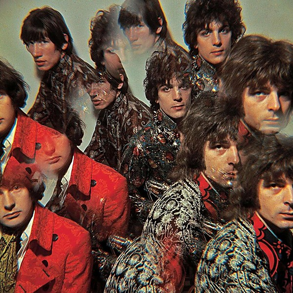

# The Piper at the Gates of Dawn

By **Pink Floyd**

## Album Data

- **Catalog:** Beets
- **Format:** Digital, Album
- **Album:** The Piper at the Gates of Dawn
- **Artist:** Pink Floyd
- **Albumartist:** Pink Floyd
- **Genre:** Space Rock
- **MusicBrainz Album Artist ID:** [83d91898-7763-47d7-b03b-b92132375c47](https://musicbrainz.org/artist/83d91898-7763-47d7-b03b-b92132375c47)
- **MusicBrainz Album ID:** [e5dbfab6-f9d5-3993-80c0-57c71765c7c2](https://musicbrainz.org/release/e5dbfab6-f9d5-3993-80c0-57c71765c7c2)
- **MusicBrainz Release Group ID:** [6792b6d1-4e65-3c3c-9d20-d08aa1dcfc60](https://musicbrainz.org/release-group/6792b6d1-4e65-3c3c-9d20-d08aa1dcfc60)
- **Year:** 1997
- **Catalog #:** 
- **Label:** 
- **Total Tracks:** 13

## Album Tracks

### Track 01 - In The Flesh?

- **Artist:** Pink Floyd
- **Format:** ALAC
- **Genre:** Psychedelic Rock
- **Length:** 3:20
- **MusicBrainz Track ID:** 
- **Title:** In The Flesh?
- **Track:** 01
- **Year:** 2011

### Track 02 - The Thin Ice

- **Artist:** Pink Floyd
- **Format:** ALAC
- **Genre:** Psychedelic Rock
- **Length:** 2:26
- **MusicBrainz Track ID:** 
- **Title:** The Thin Ice
- **Track:** 02
- **Year:** 2011

### Track 03 - Another Brick In The Wall (Part 1)

- **Artist:** Pink Floyd
- **Format:** ALAC
- **Genre:** Psychedelic Rock
- **Length:** 3:11
- **MusicBrainz Track ID:** 
- **Title:** Another Brick In The Wall (Part 1)
- **Track:** 03
- **Year:** 2011

### Track 04 - The Happiest Days Of Our Lives

- **Artist:** Pink Floyd
- **Format:** ALAC
- **Genre:** Psychedelic Rock
- **Length:** 1:50
- **MusicBrainz Track ID:** 
- **Title:** The Happiest Days Of Our Lives
- **Track:** 04
- **Year:** 2011

### Track 05 - Another Brick In The Wall (Part 2)

- **Artist:** Pink Floyd
- **Format:** ALAC
- **Genre:** Psychedelic Rock
- **Length:** 3:58
- **MusicBrainz Track ID:** 
- **Title:** Another Brick In The Wall (Part 2)
- **Track:** 05
- **Year:** 2011

### Track 06 - Mother

- **Artist:** Pink Floyd
- **Format:** ALAC
- **Genre:** Psychedelic Rock
- **Length:** 5:34
- **MusicBrainz Track ID:** 
- **Title:** Mother
- **Track:** 06
- **Year:** 2011

### Track 07 - Goodbye Blue Sky

- **Artist:** Pink Floyd
- **Format:** ALAC
- **Genre:** Psychedelic Rock
- **Length:** 2:47
- **MusicBrainz Track ID:** 
- **Title:** Goodbye Blue Sky
- **Track:** 07
- **Year:** 2011

### Track 08 - Empty Spaces

- **Artist:** Pink Floyd
- **Format:** ALAC
- **Genre:** Psychedelic Rock
- **Length:** 2:07
- **MusicBrainz Track ID:** 
- **Title:** Empty Spaces
- **Track:** 08
- **Year:** 2011

### Track 09 - Young Lust

- **Artist:** Pink Floyd
- **Format:** ALAC
- **Genre:** Psychedelic Rock
- **Length:** 3:29
- **MusicBrainz Track ID:** 
- **Title:** Young Lust
- **Track:** 09
- **Year:** 2011

### Track 10 - One Of My Turns

- **Artist:** Pink Floyd
- **Format:** ALAC
- **Genre:** Psychedelic Rock
- **Length:** 3:36
- **MusicBrainz Track ID:** 
- **Title:** One Of My Turns
- **Track:** 10
- **Year:** 2011

### Track 11 - Don't Leave Me Now

- **Artist:** Pink Floyd
- **Format:** ALAC
- **Genre:** Psychedelic Rock
- **Length:** 4:15
- **MusicBrainz Track ID:** 
- **Title:** Don't Leave Me Now
- **Track:** 11
- **Year:** 2011

### Track 12 - Another Brick In The Wall (Part 3)

- **Artist:** Pink Floyd
- **Format:** ALAC
- **Genre:** Psychedelic Rock
- **Length:** 1:14
- **MusicBrainz Track ID:** 
- **Title:** Another Brick In The Wall (Part 3)
- **Track:** 12
- **Year:** 2011

### Track 13 - Goodbye Cruel World

- **Artist:** Pink Floyd
- **Format:** ALAC
- **Genre:** Psychedelic Rock
- **Length:** 1:17
- **MusicBrainz Track ID:** 
- **Title:** Goodbye Cruel World
- **Track:** 13
- **Year:** 2011

## See also

- [A Momentary Lapse of Reason](A_Momentary_Lapse_of_Reason.md)
- [Animals](Animals.md)
- [A Saucerful of Secrets](A_Saucerful_of_Secrets.md)
- [Echoes](Echoes_2.md)
- [Echoes](Echoes.md)
- [Is there anybody out there?](Is_there_anybody_out_there.md)
- [Meddle](Meddle.md)
- [Rome 6.5.1968 VPRO](Rome_651968_VPRO.md)
- [The Dark Side Of The Moon [Live] [Disc 2] [Remaster]](The_Dark_Side_Of_The_Moon_[Live]_[Disc_2]_[Remaster].md)
- [The Dark Side of the Moon](The_Dark_Side_of_the_Moon.md)
- [The Dark Side Of The Moon [Remaster]](The_Dark_Side_Of_The_Moon_[Remaster].md)
- [The Division Bell](The_Division_Bell.md)
- [The Endless River](The_Endless_River.md)
- [The Wall [Remaster] [Disc 1]](The_Wall_[Remaster]_[Disc_1].md)
- [The Wall [Remaster] [Disc 2]](The_Wall_[Remaster]_[Disc_2].md)
- [Ummagumma](Ummagumma.md)
- [Wish You Were Here](Wish_You_Were_Here.md)
- [CD: Animals [2011 Remaster]](../../CD/Pink_Floyd/Animals_[2011_Remaster].md)
- [CD: A Saucerful Of Secrets](../../CD/Pink_Floyd/A_Saucerful_Of_Secrets.md)
- [CD: Meddle](../../CD/Pink_Floyd/Meddle.md)
- [CD: ](../../CD/Pink_Floyd/Pink_Floyd.md)
- [CD: The Dark Side Of The Moon - Immersion Box Set (Disc 1)](../../CD/Pink_Floyd/The_Dark_Side_Of_The_Moon_-_Immersion_Box_Set_Disc_1.md)
- [CD: The Division Bell](../../CD/Pink_Floyd/The_Division_Bell.md)
- [CD: The Wall (Disc 1)](../../CD/Pink_Floyd/The_Wall_Disc_1.md)
- [CD: The Wall (Disc 2)](../../CD/Pink_Floyd/The_Wall_Disc_2.md)
- [CD: Wish You Were Here](../../CD/Pink_Floyd/Wish_You_Were_Here.md)
- [Roon: A Momentary Lapse of Reason](../../Roon/Pink_Floyd/A_Momentary_Lapse_of_Reason.md)
- [Roon: Animals](../../Roon/Pink_Floyd/Animals.md)
- [Roon: Meddle](../../Roon/Pink_Floyd/Meddle.md)
- [Roon: The Dark Side of the Moon](../../Roon/Pink_Floyd/The_Dark_Side_of_the_Moon.md)
- [Roon: The Division Bell](../../Roon/Pink_Floyd/The_Division_Bell.md)
- [Roon: The Wall (Remastered 2011 Version)](../../Roon/Pink_Floyd/The_Wall_Remastered_2011_Version.md)
- [Roon: Wish You Were Here](../../Roon/Pink_Floyd/Wish_You_Were_Here.md)
- [Vinyl: A Momentary Lapse Of Reason](../../Vinyl/Pink_Floyd/A_Momentary_Lapse_Of_Reason.md)
- [Vinyl: Animals](../../Vinyl/Pink_Floyd/Animals.md)
- [Vinyl: Interstellar Overdrive](../../Vinyl/Pink_Floyd/Interstellar_Overdrive.md)
- [Vinyl: Meddle](../../Vinyl/Pink_Floyd/Meddle.md)
- [Vinyl: ](../../Vinyl/Pink_Floyd/Pink_Floyd.md)
- [Vinyl: The Dark Side Of The Moon](../../Vinyl/Pink_Floyd/The_Dark_Side_Of_The_Moon.md)
- [Vinyl: Wish You Were Here](../../Vinyl/Pink_Floyd/Wish_You_Were_Here.md)
