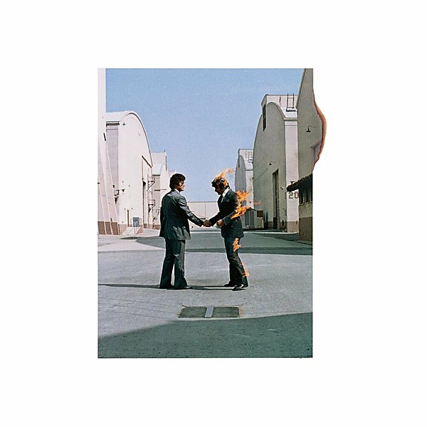

# Wish You Were Here

By **Pink Floyd**

## Album Data

- **Catalog:** Beets
- **Format:** Digital, Album
- **Album:** Wish You Were Here
- **Artist:** Pink Floyd
- **Albumartist:** Pink Floyd
- **Genre:** Psychedelic Rock
- **MusicBrainz Album Artist ID:** [83d91898-7763-47d7-b03b-b92132375c47](https://musicbrainz.org/artist/83d91898-7763-47d7-b03b-b92132375c47)
- **MusicBrainz Album ID:** [f4a8aa35-da90-33d8-9307-c630d38a2bed](https://musicbrainz.org/release/f4a8aa35-da90-33d8-9307-c630d38a2bed)
- **MusicBrainz Release Group ID:** [1a272023-10d3-38ee-bab3-317b55fcc21d](https://musicbrainz.org/release-group/1a272023-10d3-38ee-bab3-317b55fcc21d)
- **Year:** 1975
- **Catalog #:** PC 33453
- **Label:** Columbia
- **Total Tracks:** 05

## Album Tracks

### Track 01 - Shine On You Crazy Diamond, Parts I–V

- **Artist:** Pink Floyd
- **Format:** ALAC
- **Genre:** Psychedelic Rock
- **Length:** 13:40
- **MusicBrainz Track ID:** [54029746-25ba-4f88-9885-387ac581e45f](https://musicbrainz.org/recording/54029746-25ba-4f88-9885-387ac581e45f)
- **Title:** Shine On You Crazy Diamond, Parts I–V
- **Track:** 01
- **Year:** 1975

### Track 02 - Welcome to the Machine

- **Artist:** Pink Floyd
- **Format:** ALAC
- **Genre:** Space Rock
- **Length:** 7:31
- **MusicBrainz Track ID:** [3794be20-3b5c-41e8-99d5-1d5649fe3821](https://musicbrainz.org/recording/3794be20-3b5c-41e8-99d5-1d5649fe3821)
- **Title:** Welcome to the Machine
- **Track:** 02
- **Year:** 1975

### Track 03 - Have a Cigar

- **Artist:** Pink Floyd
- **Format:** ALAC
- **Genre:** Psychedelic Rock
- **Length:** 5:08
- **MusicBrainz Track ID:** [29fba82a-3a79-484d-9595-251745359ee6](https://musicbrainz.org/recording/29fba82a-3a79-484d-9595-251745359ee6)
- **Title:** Have a Cigar
- **Track:** 03
- **Year:** 1975

### Track 04 - Wish You Were Here

- **Artist:** Pink Floyd
- **Format:** ALAC
- **Genre:** Psychedelic Rock
- **Length:** 5:34
- **MusicBrainz Track ID:** [feecff58-8ee2-4a7f-ac23-dc8ce7925286](https://musicbrainz.org/recording/feecff58-8ee2-4a7f-ac23-dc8ce7925286)
- **Title:** Wish You Were Here
- **Track:** 04
- **Year:** 1975

### Track 05 - Shine On You Crazy Diamond, Parts VI–IX

- **Artist:** Pink Floyd
- **Format:** ALAC
- **Genre:** Psychedelic Rock
- **Length:** 12:31
- **MusicBrainz Track ID:** [5bdf011c-a186-4c1c-b7b6-e0faed39d4c3](https://musicbrainz.org/recording/5bdf011c-a186-4c1c-b7b6-e0faed39d4c3)
- **Title:** Shine On You Crazy Diamond, Parts VI–IX
- **Track:** 05
- **Year:** 1975

## See also

- [A Momentary Lapse of Reason](A_Momentary_Lapse_of_Reason.md)
- [Animals](Animals.md)
- [A Saucerful of Secrets](A_Saucerful_of_Secrets.md)
- [Echoes](Echoes_2.md)
- [Echoes](Echoes.md)
- [Is there anybody out there?](Is_there_anybody_out_there.md)
- [Meddle](Meddle.md)
- [Rome 6.5.1968 VPRO](Rome_651968_VPRO.md)
- [The Dark Side Of The Moon [Live] [Disc 2] [Remaster]](The_Dark_Side_Of_The_Moon_[Live]_[Disc_2]_[Remaster].md)
- [The Dark Side of the Moon](The_Dark_Side_of_the_Moon.md)
- [The Dark Side Of The Moon [Remaster]](The_Dark_Side_Of_The_Moon_[Remaster].md)
- [The Division Bell](The_Division_Bell.md)
- [The Endless River](The_Endless_River.md)
- [The Piper at the Gates of Dawn](The_Piper_at_the_Gates_of_Dawn.md)
- [The Wall [Remaster] [Disc 1]](The_Wall_[Remaster]_[Disc_1].md)
- [The Wall [Remaster] [Disc 2]](The_Wall_[Remaster]_[Disc_2].md)
- [Ummagumma](Ummagumma.md)
- [CD: Animals [2011 Remaster]](../../CD/Pink_Floyd/Animals_[2011_Remaster].md)
- [CD: A Saucerful Of Secrets](../../CD/Pink_Floyd/A_Saucerful_Of_Secrets.md)
- [CD: Meddle](../../CD/Pink_Floyd/Meddle.md)
- [CD: ](../../CD/Pink_Floyd/Pink_Floyd.md)
- [CD: The Dark Side Of The Moon - Immersion Box Set (Disc 1)](../../CD/Pink_Floyd/The_Dark_Side_Of_The_Moon_-_Immersion_Box_Set_Disc_1.md)
- [CD: The Division Bell](../../CD/Pink_Floyd/The_Division_Bell.md)
- [CD: The Wall (Disc 1)](../../CD/Pink_Floyd/The_Wall_Disc_1.md)
- [CD: The Wall (Disc 2)](../../CD/Pink_Floyd/The_Wall_Disc_2.md)
- [CD: Wish You Were Here](../../CD/Pink_Floyd/Wish_You_Were_Here.md)
- [Roon: A Momentary Lapse of Reason](../../Roon/Pink_Floyd/A_Momentary_Lapse_of_Reason.md)
- [Roon: Animals](../../Roon/Pink_Floyd/Animals.md)
- [Roon: Meddle](../../Roon/Pink_Floyd/Meddle.md)
- [Roon: The Dark Side of the Moon](../../Roon/Pink_Floyd/The_Dark_Side_of_the_Moon.md)
- [Roon: The Division Bell](../../Roon/Pink_Floyd/The_Division_Bell.md)
- [Roon: The Wall (Remastered 2011 Version)](../../Roon/Pink_Floyd/The_Wall_Remastered_2011_Version.md)
- [Roon: Wish You Were Here](../../Roon/Pink_Floyd/Wish_You_Were_Here.md)
- [Vinyl: A Momentary Lapse Of Reason](../../Vinyl/Pink_Floyd/A_Momentary_Lapse_Of_Reason.md)
- [Vinyl: Animals](../../Vinyl/Pink_Floyd/Animals.md)
- [Vinyl: Interstellar Overdrive](../../Vinyl/Pink_Floyd/Interstellar_Overdrive.md)
- [Vinyl: Meddle](../../Vinyl/Pink_Floyd/Meddle.md)
- [Vinyl: ](../../Vinyl/Pink_Floyd/Pink_Floyd.md)
- [Vinyl: The Dark Side Of The Moon](../../Vinyl/Pink_Floyd/The_Dark_Side_Of_The_Moon.md)
- [Vinyl: Wish You Were Here](../../Vinyl/Pink_Floyd/Wish_You_Were_Here.md)
