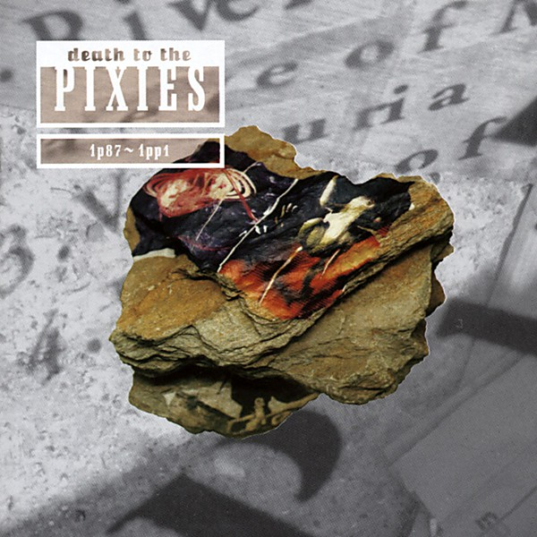

# Death to the Pixies

By **Pixies**

## Album Data

- **Catalog:** Beets
- **Format:** Digital, Album
- **Album:** Death to the Pixies
- **Artist:** Pixies
- **Albumartist:** Pixies
- **Genre:** Noise Pop
- **MusicBrainz Album Artist ID:** [b6b2bb8d-54a9-491f-9607-7b546023b433](https://musicbrainz.org/artist/b6b2bb8d-54a9-491f-9607-7b546023b433)
- **MusicBrainz Album ID:** [3d19354e-7676-46d8-9d14-5e25ea3ed1f1](https://musicbrainz.org/release/3d19354e-7676-46d8-9d14-5e25ea3ed1f1)
- **MusicBrainz Release Group ID:** [e70cdd99-5bcc-3183-8a18-c2e913d3939d](https://musicbrainz.org/release-group/e70cdd99-5bcc-3183-8a18-c2e913d3939d)
- **Year:** 1997
- **Catalog #:** 
- **Label:** 
- **Total Tracks:** 00

## Album Tracks

### Track 00 - Mr. Grieves

- **Artist:** Pixies
- **Format:** AAC
- **Genre:** Noise Pop
- **Length:** 2:05
- **MusicBrainz Track ID:** 
- **Title:** Mr. Grieves
- **Track:** 00
- **Year:** 1989

## See also

- [Doolittle](Doolittle.md)
- [Fight Club OST](Fight_Club_OST.md)
- [Roon: Bossanova](../../Roon/Pixies/Bossanova.md)
- [Roon: Doolittle](../../Roon/Pixies/Doolittle.md)
- [Roon: Surfer Rosa (Remastered)](../../Roon/Pixies/Surfer_Rosa_Remastered.md)
- [Roon: Trompe le Monde](../../Roon/Pixies/Trompe_le_Monde.md)
