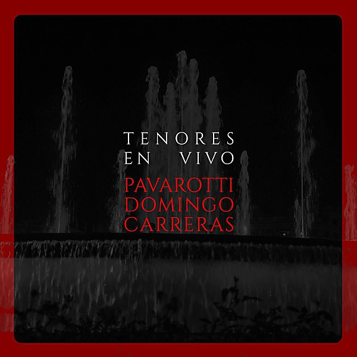

# Carreras Domingo Pavarotti In Concert

By **Placido Domingo**

## Album Data

- **Catalog:** Beets
- **Format:** Digital, Album
- **Album:** Carreras Domingo Pavarotti In Concert
- **Artist:** Placido Domingo
- **Albumartist:** Placido Domingo
- **Genre:** Opera
- **MusicBrainz Album Artist ID:** 
- **MusicBrainz Album ID:** 
- **MusicBrainz Release Group ID:** 
- **Year:** 0000
- **Catalog #:** 
- **Label:** 
- **Total Tracks:** 00

## Album Tracks

### Track 11 - E lucevan le stelle -from Tosca by Puccini - Placido Domingo

- **Artist:** Placido Domingo
- **Format:** MP3
- **Genre:** Opera
- **Length:** 2:40
- **MusicBrainz Track ID:** 
- **Title:** E lucevan le stelle -from Tosca by Puccini - Placido Domingo
- **Track:** 11
- **Year:** 0000

