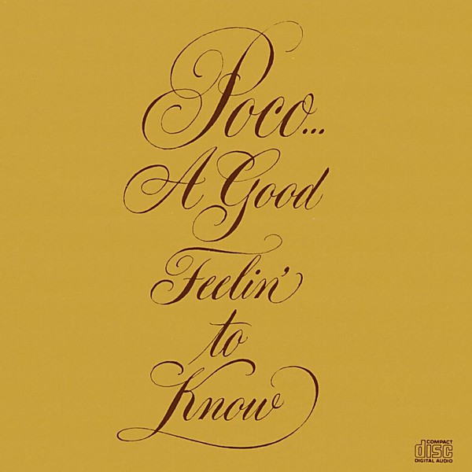

# A Good Feelin' To Know

By **Poco**

## Album Data

- **Catalog:** Beets
- **Format:** Digital, Album
- **Album:** A Good Feelin' To Know
- **Artist:** Poco
- **Albumartist:** Poco
- **Genre:** Soft Rock
- **MusicBrainz Album Artist ID:** [459ecf74-7f1f-434c-a304-73b78e9cdc97](https://musicbrainz.org/artist/459ecf74-7f1f-434c-a304-73b78e9cdc97)
- **MusicBrainz Album ID:** [c248df4c-3aee-484c-913f-68c946c39a15](https://musicbrainz.org/release/c248df4c-3aee-484c-913f-68c946c39a15)
- **MusicBrainz Release Group ID:** [bac65633-65bd-315b-a59a-ecf8d5e8489e](https://musicbrainz.org/release-group/bac65633-65bd-315b-a59a-ecf8d5e8489e)
- **Year:** 1989
- **Catalog #:** 
- **Label:** Legacy
- **Total Tracks:** 12

## Album Tracks

### Track 01 - Hoe Down

- **Artist:** Poco
- **Format:** ALAC
- **Genre:** Country Rock
- **Length:** 2:07
- **MusicBrainz Track ID:** [2d686691-cc46-4bd6-93b6-396cf9e1de4d](https://musicbrainz.org/recording/2d686691-cc46-4bd6-93b6-396cf9e1de4d)
- **Title:** Hoe Down
- **Track:** 01
- **Year:** 2014

### Track 02 - Bad Weather

- **Artist:** Poco
- **Format:** ALAC
- **Genre:** Southern Rock
- **Length:** 5:04
- **MusicBrainz Track ID:** [d17a0e17-263a-43ee-a99b-98b047df54d3](https://musicbrainz.org/recording/d17a0e17-263a-43ee-a99b-98b047df54d3)
- **Title:** Bad Weather
- **Track:** 02
- **Year:** 2014

### Track 03 - What Am I Gonna Do

- **Artist:** Poco
- **Format:** ALAC
- **Genre:** Soft Rock
- **Length:** 3:49
- **MusicBrainz Track ID:** [e4f3c71c-8234-4d86-a217-d0103edcc628](https://musicbrainz.org/recording/e4f3c71c-8234-4d86-a217-d0103edcc628)
- **Title:** What Am I Gonna Do
- **Track:** 03
- **Year:** 2014

### Track 04 - You Are the One

- **Artist:** Poco
- **Format:** ALAC
- **Genre:** Soft Rock
- **Length:** 3:52
- **MusicBrainz Track ID:** [a1dc169c-b8a4-4987-858d-23a9534ed63b](https://musicbrainz.org/recording/a1dc169c-b8a4-4987-858d-23a9534ed63b)
- **Title:** You Are the One
- **Track:** 04
- **Year:** 2014

### Track 05 - Railroad Days

- **Artist:** Poco
- **Format:** ALAC
- **Genre:** Soft Rock
- **Length:** 3:38
- **MusicBrainz Track ID:** [08d47b35-ae84-4cf1-9d9a-dccfb1899b27](https://musicbrainz.org/recording/08d47b35-ae84-4cf1-9d9a-dccfb1899b27)
- **Title:** Railroad Days
- **Track:** 05
- **Year:** 2014

### Track 06 - From the Inside

- **Artist:** Poco
- **Format:** ALAC
- **Genre:** Soft Rock
- **Length:** 3:13
- **MusicBrainz Track ID:** [3de8de50-f5de-46e6-8b84-4c7db37b1a62](https://musicbrainz.org/recording/3de8de50-f5de-46e6-8b84-4c7db37b1a62)
- **Title:** From the Inside
- **Track:** 06
- **Year:** 2014

### Track 07 - Do You Feel It Too

- **Artist:** Poco
- **Format:** ALAC
- **Genre:** Soft Rock
- **Length:** 5:35
- **MusicBrainz Track ID:** [3117e358-35dc-4816-b0fa-f1daf01901f7](https://musicbrainz.org/recording/3117e358-35dc-4816-b0fa-f1daf01901f7)
- **Title:** Do You Feel It Too
- **Track:** 07
- **Year:** 2014

### Track 08 - Ol’ Forgiver

- **Artist:** Poco
- **Format:** ALAC
- **Genre:** Soft Rock
- **Length:** 3:42
- **MusicBrainz Track ID:** [5ce12ad8-bf6f-4757-9e9d-1aa0cd372a43](https://musicbrainz.org/recording/5ce12ad8-bf6f-4757-9e9d-1aa0cd372a43)
- **Title:** Ol’ Forgiver
- **Track:** 08
- **Year:** 2014

### Track 09 - What If I Should Say I Love You

- **Artist:** Poco
- **Format:** ALAC
- **Genre:** Soft Rock
- **Length:** 3:36
- **MusicBrainz Track ID:** [17d8498b-9c6b-4077-a8b9-07b8a969645f](https://musicbrainz.org/recording/17d8498b-9c6b-4077-a8b9-07b8a969645f)
- **Title:** What If I Should Say I Love You
- **Track:** 09
- **Year:** 2014

### Track 10 - Just for Me and You

- **Artist:** Poco
- **Format:** ALAC
- **Genre:** Country Rock
- **Length:** 3:44
- **MusicBrainz Track ID:** [9d25f8d7-4aae-4d88-98cd-46a12ef9f822](https://musicbrainz.org/recording/9d25f8d7-4aae-4d88-98cd-46a12ef9f822)
- **Title:** Just for Me and You
- **Track:** 10
- **Year:** 2014

### Track 11 - C’mon

- **Artist:** Poco
- **Format:** ALAC
- **Genre:** Soft Rock
- **Length:** 2:54
- **MusicBrainz Track ID:** [61d7ce60-9e7b-4fb5-9d2f-dc3e0f1d5480](https://musicbrainz.org/recording/61d7ce60-9e7b-4fb5-9d2f-dc3e0f1d5480)
- **Title:** C’mon
- **Track:** 11
- **Year:** 2014

### Track 12 - A Man Like Me

- **Artist:** Poco
- **Format:** ALAC
- **Genre:** Soft Rock
- **Length:** 3:36
- **MusicBrainz Track ID:** [a6fd365c-e9b5-47ab-9fe0-4a12d1e8e8fe](https://musicbrainz.org/recording/a6fd365c-e9b5-47ab-9fe0-4a12d1e8e8fe)
- **Title:** A Man Like Me
- **Track:** 12
- **Year:** 2014

## See also

- [From the Inside](From_the_Inside.md)
- [Poco](Poco.md)
- [Roon: A Good Feelin' To Know](../../Roon/Poco/A_Good_Feelin_To_Know.md)
- [Roon: Crazy Eyes](../../Roon/Poco/Crazy_Eyes.md)
- [Vinyl: Crazy Eyes](../../Vinyl/Poco/Crazy_Eyes.md)
- [Vinyl: ](../../Vinyl/Poco/Poco.md)
