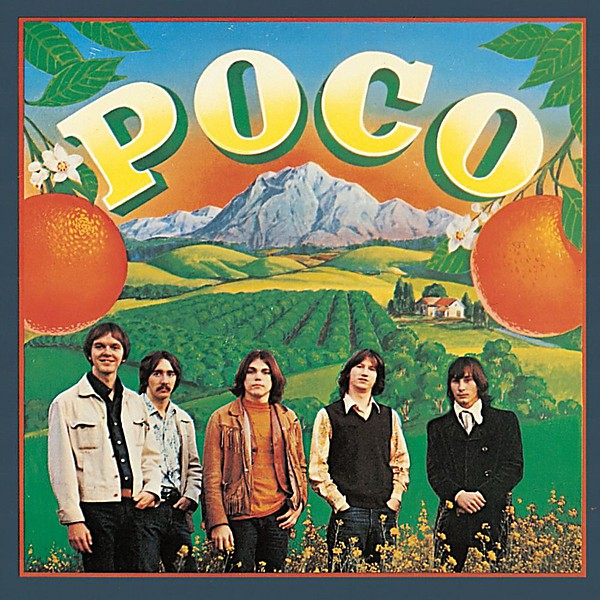

# Poco

By **Poco**

## Album Data

- **Catalog:** Beets
- **Format:** Digital, Album
- **Album:** Poco
- **Artist:** Poco
- **Albumartist:** Poco
- **Genre:** Soft Rock
- **MusicBrainz Album Artist ID:** 
- **MusicBrainz Album ID:** 
- **MusicBrainz Release Group ID:** 
- **Year:** 0000
- **Catalog #:** 
- **Label:** 
- **Total Tracks:** 00

## Album Tracks

### Track 00 - Crazy Eyes

- **Artist:** Poco
- **Format:** AAC
- **Genre:** Progressive Rock
- **Length:** 9:38
- **MusicBrainz Track ID:** 
- **Title:** Crazy Eyes
- **Track:** 00
- **Year:** 0000

## See also

- [A Good Feelin' To Know](A_Good_Feelin_To_Know.md)
- [From the Inside](From_the_Inside.md)
- [Roon: A Good Feelin' To Know](../../Roon/Poco/A_Good_Feelin_To_Know.md)
- [Roon: Crazy Eyes](../../Roon/Poco/Crazy_Eyes.md)
- [Vinyl: Crazy Eyes](../../Vinyl/Poco/Crazy_Eyes.md)
- [Vinyl: ](../../Vinyl/Poco/Poco.md)
