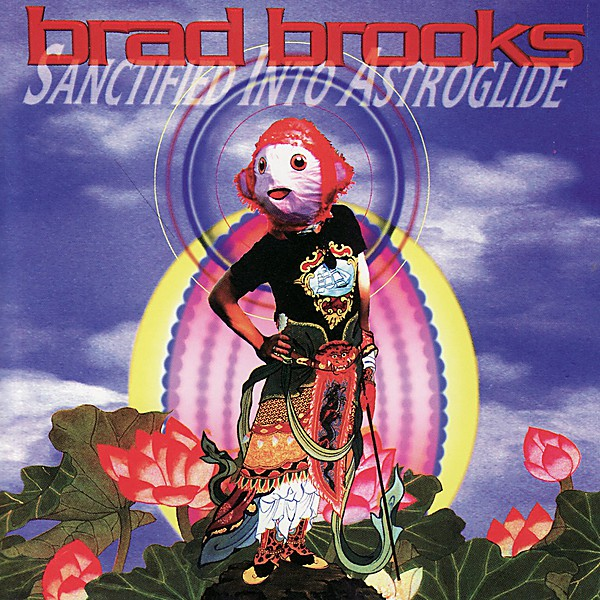

# Power Pop Prime - Volume 7

By **Pop Geek Heaven**

## Album Data

- **Catalog:** Beets
- **Format:** Digital, Album
- **Album:** Power Pop Prime - Volume 7
- **Artist:** Pop Geek Heaven
- **Albumartist:** Pop Geek Heaven
- **Genre:** Unknown
- **MusicBrainz Album Artist ID:** 
- **MusicBrainz Album ID:** 
- **MusicBrainz Release Group ID:** 
- **Year:** 0000
- **Catalog #:** 
- **Label:** 
- **Total Tracks:** 18

## Album Tracks

### Track 07 - Silk from Ashes

- **Artist:** Adrian Bourgeois
- **Format:** MP3
- **Genre:** Indie Pop
- **Length:** 3:39
- **MusicBrainz Track ID:** 
- **Title:** Silk from Ashes
- **Track:** 07
- **Year:** 0000

### Track 15 - Whisper Softly

- **Artist:** Andy Bopp
- **Format:** MP3
- **Genre:** Pop
- **Length:** 2:15
- **MusicBrainz Track ID:** 
- **Title:** Whisper Softly
- **Track:** 15
- **Year:** 0000

### Track 18 - Lonelyhearts

- **Artist:** Atlantics, The
- **Format:** MP3
- **Genre:** Psychobilly
- **Length:** 3:15
- **MusicBrainz Track ID:** 
- **Title:** Lonelyhearts
- **Track:** 18
- **Year:** 0000

### Track 01 - Lathered in Cream

- **Artist:** Brad Brooks
- **Format:** MP3
- **Genre:** Unknown
- **Length:** 2:57
- **MusicBrainz Track ID:** 
- **Title:** Lathered in Cream
- **Track:** 01
- **Year:** 0000

### Track 10 - Imitation of the Sky

- **Artist:** Bryan Scary
- **Format:** MP3
- **Genre:** Indie Pop
- **Length:** 4:03
- **MusicBrainz Track ID:** 
- **Title:** Imitation of the Sky
- **Track:** 10
- **Year:** 0000

### Track 13 - Turn Up the Radio

- **Artist:** Caddy
- **Format:** MP3
- **Genre:** Power Pop
- **Length:** 3:17
- **MusicBrainz Track ID:** 
- **Title:** Turn Up the Radio
- **Track:** 13
- **Year:** 0000

### Track 14 - The Truth About Flying Saucers

- **Artist:** Deadbeat Poets
- **Format:** MP3
- **Genre:** Power Pop
- **Length:** 3:41
- **MusicBrainz Track ID:** 
- **Title:** The Truth About Flying Saucers
- **Track:** 14
- **Year:** 0000

### Track 04 - I Can Change the World

- **Artist:** Favorita
- **Format:** MP3
- **Genre:** Rock
- **Length:** 3:26
- **MusicBrainz Track ID:** 
- **Title:** I Can Change the World
- **Track:** 04
- **Year:** 0000

### Track 06 - Little Girl

- **Artist:** Frank Ciampi
- **Format:** MP3
- **Genre:** Power Pop
- **Length:** 2:28
- **MusicBrainz Track ID:** 
- **Title:** Little Girl
- **Track:** 06
- **Year:** 0000

### Track 16 - Time Is Running Out

- **Artist:** Jeremy
- **Format:** MP3
- **Genre:** Progressive Metal
- **Length:** 3:26
- **MusicBrainz Track ID:** 
- **Title:** Time Is Running Out
- **Track:** 16
- **Year:** 0000

### Track 05 - When You Wake Up

- **Artist:** Khalid Hanifi
- **Format:** MP3
- **Genre:** Unknown
- **Length:** 2:48
- **MusicBrainz Track ID:** 
- **Title:** When You Wake Up
- **Track:** 05
- **Year:** 0000

### Track 11 - Give Me a Chance

- **Artist:** Lannie Flowers
- **Format:** MP3
- **Genre:** Power Pop
- **Length:** 2:57
- **MusicBrainz Track ID:** 
- **Title:** Give Me a Chance
- **Track:** 11
- **Year:** 0000

### Track 12 - The Laurie Song

- **Artist:** Lolas, The
- **Format:** MP3
- **Genre:** Unknown
- **Length:** 2:15
- **MusicBrainz Track ID:** 
- **Title:** The Laurie Song
- **Track:** 12
- **Year:** 0000

### Track 09 - The Ballad of Ambivalence

- **Artist:** Michael Carpenter & the Cuban Heels
- **Format:** MP3
- **Genre:** Country
- **Length:** 3:14
- **MusicBrainz Track ID:** 
- **Title:** The Ballad of Ambivalence
- **Track:** 09
- **Year:** 0000

### Track 02 - Cruel Girl

- **Artist:** Red Button, The
- **Format:** MP3
- **Genre:** Power Pop
- **Length:** 2:45
- **MusicBrainz Track ID:** 
- **Title:** Cruel Girl
- **Track:** 02
- **Year:** 0000

### Track 03 - A Girl That I Once Knew

- **Artist:** Three Hour Tour
- **Format:** MP3
- **Genre:** Power Pop
- **Length:** 3:21
- **MusicBrainz Track ID:** 
- **Title:** A Girl That I Once Knew
- **Track:** 03
- **Year:** 0000

### Track 08 - Tonight

- **Artist:** Vibeke
- **Format:** MP3
- **Genre:** Power Pop
- **Length:** 2:22
- **MusicBrainz Track ID:** 
- **Title:** Tonight
- **Track:** 08
- **Year:** 0000

### Track 17 - Hope Is Fading

- **Artist:** Well Wishers, The
- **Format:** MP3
- **Genre:** Unknown
- **Length:** 4:20
- **MusicBrainz Track ID:** 
- **Title:** Hope Is Fading
- **Track:** 17
- **Year:** 0000

## See also

- [Roon: Power Pop Prime - Volume 7](../../Roon/Pop_Geek_Heaven/Power_Pop_Prime_-_Volume_7.md)
