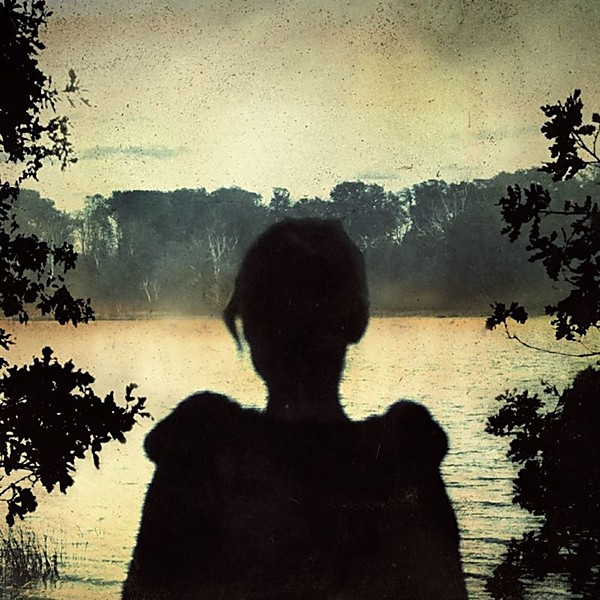

# Deadwing

By **Porcupine Tree**

## Album Data

- **Catalog:** Beets
- **Format:** Digital, Album
- **Album:** Deadwing
- **Artist:** Porcupine Tree
- **Albumartist:** Porcupine Tree
- **Genre:** Progressive Metal
- **MusicBrainz Album Artist ID:** [169c4c28-858e-497b-81a4-8bc15e0026ea](https://musicbrainz.org/artist/169c4c28-858e-497b-81a4-8bc15e0026ea)
- **MusicBrainz Album ID:** [7dc77085-f5b2-46a6-ad00-235ad3d45f31](https://musicbrainz.org/release/7dc77085-f5b2-46a6-ad00-235ad3d45f31)
- **MusicBrainz Release Group ID:** [cdebdda3-f478-367c-92d2-3d592323cd91](https://musicbrainz.org/release-group/cdebdda3-f478-367c-92d2-3d592323cd91)
- **Year:** 2005
- **Catalog #:** 
- **Label:** Kscope
- **Total Tracks:** 06

## Album Tracks

### Track 01 - Fear Of A Blank Planet

- **Artist:** Porcupine Tree
- **Format:** ALAC
- **Genre:** Progressive Metal
- **Length:** 7:28
- **MusicBrainz Track ID:** [https](https://musicbrainz.org/recording/https)
- **Title:** Fear Of A Blank Planet
- **Track:** 01
- **Year:** 2007

### Track 02 - My Ashes

- **Artist:** Porcupine Tree
- **Format:** ALAC
- **Genre:** Progressive Metal
- **Length:** 5:07
- **MusicBrainz Track ID:** [https](https://musicbrainz.org/recording/https)
- **Title:** My Ashes
- **Track:** 02
- **Year:** 2007

### Track 03 - Anesthetize

- **Artist:** Porcupine Tree
- **Format:** ALAC
- **Genre:** Progressive Metal
- **Length:** 17:42
- **MusicBrainz Track ID:** [https](https://musicbrainz.org/recording/https)
- **Title:** Anesthetize
- **Track:** 03
- **Year:** 2007

### Track 04 - Sentimental

- **Artist:** Porcupine Tree
- **Format:** ALAC
- **Genre:** Progressive Rock
- **Length:** 5:26
- **MusicBrainz Track ID:** [https](https://musicbrainz.org/recording/https)
- **Title:** Sentimental
- **Track:** 04
- **Year:** 2007

### Track 05 - Way Out Of Here

- **Artist:** Porcupine Tree
- **Format:** ALAC
- **Genre:** Progressive Metal
- **Length:** 7:37
- **MusicBrainz Track ID:** [https](https://musicbrainz.org/recording/https)
- **Title:** Way Out Of Here
- **Track:** 05
- **Year:** 2007

### Track 06 - Sleep Together

- **Artist:** Porcupine Tree
- **Format:** ALAC
- **Genre:** Progressive Metal
- **Length:** 7:31
- **MusicBrainz Track ID:** [https](https://musicbrainz.org/recording/https)
- **Title:** Sleep Together
- **Track:** 06
- **Year:** 2007

## See also

- [Fear Of A Blank Planet](Fear_Of_A_Blank_Planet.md)
- [In Absentia](In_Absentia.md)
- [Lightbulb Sun](Lightbulb_Sun.md)
- [Nil Recurring](Nil_Recurring.md)
- [Recordings](Recordings.md)
- [Stupid Dream](Stupid_Dream.md)
- [Roon: Anesthetize (Live)](../../Roon/Porcupine_Tree/Anesthetize_Live.md)
- [Roon: CLOSURE / CONTINUATION](../../Roon/Porcupine_Tree/CLOSURE_-_CONTINUATION.md)
- [Roon: Deadwing](../../Roon/Porcupine_Tree/Deadwing.md)
- [Roon: Fear of a Blank Planet](../../Roon/Porcupine_Tree/Fear_of_a_Blank_Planet.md)
- [Roon: In Absentia](../../Roon/Porcupine_Tree/In_Absentia.md)
- [Roon: Lightbulb Sun](../../Roon/Porcupine_Tree/Lightbulb_Sun.md)
- [Roon: Nil Recurring](../../Roon/Porcupine_Tree/Nil_Recurring.md)
- [Roon: Recordings](../../Roon/Porcupine_Tree/Recordings.md)
- [Roon: Signify (Remaster)](../../Roon/Porcupine_Tree/Signify_Remaster.md)
- [Roon: Stupid Dream](../../Roon/Porcupine_Tree/Stupid_Dream.md)
- [Vinyl: Nil Recurring](../../Vinyl/Porcupine_Tree/Nil_Recurring.md)
- [Vinyl: ](../../Vinyl/Porcupine_Tree/Porcupine_Tree.md)
- [Vinyl: Recordings](../../Vinyl/Porcupine_Tree/Recordings.md)
- [Vinyl: Stupid Dream](../../Vinyl/Porcupine_Tree/Stupid_Dream.md)
