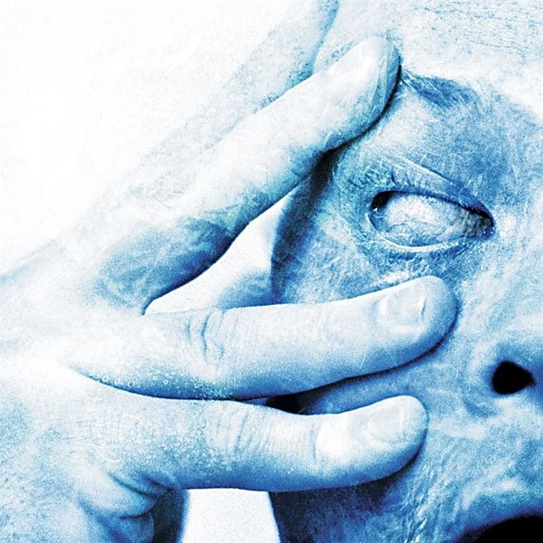

# In Absentia

By **Porcupine Tree**

## Album Data

- **Catalog:** Beets
- **Format:** Digital, Album
- **Album:** In Absentia
- **Artist:** Porcupine Tree
- **Albumartist:** Porcupine Tree
- **Genre:** Progressive Metal
- **MusicBrainz Album Artist ID:** [169c4c28-858e-497b-81a4-8bc15e0026ea](https://musicbrainz.org/artist/169c4c28-858e-497b-81a4-8bc15e0026ea)
- **MusicBrainz Album ID:** [29f187d6-1878-41a0-8544-7081e00d170d](https://musicbrainz.org/release/29f187d6-1878-41a0-8544-7081e00d170d)
- **MusicBrainz Release Group ID:** [94cfdc4c-5eb5-3b62-9dbe-8e051528c6e5](https://musicbrainz.org/release-group/94cfdc4c-5eb5-3b62-9dbe-8e051528c6e5)
- **Year:** 2002
- **Catalog #:** 
- **Label:** 
- **Total Tracks:** 00

## Album Tracks

### Track 00 - 00 - PT_LBS 1

- **Artist:** Porcupine Tree
- **Format:** AAC
- **Genre:** Psychedelic Rock
- **Length:** 56:27
- **MusicBrainz Track ID:** 
- **Title:** 00 - PT_LBS 1
- **Track:** 00
- **Year:** 2000

### Track 01 - Lightbulb Sun

- **Artist:** Porcupine Tree
- **Format:** ALAC
- **Genre:** Space Rock
- **Length:** 5:31
- **MusicBrainz Track ID:** 
- **Title:** Lightbulb Sun
- **Track:** 01
- **Year:** 2000

### Track 02 - How Is Your Life Today?

- **Artist:** Porcupine Tree
- **Format:** ALAC
- **Genre:** Progressive Rock
- **Length:** 2:46
- **MusicBrainz Track ID:** 
- **Title:** How Is Your Life Today?
- **Track:** 02
- **Year:** 2000

### Track 03 - Four Chords That Made A Million

- **Artist:** Porcupine Tree
- **Format:** ALAC
- **Genre:** Psychedelic Rock
- **Length:** 3:36
- **MusicBrainz Track ID:** 
- **Title:** Four Chords That Made A Million
- **Track:** 03
- **Year:** 2000

### Track 04 - Shesmovedon

- **Artist:** Porcupine Tree
- **Format:** ALAC
- **Genre:** Progressive Metal
- **Length:** 5:14
- **MusicBrainz Track ID:** 
- **Title:** Shesmovedon
- **Track:** 04
- **Year:** 2000

### Track 05 - Last Chance To Evacuate Planet Earth Before It Is Recycled

- **Artist:** Porcupine Tree
- **Format:** ALAC
- **Genre:** Progressive Rock
- **Length:** 4:49
- **MusicBrainz Track ID:** 
- **Title:** Last Chance To Evacuate Planet Earth Before It Is Recycled
- **Track:** 05
- **Year:** 2000

### Track 06 - The Rest Will Flow

- **Artist:** Porcupine Tree
- **Format:** ALAC
- **Genre:** Progressive Rock
- **Length:** 3:18
- **MusicBrainz Track ID:** 
- **Title:** The Rest Will Flow
- **Track:** 06
- **Year:** 2000

### Track 07 - Hatesong

- **Artist:** Porcupine Tree
- **Format:** ALAC
- **Genre:** Psychedelic Rock
- **Length:** 8:30
- **MusicBrainz Track ID:** 
- **Title:** Hatesong
- **Track:** 07
- **Year:** 2000

### Track 08 - Where We Would Be

- **Artist:** Porcupine Tree
- **Format:** ALAC
- **Genre:** Psychedelic Rock
- **Length:** 4:13
- **MusicBrainz Track ID:** 
- **Title:** Where We Would Be
- **Track:** 08
- **Year:** 2000

### Track 09 - Russia On Ice

- **Artist:** Porcupine Tree
- **Format:** ALAC
- **Genre:** Progressive Metal
- **Length:** 13:05
- **MusicBrainz Track ID:** 
- **Title:** Russia On Ice
- **Track:** 09
- **Year:** 2000

### Track 10 - Feel So Low

- **Artist:** Porcupine Tree
- **Format:** ALAC
- **Genre:** Progressive Rock
- **Length:** 5:22
- **MusicBrainz Track ID:** 
- **Title:** Feel So Low
- **Track:** 10
- **Year:** 2000

## See also

- [Deadwing](Deadwing.md)
- [Fear Of A Blank Planet](Fear_Of_A_Blank_Planet.md)
- [Lightbulb Sun](Lightbulb_Sun.md)
- [Nil Recurring](Nil_Recurring.md)
- [Recordings](Recordings.md)
- [Stupid Dream](Stupid_Dream.md)
- [Roon: Anesthetize (Live)](../../Roon/Porcupine_Tree/Anesthetize_Live.md)
- [Roon: CLOSURE / CONTINUATION](../../Roon/Porcupine_Tree/CLOSURE_-_CONTINUATION.md)
- [Roon: Deadwing](../../Roon/Porcupine_Tree/Deadwing.md)
- [Roon: Fear of a Blank Planet](../../Roon/Porcupine_Tree/Fear_of_a_Blank_Planet.md)
- [Roon: In Absentia](../../Roon/Porcupine_Tree/In_Absentia.md)
- [Roon: Lightbulb Sun](../../Roon/Porcupine_Tree/Lightbulb_Sun.md)
- [Roon: Nil Recurring](../../Roon/Porcupine_Tree/Nil_Recurring.md)
- [Roon: Recordings](../../Roon/Porcupine_Tree/Recordings.md)
- [Roon: Signify (Remaster)](../../Roon/Porcupine_Tree/Signify_Remaster.md)
- [Roon: Stupid Dream](../../Roon/Porcupine_Tree/Stupid_Dream.md)
- [Vinyl: Nil Recurring](../../Vinyl/Porcupine_Tree/Nil_Recurring.md)
- [Vinyl: ](../../Vinyl/Porcupine_Tree/Porcupine_Tree.md)
- [Vinyl: Recordings](../../Vinyl/Porcupine_Tree/Recordings.md)
- [Vinyl: Stupid Dream](../../Vinyl/Porcupine_Tree/Stupid_Dream.md)
