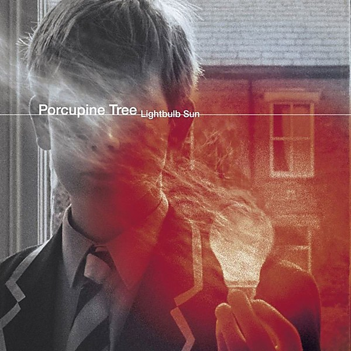

# Lightbulb Sun

By **Porcupine Tree**

## Album Data

- **Catalog:** Beets
- **Format:** Digital, Album
- **Album:** Lightbulb Sun
- **Artist:** Porcupine Tree
- **Albumartist:** Porcupine Tree
- **Genre:** Psychedelic Rock
- **MusicBrainz Album Artist ID:** 
- **MusicBrainz Album ID:** 
- **MusicBrainz Release Group ID:** 
- **Year:** 2000
- **Catalog #:** Kscope150M
- **Label:** Kscope
- **Total Tracks:** 04

## Album Tracks

### Track 01 - Nil Recurring

- **Artist:** Porcupine Tree
- **Format:** MP3
- **Genre:** Space Rock
- **Length:** 6:14
- **MusicBrainz Track ID:** [47b04814-d86d-4830-8eaf-07fc69b61dad](https://musicbrainz.org/recording/47b04814-d86d-4830-8eaf-07fc69b61dad)
- **Title:** Nil Recurring
- **Track:** 01
- **Year:** 2010

### Track 02 - Normal

- **Artist:** Porcupine Tree
- **Format:** MP3
- **Genre:** Progressive Metal
- **Length:** 7:08
- **MusicBrainz Track ID:** [c8bf47ec-9c9d-4b48-abae-db36b71a9683](https://musicbrainz.org/recording/c8bf47ec-9c9d-4b48-abae-db36b71a9683)
- **Title:** Normal
- **Track:** 02
- **Year:** 2010

### Track 03 - Cheating the Polygraph

- **Artist:** Porcupine Tree
- **Format:** MP3
- **Genre:** Space Rock
- **Length:** 7:10
- **MusicBrainz Track ID:** [a0c22d50-ce97-4645-92dc-4359ca1e942e](https://musicbrainz.org/recording/a0c22d50-ce97-4645-92dc-4359ca1e942e)
- **Title:** Cheating the Polygraph
- **Track:** 03
- **Year:** 2010

### Track 04 - What Happens Now?

- **Artist:** Porcupine Tree
- **Format:** MP3
- **Genre:** Space Rock
- **Length:** 8:23
- **MusicBrainz Track ID:** [b76292d0-e880-44bf-ae8a-69d4b271acd7](https://musicbrainz.org/recording/b76292d0-e880-44bf-ae8a-69d4b271acd7)
- **Title:** What Happens Now?
- **Track:** 04
- **Year:** 2010

## See also

- [Deadwing](Deadwing.md)
- [Fear Of A Blank Planet](Fear_Of_A_Blank_Planet.md)
- [In Absentia](In_Absentia.md)
- [Nil Recurring](Nil_Recurring.md)
- [Recordings](Recordings.md)
- [Stupid Dream](Stupid_Dream.md)
- [Roon: Anesthetize (Live)](../../Roon/Porcupine_Tree/Anesthetize_Live.md)
- [Roon: CLOSURE / CONTINUATION](../../Roon/Porcupine_Tree/CLOSURE_-_CONTINUATION.md)
- [Roon: Deadwing](../../Roon/Porcupine_Tree/Deadwing.md)
- [Roon: Fear of a Blank Planet](../../Roon/Porcupine_Tree/Fear_of_a_Blank_Planet.md)
- [Roon: In Absentia](../../Roon/Porcupine_Tree/In_Absentia.md)
- [Roon: Lightbulb Sun](../../Roon/Porcupine_Tree/Lightbulb_Sun.md)
- [Roon: Nil Recurring](../../Roon/Porcupine_Tree/Nil_Recurring.md)
- [Roon: Recordings](../../Roon/Porcupine_Tree/Recordings.md)
- [Roon: Signify (Remaster)](../../Roon/Porcupine_Tree/Signify_Remaster.md)
- [Roon: Stupid Dream](../../Roon/Porcupine_Tree/Stupid_Dream.md)
- [Vinyl: Nil Recurring](../../Vinyl/Porcupine_Tree/Nil_Recurring.md)
- [Vinyl: ](../../Vinyl/Porcupine_Tree/Porcupine_Tree.md)
- [Vinyl: Recordings](../../Vinyl/Porcupine_Tree/Recordings.md)
- [Vinyl: Stupid Dream](../../Vinyl/Porcupine_Tree/Stupid_Dream.md)
