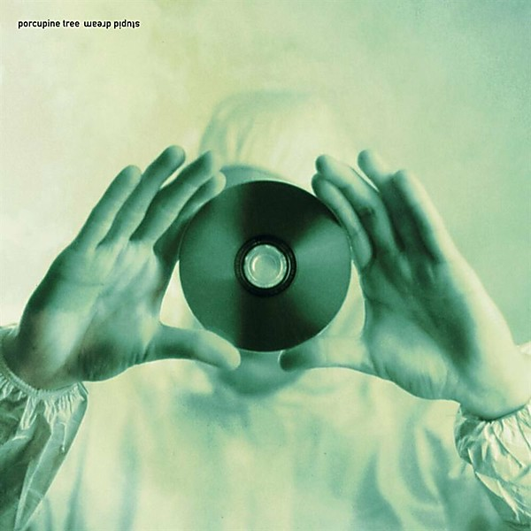

# Stupid Dream

By **Porcupine Tree**

## Album Data

- **Catalog:** Beets
- **Format:** Digital, Album
- **Album:** Stupid Dream
- **Artist:** Porcupine Tree
- **Albumartist:** Porcupine Tree
- **Genre:** Psychedelic Rock
- **MusicBrainz Album Artist ID:** 
- **MusicBrainz Album ID:** 
- **MusicBrainz Release Group ID:** 
- **Year:** 1999
- **Catalog #:** 
- **Label:** 
- **Total Tracks:** 00

## Album Tracks

### Track 00 - 00 - STUPIDDR 2

- **Artist:** Porcupine Tree
- **Format:** AAC
- **Genre:** Psychedelic Rock
- **Length:** 3:26
- **MusicBrainz Track ID:** 
- **Title:** 00 - STUPIDDR 2
- **Track:** 00
- **Year:** 1999

### Track 00 - 00 - STUPIDDR 3

- **Artist:** Porcupine Tree
- **Format:** AAC
- **Genre:** Psychedelic Rock
- **Length:** 2:34
- **MusicBrainz Track ID:** 
- **Title:** 00 - STUPIDDR 3
- **Track:** 00
- **Year:** 1999

### Track 01 - Even Less

- **Artist:** Porcupine Tree
- **Format:** ALAC
- **Genre:** Progressive Metal
- **Length:** 7:11
- **MusicBrainz Track ID:** 
- **Title:** Even Less
- **Track:** 01
- **Year:** 1999

### Track 02 - Piano Lessons

- **Artist:** Porcupine Tree
- **Format:** ALAC
- **Genre:** Psychedelic Rock
- **Length:** 4:22
- **MusicBrainz Track ID:** 
- **Title:** Piano Lessons
- **Track:** 02
- **Year:** 1999

### Track 03 - Stupid Dream

- **Artist:** Porcupine Tree
- **Format:** ALAC
- **Genre:** Progressive Rock
- **Length:** 0:28
- **MusicBrainz Track ID:** 
- **Title:** Stupid Dream
- **Track:** 03
- **Year:** 1999

### Track 04 - Pure Narcotic

- **Artist:** Porcupine Tree
- **Format:** ALAC
- **Genre:** Psychedelic Rock
- **Length:** 5:02
- **MusicBrainz Track ID:** 
- **Title:** Pure Narcotic
- **Track:** 04
- **Year:** 1999

### Track 05 - Slave Called Shiver

- **Artist:** Porcupine Tree
- **Format:** ALAC
- **Genre:** Space Rock
- **Length:** 4:41
- **MusicBrainz Track ID:** 
- **Title:** Slave Called Shiver
- **Track:** 05
- **Year:** 1999

### Track 06 - Don't Hate Me

- **Artist:** Porcupine Tree
- **Format:** ALAC
- **Genre:** Psychedelic Rock
- **Length:** 8:30
- **MusicBrainz Track ID:** 
- **Title:** Don't Hate Me
- **Track:** 06
- **Year:** 1999

### Track 07 - This is No Rehearsal

- **Artist:** Porcupine Tree
- **Format:** ALAC
- **Genre:** Psychedelic Rock
- **Length:** 3:27
- **MusicBrainz Track ID:** 
- **Title:** This is No Rehearsal
- **Track:** 07
- **Year:** 1999

### Track 08 - Baby Dream in Cellephane

- **Artist:** Porcupine Tree
- **Format:** ALAC
- **Genre:** Psychedelic Rock
- **Length:** 3:13
- **MusicBrainz Track ID:** 
- **Title:** Baby Dream in Cellephane
- **Track:** 08
- **Year:** 1999

### Track 09 - Stranger By The Minute

- **Artist:** Porcupine Tree
- **Format:** ALAC
- **Genre:** Psychedelic Rock
- **Length:** 4:30
- **MusicBrainz Track ID:** 
- **Title:** Stranger By The Minute
- **Track:** 09
- **Year:** 1999

### Track 10 - A Smart Kid

- **Artist:** Porcupine Tree
- **Format:** ALAC
- **Genre:** Progressive Rock
- **Length:** 5:21
- **MusicBrainz Track ID:** 
- **Title:** A Smart Kid
- **Track:** 10
- **Year:** 1999

### Track 11 - Tinto Brass

- **Artist:** Porcupine Tree
- **Format:** ALAC
- **Genre:** Space Rock
- **Length:** 6:18
- **MusicBrainz Track ID:** 
- **Title:** Tinto Brass
- **Track:** 11
- **Year:** 1999

### Track 12 - Stop Swimming

- **Artist:** Porcupine Tree
- **Format:** ALAC
- **Genre:** Space Rock
- **Length:** 6:54
- **MusicBrainz Track ID:** 
- **Title:** Stop Swimming
- **Track:** 12
- **Year:** 1999

## See also

- [Deadwing](Deadwing.md)
- [Fear Of A Blank Planet](Fear_Of_A_Blank_Planet.md)
- [In Absentia](In_Absentia.md)
- [Lightbulb Sun](Lightbulb_Sun.md)
- [Nil Recurring](Nil_Recurring.md)
- [Recordings](Recordings.md)
- [Roon: Anesthetize (Live)](../../Roon/Porcupine_Tree/Anesthetize_Live.md)
- [Roon: CLOSURE / CONTINUATION](../../Roon/Porcupine_Tree/CLOSURE_-_CONTINUATION.md)
- [Roon: Deadwing](../../Roon/Porcupine_Tree/Deadwing.md)
- [Roon: Fear of a Blank Planet](../../Roon/Porcupine_Tree/Fear_of_a_Blank_Planet.md)
- [Roon: In Absentia](../../Roon/Porcupine_Tree/In_Absentia.md)
- [Roon: Lightbulb Sun](../../Roon/Porcupine_Tree/Lightbulb_Sun.md)
- [Roon: Nil Recurring](../../Roon/Porcupine_Tree/Nil_Recurring.md)
- [Roon: Recordings](../../Roon/Porcupine_Tree/Recordings.md)
- [Roon: Signify (Remaster)](../../Roon/Porcupine_Tree/Signify_Remaster.md)
- [Roon: Stupid Dream](../../Roon/Porcupine_Tree/Stupid_Dream.md)
- [Vinyl: Nil Recurring](../../Vinyl/Porcupine_Tree/Nil_Recurring.md)
- [Vinyl: ](../../Vinyl/Porcupine_Tree/Porcupine_Tree.md)
- [Vinyl: Recordings](../../Vinyl/Porcupine_Tree/Recordings.md)
- [Vinyl: Stupid Dream](../../Vinyl/Porcupine_Tree/Stupid_Dream.md)
