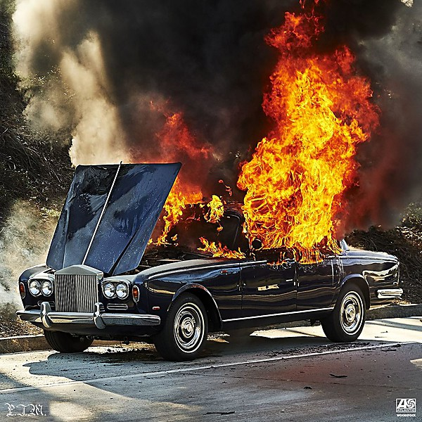

# Woodstock

By **Portugal. The Man**

## Album Data

- **Catalog:** Beets
- **Format:** Digital, Album
- **Album:** Woodstock
- **Artist:** Portugal. The Man
- **Albumartist:** Portugal. The Man
- **Genre:** Indie Pop
- **MusicBrainz Album Artist ID:** [3599a39e-4e10-4cb5-90d4-c8a015ebc73b](https://musicbrainz.org/artist/3599a39e-4e10-4cb5-90d4-c8a015ebc73b)
- **MusicBrainz Album ID:** [8c7f8a36-aced-437b-9f15-ee7510633f97](https://musicbrainz.org/release/8c7f8a36-aced-437b-9f15-ee7510633f97)
- **MusicBrainz Release Group ID:** [d18f6a72-abf4-4dc0-9bef-89c31d8ee877](https://musicbrainz.org/release-group/d18f6a72-abf4-4dc0-9bef-89c31d8ee877)
- **Year:** 2017
- **Catalog #:** 
- **Label:** Atlantic
- **Total Tracks:** 10

## Album Tracks

### Track 02 - Easy Tiger

- **Artist:** Portugal. The Man
- **Format:** MP3
- **Genre:** Indie Pop
- **Length:** 3:37
- **MusicBrainz Track ID:** [ce26edce-a58a-4104-98dd-f4820c6d76d6](https://musicbrainz.org/recording/ce26edce-a58a-4104-98dd-f4820c6d76d6)
- **Title:** Easy Tiger
- **Track:** 02
- **Year:** 2017

### Track 03 - Live in the Moment

- **Artist:** Portugal. The Man
- **Format:** MP3
- **Genre:** Indie Pop
- **Length:** 4:06
- **MusicBrainz Track ID:** [2f8bf704-a13c-452c-8959-8d9df22e620d](https://musicbrainz.org/recording/2f8bf704-a13c-452c-8959-8d9df22e620d)
- **Title:** Live in the Moment
- **Track:** 03
- **Year:** 2017

### Track 04 - Feel It Still

- **Artist:** Portugal. The Man
- **Format:** MP3
- **Genre:** Psychedelic Pop
- **Length:** 2:43
- **MusicBrainz Track ID:** [6728f2b7-dec1-4098-8c91-362db1d0ff31](https://musicbrainz.org/recording/6728f2b7-dec1-4098-8c91-362db1d0ff31)
- **Title:** Feel It Still
- **Track:** 04
- **Year:** 2017

### Track 05 - Rich Friends

- **Artist:** Portugal. The Man
- **Format:** MP3
- **Genre:** Indie Pop
- **Length:** 3:41
- **MusicBrainz Track ID:** [ca5709e7-5630-43b0-826f-4a0a10e5f903](https://musicbrainz.org/recording/ca5709e7-5630-43b0-826f-4a0a10e5f903)
- **Title:** Rich Friends
- **Track:** 05
- **Year:** 2017

### Track 06 - Keep On

- **Artist:** Portugal. The Man
- **Format:** MP3
- **Genre:** Indie Pop
- **Length:** 3:23
- **MusicBrainz Track ID:** [92f22f6e-3bf4-4c63-bbd9-e2c38e863313](https://musicbrainz.org/recording/92f22f6e-3bf4-4c63-bbd9-e2c38e863313)
- **Title:** Keep On
- **Track:** 06
- **Year:** 2017

### Track 07 - So Young

- **Artist:** Portugal. The Man
- **Format:** MP3
- **Genre:** Indie Rock
- **Length:** 4:06
- **MusicBrainz Track ID:** [03e6648a-f016-44d8-bc8b-a32258e879f3](https://musicbrainz.org/recording/03e6648a-f016-44d8-bc8b-a32258e879f3)
- **Title:** So Young
- **Track:** 07
- **Year:** 2017

### Track 09 - Tidal Wave

- **Artist:** Portugal. The Man
- **Format:** MP3
- **Genre:** Indie Pop
- **Length:** 3:31
- **MusicBrainz Track ID:** [2694cf8c-4aa6-4e4f-956f-bfa69adcb396](https://musicbrainz.org/recording/2694cf8c-4aa6-4e4f-956f-bfa69adcb396)
- **Title:** Tidal Wave
- **Track:** 09
- **Year:** 2017

### Track 08 - Mr Lonely

- **Artist:** Portugal. The Man feat. Fatlip
- **Format:** MP3
- **Genre:** Indie Pop
- **Length:** 4:22
- **MusicBrainz Track ID:** [e956a40b-142c-4341-a783-a4f0fa564f02](https://musicbrainz.org/recording/e956a40b-142c-4341-a783-a4f0fa564f02)
- **Title:** Mr Lonely
- **Track:** 08
- **Year:** 2017

### Track 01 - Number One

- **Artist:** Portugal. The Man feat. Richie Havens & Son Little
- **Format:** MP3
- **Genre:** Indie Pop
- **Length:** 5:21
- **MusicBrainz Track ID:** [26e1c90b-5923-4422-b0fc-4cce7a1d9801](https://musicbrainz.org/recording/26e1c90b-5923-4422-b0fc-4cce7a1d9801)
- **Title:** Number One
- **Track:** 01
- **Year:** 2017

### Track 10 - Noise Pollution (version A, vocal up mix 1.3)

- **Artist:** Portugal. The Man feat. Mary Elizabeth Winstead & Zoe Manville
- **Format:** MP3
- **Genre:** Indie Pop
- **Length:** 3:45
- **MusicBrainz Track ID:** [e15218eb-11c2-484f-8180-c1bc8b5ff65f](https://musicbrainz.org/recording/e15218eb-11c2-484f-8180-c1bc8b5ff65f)
- **Title:** Noise Pollution (version A, vocal up mix 1.3)
- **Track:** 10
- **Year:** 2017

## See also

- [Roon: Woodstock](../../Roon/Portugal_The_Man/Woodstock.md)
- [Vinyl: In The Mountain In The Cloud](../../Vinyl/Portugal_The_Man/In_The_Mountain_In_The_Cloud.md)
- [Vinyl: ](../../Vinyl/Portugal_The_Man/Portugal_The_Man.md)
