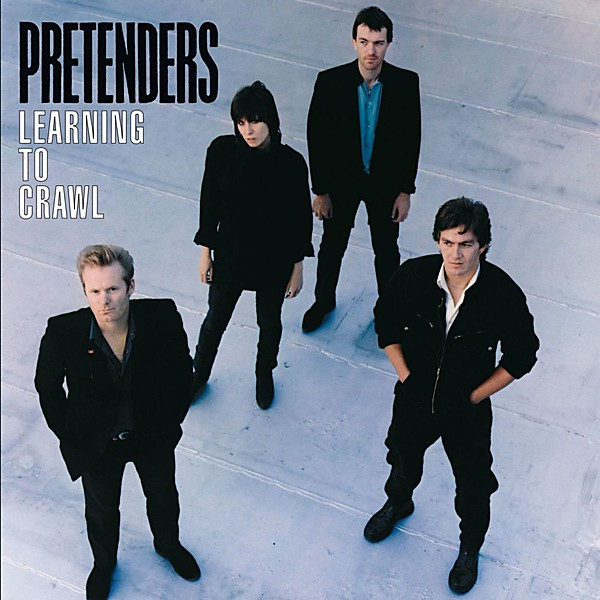

# Learning to Crawl

By **Pretenders**

## Album Data

- **Catalog:** Beets
- **Format:** Digital, Album
- **Album:** Learning to Crawl
- **Artist:** Pretenders
- **Albumartist:** Pretenders
- **Genre:** New Wave
- **MusicBrainz Album Artist ID:** [e9c832b0-384b-4ee6-aec0-111372784aac](https://musicbrainz.org/artist/e9c832b0-384b-4ee6-aec0-111372784aac)
- **MusicBrainz Album ID:** [566caf57-bdae-421a-be9f-45d0dc590dce](https://musicbrainz.org/release/566caf57-bdae-421a-be9f-45d0dc590dce)
- **MusicBrainz Release Group ID:** [3c6e2aa2-f015-3924-a00a-6f577fe93c3f](https://musicbrainz.org/release-group/3c6e2aa2-f015-3924-a00a-6f577fe93c3f)
- **Year:** 1984
- **Catalog #:** 9 26219-2
- **Label:** Sire Records
- **Total Tracks:** 11

## Album Tracks

### Track 01 - Never Do That

- **Artist:** Pretenders
- **Format:** ALAC
- **Genre:** Pop Rock
- **Length:** 3:19
- **MusicBrainz Track ID:** [65c610d7-354c-4021-8d76-46f4b27ceda2](https://musicbrainz.org/recording/65c610d7-354c-4021-8d76-46f4b27ceda2)
- **Title:** Never Do That
- **Track:** 01
- **Year:** 1990

### Track 02 - Let’s Make a Pact

- **Artist:** Pretenders
- **Format:** ALAC
- **Genre:** New Wave
- **Length:** 3:18
- **MusicBrainz Track ID:** [bd02ece2-24b0-4cfd-a2d1-e4790fa719f5](https://musicbrainz.org/recording/bd02ece2-24b0-4cfd-a2d1-e4790fa719f5)
- **Title:** Let’s Make a Pact
- **Track:** 02
- **Year:** 1990

### Track 03 - Millionaires

- **Artist:** Pretenders
- **Format:** ALAC
- **Genre:** Pop Rock
- **Length:** 3:04
- **MusicBrainz Track ID:** [e46a35e4-1098-452b-a438-523c4bb3408f](https://musicbrainz.org/recording/e46a35e4-1098-452b-a438-523c4bb3408f)
- **Title:** Millionaires
- **Track:** 03
- **Year:** 1990

### Track 04 - May This Be Love

- **Artist:** Pretenders
- **Format:** ALAC
- **Genre:** New Wave
- **Length:** 2:43
- **MusicBrainz Track ID:** [bebedc2b-455b-461f-b7d3-415f849393dd](https://musicbrainz.org/recording/bebedc2b-455b-461f-b7d3-415f849393dd)
- **Title:** May This Be Love
- **Track:** 04
- **Year:** 1990

### Track 05 - No Guarantee

- **Artist:** Pretenders
- **Format:** ALAC
- **Genre:** Post-Punk
- **Length:** 3:49
- **MusicBrainz Track ID:** [c485d000-1c8e-40bb-9272-89b6380cd77e](https://musicbrainz.org/recording/c485d000-1c8e-40bb-9272-89b6380cd77e)
- **Title:** No Guarantee
- **Track:** 05
- **Year:** 1990

### Track 06 - When Will I See You

- **Artist:** Pretenders
- **Format:** ALAC
- **Genre:** New Wave
- **Length:** 4:54
- **MusicBrainz Track ID:** [29683979-7de1-435f-b1fb-a6abd67b7c5b](https://musicbrainz.org/recording/29683979-7de1-435f-b1fb-a6abd67b7c5b)
- **Title:** When Will I See You
- **Track:** 06
- **Year:** 1990

### Track 07 - Sense of Purpose

- **Artist:** Pretenders
- **Format:** ALAC
- **Genre:** Pop Rock
- **Length:** 3:02
- **MusicBrainz Track ID:** [c5899bdf-274f-460d-9f89-6c9f5ff903df](https://musicbrainz.org/recording/c5899bdf-274f-460d-9f89-6c9f5ff903df)
- **Title:** Sense of Purpose
- **Track:** 07
- **Year:** 1990

### Track 08 - Downtown (Akron)

- **Artist:** Pretenders
- **Format:** ALAC
- **Genre:** New Wave
- **Length:** 2:43
- **MusicBrainz Track ID:** [75fb5720-6543-4550-8129-be151c50f843](https://musicbrainz.org/recording/75fb5720-6543-4550-8129-be151c50f843)
- **Title:** Downtown (Akron)
- **Track:** 08
- **Year:** 1990

### Track 09 - How Do I Miss You

- **Artist:** Pretenders
- **Format:** ALAC
- **Genre:** Dub
- **Length:** 4:22
- **MusicBrainz Track ID:** [34def3fb-a40c-427c-a023-75177daf23ba](https://musicbrainz.org/recording/34def3fb-a40c-427c-a023-75177daf23ba)
- **Title:** How Do I Miss You
- **Track:** 09
- **Year:** 1990

### Track 10 - Hold a Candle to This

- **Artist:** Pretenders
- **Format:** ALAC
- **Genre:** New Wave
- **Length:** 3:40
- **MusicBrainz Track ID:** [a610d5d0-cf7c-49fa-8d3c-57e1441c0395](https://musicbrainz.org/recording/a610d5d0-cf7c-49fa-8d3c-57e1441c0395)
- **Title:** Hold a Candle to This
- **Track:** 10
- **Year:** 1990

### Track 11 - Criminal

- **Artist:** Pretenders
- **Format:** ALAC
- **Genre:** New Wave
- **Length:** 3:49
- **MusicBrainz Track ID:** [e64e4935-8873-45f7-8641-9d82e6bb1779](https://musicbrainz.org/recording/e64e4935-8873-45f7-8641-9d82e6bb1779)
- **Title:** Criminal
- **Track:** 11
- **Year:** 1990

## See also

- [Last of the Independents](Last_of_the_Independents.md)
- [Packed!](Packed!.md)
- [Pretenders II](Pretenders_II.md)
- [CD: Pretenders II Deluxe Special Edition (Disc 2 )](../../CD/Pretenders/Pretenders_II_[Deluxe_Special_Edition]_Disc_2_.md)
- [CD: Pretenders II](../../CD/Pretenders/Pretenders_II.md)
- [CD: ](../../CD/Pretenders/Pretenders.md)
- [CD: The Pretenders (Disc 1)](../../CD/Pretenders/The_Pretenders_Disc_1.md)
- [CD: The Pretenders (Disc 2)](../../CD/Pretenders/The_Pretenders_Disc_2.md)
- [Roon: 2000 Miles](../../Roon/Pretenders/2000_Miles.md)
- [Roon: Get Close](../../Roon/Pretenders/Get_Close.md)
- [Roon: Last of the Independents](../../Roon/Pretenders/Last_of_the_Independents.md)
- [Roon: Learning to Crawl (US Release)](../../Roon/Pretenders/Learning_to_Crawl_US_Release.md)
- [Roon: Packed!](../../Roon/Pretenders/Packed!.md)
- [Roon: Pretenders (Deluxe Edition)](../../Roon/Pretenders/Pretenders_Deluxe_Edition.md)
- [Roon: Pretenders II (Deluxe Edition)](../../Roon/Pretenders/Pretenders_II_Deluxe_Edition.md)
- [Roon: Pretenders II](../../Roon/Pretenders/Pretenders_II.md)
- [Roon: Pretenders](../../Roon/Pretenders/Pretenders.md)
- [Roon: The Singles (US Version)](../../Roon/Pretenders/The_Singles_US_Version.md)
