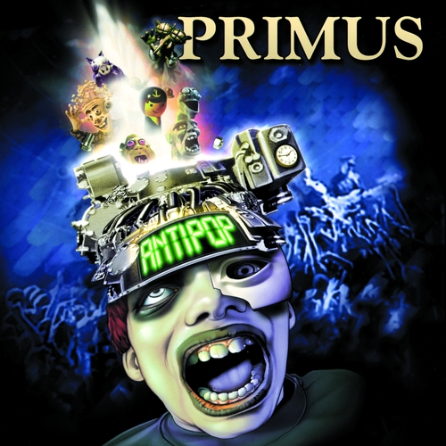

# Antipop

By **Primus**

## Album Data

- **Catalog:** Beets
- **Format:** Digital, Album
- **Album:** Antipop
- **Artist:** Primus
- **Albumartist:** Primus
- **Genre:** Funk Metal
- **MusicBrainz Album Artist ID:** [84dc4f23-c0b8-4fe1-bbca-a3993ddc8fc2](https://musicbrainz.org/artist/84dc4f23-c0b8-4fe1-bbca-a3993ddc8fc2)
- **MusicBrainz Album ID:** [7c6c1392-9616-450b-a846-fe869328c09b](https://musicbrainz.org/release/7c6c1392-9616-450b-a846-fe869328c09b)
- **MusicBrainz Release Group ID:** [e831feab-e4bf-37f0-8cb5-797e5a0e5237](https://musicbrainz.org/release-group/e831feab-e4bf-37f0-8cb5-797e5a0e5237)
- **Year:** 1999
- **Catalog #:** INT3P-6184
- **Label:** Interscope Records
- **Total Tracks:** 15

## Album Tracks

### Track 01 - The Return of Sathington Willoughby

- **Artist:** Primus
- **Format:** MP3
- **Genre:** Funk Metal
- **Length:** 5:04
- **MusicBrainz Track ID:** [a50ab416-f149-44a7-8f9e-528a454c70f3](https://musicbrainz.org/recording/a50ab416-f149-44a7-8f9e-528a454c70f3)
- **Title:** The Return of Sathington Willoughby
- **Track:** 01
- **Year:** 1997

### Track 02 - Fisticuffs

- **Artist:** Primus
- **Format:** MP3
- **Genre:** Funk Metal
- **Length:** 4:24
- **MusicBrainz Track ID:** [529f8f43-4a28-440e-b07a-7de5f821ac78](https://musicbrainz.org/recording/529f8f43-4a28-440e-b07a-7de5f821ac78)
- **Title:** Fisticuffs
- **Track:** 02
- **Year:** 1997

### Track 03 - Golden Boy

- **Artist:** Primus
- **Format:** MP3
- **Genre:** Funk Metal
- **Length:** 3:05
- **MusicBrainz Track ID:** [d920ac36-448d-40a2-8ca7-e2e6b61996ea](https://musicbrainz.org/recording/d920ac36-448d-40a2-8ca7-e2e6b61996ea)
- **Title:** Golden Boy
- **Track:** 03
- **Year:** 1997

### Track 04 - Over the Falls

- **Artist:** Primus
- **Format:** MP3
- **Genre:** Funk Metal
- **Length:** 2:41
- **MusicBrainz Track ID:** [104bee4d-6cb4-4f8a-9f51-9207b4f61cd0](https://musicbrainz.org/recording/104bee4d-6cb4-4f8a-9f51-9207b4f61cd0)
- **Title:** Over the Falls
- **Track:** 04
- **Year:** 1997

### Track 05 - Shake Hands With Beef

- **Artist:** Primus
- **Format:** MP3
- **Genre:** Funk Metal
- **Length:** 4:02
- **MusicBrainz Track ID:** [f6e15479-e130-4294-82af-1c22abf53a9e](https://musicbrainz.org/recording/f6e15479-e130-4294-82af-1c22abf53a9e)
- **Title:** Shake Hands With Beef
- **Track:** 05
- **Year:** 1997

### Track 06 - Camelback Cinema

- **Artist:** Primus
- **Format:** MP3
- **Genre:** Funk Metal
- **Length:** 4:00
- **MusicBrainz Track ID:** [2df24f54-5f5d-4b94-b6cf-f5c9e746b71a](https://musicbrainz.org/recording/2df24f54-5f5d-4b94-b6cf-f5c9e746b71a)
- **Title:** Camelback Cinema
- **Track:** 06
- **Year:** 1997

### Track 07 - Hats Off

- **Artist:** Primus
- **Format:** MP3
- **Genre:** Funk Metal
- **Length:** 1:57
- **MusicBrainz Track ID:** [8c9162ad-9bf5-4bf9-9e5e-772627137ea1](https://musicbrainz.org/recording/8c9162ad-9bf5-4bf9-9e5e-772627137ea1)
- **Title:** Hats Off
- **Track:** 07
- **Year:** 1997

### Track 08 - Puddin’ Taine

- **Artist:** Primus
- **Format:** MP3
- **Genre:** Funk Metal
- **Length:** 3:37
- **MusicBrainz Track ID:** [2ce385ae-5149-4a6c-ae72-54bdd6a8e9bc](https://musicbrainz.org/recording/2ce385ae-5149-4a6c-ae72-54bdd6a8e9bc)
- **Title:** Puddin’ Taine
- **Track:** 08
- **Year:** 1997

### Track 09 - Bob’s Party Time Lounge

- **Artist:** Primus
- **Format:** MP3
- **Genre:** Funk Metal
- **Length:** 4:43
- **MusicBrainz Track ID:** [834c6102-27a1-4b0b-b8ce-a073e72d3d6d](https://musicbrainz.org/recording/834c6102-27a1-4b0b-b8ce-a073e72d3d6d)
- **Title:** Bob’s Party Time Lounge
- **Track:** 09
- **Year:** 1997

### Track 10 - Duchess and the Proverbial Mind Spread

- **Artist:** Primus
- **Format:** MP3
- **Genre:** Funk Metal
- **Length:** 3:29
- **MusicBrainz Track ID:** [41c510ce-2175-47d1-88b3-553b75347f11](https://musicbrainz.org/recording/41c510ce-2175-47d1-88b3-553b75347f11)
- **Title:** Duchess and the Proverbial Mind Spread
- **Track:** 10
- **Year:** 1997

### Track 11 - Restin’ Bones

- **Artist:** Primus
- **Format:** MP3
- **Genre:** Funk Metal
- **Length:** 4:29
- **MusicBrainz Track ID:** [1bcd727c-77a5-4746-b885-0110ab2a7ccf](https://musicbrainz.org/recording/1bcd727c-77a5-4746-b885-0110ab2a7ccf)
- **Title:** Restin’ Bones
- **Track:** 11
- **Year:** 1997

### Track 12 - Coddingtown

- **Artist:** Primus
- **Format:** MP3
- **Genre:** Funk Metal
- **Length:** 2:52
- **MusicBrainz Track ID:** [f6847980-987c-472d-9530-1de7cddec17e](https://musicbrainz.org/recording/f6847980-987c-472d-9530-1de7cddec17e)
- **Title:** Coddingtown
- **Track:** 12
- **Year:** 1997

### Track 13 - Kalamazoo

- **Artist:** Primus
- **Format:** MP3
- **Genre:** Emo
- **Length:** 3:30
- **MusicBrainz Track ID:** [f3c4ba69-9b85-40a2-a73d-d5d81db44b83](https://musicbrainz.org/recording/f3c4ba69-9b85-40a2-a73d-d5d81db44b83)
- **Title:** Kalamazoo
- **Track:** 13
- **Year:** 1997

### Track 14 - The Chastising of Renegade

- **Artist:** Primus
- **Format:** MP3
- **Genre:** Funk Metal
- **Length:** 5:03
- **MusicBrainz Track ID:** [ac545f1f-5fdd-402a-8079-94f3a9798b7b](https://musicbrainz.org/recording/ac545f1f-5fdd-402a-8079-94f3a9798b7b)
- **Title:** The Chastising of Renegade
- **Track:** 14
- **Year:** 1997

### Track 15 - Arnie

- **Artist:** Primus
- **Format:** MP3
- **Genre:** Funk Metal
- **Length:** 3:54
- **MusicBrainz Track ID:** [0e5456c9-6494-4d61-a6f3-14f5b1d7b46b](https://musicbrainz.org/recording/0e5456c9-6494-4d61-a6f3-14f5b1d7b46b)
- **Title:** Arnie
- **Track:** 15
- **Year:** 1997

## See also

- [Brown Album](Brown_Album.md)
