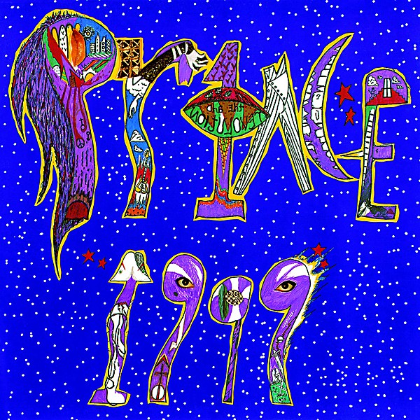

# 1999

By **Prince**

## Album Data

- **Catalog:** Beets
- **Format:** Digital, Album
- **Album:** 1999
- **Artist:** Prince
- **Albumartist:** Prince
- **Genre:** Dance-Pop
- **MusicBrainz Album Artist ID:** [070d193a-845c-479f-980e-bef15710653e](https://musicbrainz.org/artist/070d193a-845c-479f-980e-bef15710653e)
- **MusicBrainz Album ID:** [8d5cb4b2-f321-44d0-9db4-78f200562b88](https://musicbrainz.org/release/8d5cb4b2-f321-44d0-9db4-78f200562b88)
- **MusicBrainz Release Group ID:** [561be5b7-a39c-3866-859d-d86f30816ae7](https://musicbrainz.org/release-group/561be5b7-a39c-3866-859d-d86f30816ae7)
- **Year:** 1990
- **Catalog #:** 9 23720-2
- **Label:** Warner Bros. Records
- **Total Tracks:** 11

## Album Tracks

### Track 01 - 1999

- **Artist:** Prince
- **Format:** MP3
- **Genre:** Soul
- **Length:** 6:19
- **MusicBrainz Track ID:** [d2c83920-6066-48f4-88d6-2ad6f469ecf4](https://musicbrainz.org/recording/d2c83920-6066-48f4-88d6-2ad6f469ecf4)
- **Title:** 1999
- **Track:** 01
- **Year:** 1990

### Track 02 - Little Red Corvette

- **Artist:** Prince
- **Format:** MP3
- **Genre:** Soul
- **Length:** 4:56
- **MusicBrainz Track ID:** [18fe52d0-d030-4430-8b63-81b682baa5cc](https://musicbrainz.org/recording/18fe52d0-d030-4430-8b63-81b682baa5cc)
- **Title:** Little Red Corvette
- **Track:** 02
- **Year:** 1990

### Track 03 - Delirious

- **Artist:** Prince
- **Format:** MP3
- **Genre:** Soul
- **Length:** 4:00
- **MusicBrainz Track ID:** [4573c305-b308-44e2-aa33-bef6e871591c](https://musicbrainz.org/recording/4573c305-b308-44e2-aa33-bef6e871591c)
- **Title:** Delirious
- **Track:** 03
- **Year:** 1990

### Track 04 - Let’s Pretend We’re Married

- **Artist:** Prince
- **Format:** MP3
- **Genre:** Dance-Pop
- **Length:** 7:21
- **MusicBrainz Track ID:** [3080e30c-404b-4335-bd91-5e36d9e7ef04](https://musicbrainz.org/recording/3080e30c-404b-4335-bd91-5e36d9e7ef04)
- **Title:** Let’s Pretend We’re Married
- **Track:** 04
- **Year:** 1990

### Track 05 - D.M.S.R.

- **Artist:** Prince
- **Format:** MP3
- **Genre:** Uk Garage
- **Length:** 8:17
- **MusicBrainz Track ID:** [cfba9e6b-4c62-42d1-b433-bc491538ee43](https://musicbrainz.org/recording/cfba9e6b-4c62-42d1-b433-bc491538ee43)
- **Title:** D.M.S.R.
- **Track:** 05
- **Year:** 1990

### Track 06 - Automatic

- **Artist:** Prince
- **Format:** MP3
- **Genre:** Soul
- **Length:** 9:28
- **MusicBrainz Track ID:** [5efc29ae-0df0-4363-a95d-720989c2370a](https://musicbrainz.org/recording/5efc29ae-0df0-4363-a95d-720989c2370a)
- **Title:** Automatic
- **Track:** 06
- **Year:** 1990

### Track 07 - Something in the Water (Does Not Compute)

- **Artist:** Prince
- **Format:** MP3
- **Genre:** Synthpop
- **Length:** 4:02
- **MusicBrainz Track ID:** [58681a78-8b09-4e3d-9206-693673220b6b](https://musicbrainz.org/recording/58681a78-8b09-4e3d-9206-693673220b6b)
- **Title:** Something in the Water (Does Not Compute)
- **Track:** 07
- **Year:** 1990

### Track 08 - Free

- **Artist:** Prince
- **Format:** MP3
- **Genre:** Soul
- **Length:** 5:08
- **MusicBrainz Track ID:** [193127ec-3c22-495c-8573-3c9cdabd1339](https://musicbrainz.org/recording/193127ec-3c22-495c-8573-3c9cdabd1339)
- **Title:** Free
- **Track:** 08
- **Year:** 1990

### Track 09 - Lady Cab Driver

- **Artist:** Prince
- **Format:** MP3
- **Genre:** Uk Garage
- **Length:** 8:19
- **MusicBrainz Track ID:** [10015f04-8ff1-4423-aef2-04f5de7b361c](https://musicbrainz.org/recording/10015f04-8ff1-4423-aef2-04f5de7b361c)
- **Title:** Lady Cab Driver
- **Track:** 09
- **Year:** 1990

### Track 10 - All the Critics Love U in New York

- **Artist:** Prince
- **Format:** MP3
- **Genre:** Soul
- **Length:** 5:59
- **MusicBrainz Track ID:** [7dabf7b3-d0ae-48fe-8670-c394b2c1031e](https://musicbrainz.org/recording/7dabf7b3-d0ae-48fe-8670-c394b2c1031e)
- **Title:** All the Critics Love U in New York
- **Track:** 10
- **Year:** 1990

### Track 11 - International Lover

- **Artist:** Prince
- **Format:** MP3
- **Genre:** Synthpop
- **Length:** 6:37
- **MusicBrainz Track ID:** [b80cdc3e-28fe-4b87-8aaf-5daaa10c1a51](https://musicbrainz.org/recording/b80cdc3e-28fe-4b87-8aaf-5daaa10c1a51)
- **Title:** International Lover
- **Track:** 11
- **Year:** 1990

## See also

- [Roon: 1999 (Super Deluxe Edition)](../../Roon/Prince/1999_Super_Deluxe_Edition.md)
- [Roon: Purple Rain Deluxe (Expanded Edition)](../../Roon/Prince/Purple_Rain_Deluxe_Expanded_Edition.md)
- [Vinyl: 1999](../../Vinyl/Prince/1999.md)
- [Vinyl: ](../../Vinyl/Prince/Prince.md)
