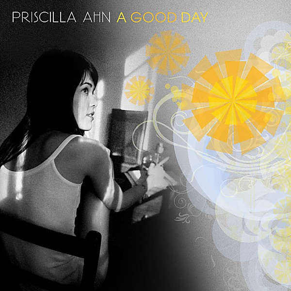

# A Good Day

By **Priscilla Ahn**

## Album Data

- **Catalog:** Beets
- **Format:** Digital, Album
- **Album:** A Good Day
- **Artist:** Priscilla Ahn
- **Albumartist:** Priscilla Ahn
- **Genre:** Dream Pop
- **MusicBrainz Album Artist ID:** [d4d3c818-005f-43bd-b0f8-89e74dfe4dca](https://musicbrainz.org/artist/d4d3c818-005f-43bd-b0f8-89e74dfe4dca)
- **MusicBrainz Album ID:** [e2571a99-f9f8-4fa1-bdd2-22740cdcb31f](https://musicbrainz.org/release/e2571a99-f9f8-4fa1-bdd2-22740cdcb31f)
- **MusicBrainz Release Group ID:** [a660d38e-8c1e-3dad-ba6c-bc3598f973c7](https://musicbrainz.org/release-group/a660d38e-8c1e-3dad-ba6c-bc3598f973c7)
- **Year:** 2008
- **Catalog #:** SQE142
- **Label:** SQE
- **Total Tracks:** 13

## Album Tracks

### Track 01 - Diana

- **Artist:** Priscilla Ahn
- **Format:** ALAC
- **Genre:** Unknown
- **Length:** 4:32
- **MusicBrainz Track ID:** [50740fd4-0846-4931-b0df-83c108582513](https://musicbrainz.org/recording/50740fd4-0846-4931-b0df-83c108582513)
- **Title:** Diana
- **Track:** 01
- **Year:** 2013

### Track 02 - Remember How I Broke Your Heart

- **Artist:** Priscilla Ahn
- **Format:** ALAC
- **Genre:** Unknown
- **Length:** 2:35
- **MusicBrainz Track ID:** [21667d87-4a42-4026-95eb-2e975941c2d5](https://musicbrainz.org/recording/21667d87-4a42-4026-95eb-2e975941c2d5)
- **Title:** Remember How I Broke Your Heart
- **Track:** 02
- **Year:** 2013

### Track 03 - This Is Where We Are

- **Artist:** Priscilla Ahn
- **Format:** ALAC
- **Genre:** Unknown
- **Length:** 3:12
- **MusicBrainz Track ID:** [102c0214-b696-45f0-be9f-2e703eab67c0](https://musicbrainz.org/recording/102c0214-b696-45f0-be9f-2e703eab67c0)
- **Title:** This Is Where We Are
- **Track:** 03
- **Year:** 2013

### Track 04 - Home

- **Artist:** Priscilla Ahn
- **Format:** ALAC
- **Genre:** Unknown
- **Length:** 3:40
- **MusicBrainz Track ID:** [a42d4daa-4c6a-4f7b-8ad6-521e6f727006](https://musicbrainz.org/recording/a42d4daa-4c6a-4f7b-8ad6-521e6f727006)
- **Title:** Home
- **Track:** 04
- **Year:** 2013

### Track 05 - I Can't Fall Asleep

- **Artist:** Priscilla Ahn
- **Format:** ALAC
- **Genre:** Unknown
- **Length:** 3:47
- **MusicBrainz Track ID:** [f543b540-08cd-4190-ad24-d7c7e655a4b4](https://musicbrainz.org/recording/f543b540-08cd-4190-ad24-d7c7e655a4b4)
- **Title:** I Can't Fall Asleep
- **Track:** 05
- **Year:** 2013

### Track 06 - Loop

- **Artist:** Priscilla Ahn
- **Format:** ALAC
- **Genre:** Unknown
- **Length:** 3:06
- **MusicBrainz Track ID:** [47334093-445c-49a8-916f-06e56b3f7f64](https://musicbrainz.org/recording/47334093-445c-49a8-916f-06e56b3f7f64)
- **Title:** Loop
- **Track:** 06
- **Year:** 2013

### Track 07 - Your Name

- **Artist:** Priscilla Ahn
- **Format:** ALAC
- **Genre:** Unknown
- **Length:** 1:06
- **MusicBrainz Track ID:** [9287812c-6650-43b4-a7d0-748a781f50a7](https://musicbrainz.org/recording/9287812c-6650-43b4-a7d0-748a781f50a7)
- **Title:** Your Name
- **Track:** 07
- **Year:** 2013

### Track 08 - Wedding March

- **Artist:** Priscilla Ahn
- **Format:** ALAC
- **Genre:** Unknown
- **Length:** 3:13
- **MusicBrainz Track ID:** [4e7a6a54-f992-4a48-b1d0-6ec051a7fcde](https://musicbrainz.org/recording/4e7a6a54-f992-4a48-b1d0-6ec051a7fcde)
- **Title:** Wedding March
- **Track:** 08
- **Year:** 2013

### Track 09 - Ooooooo

- **Artist:** Priscilla Ahn
- **Format:** ALAC
- **Genre:** Unknown
- **Length:** 2:55
- **MusicBrainz Track ID:** [439f3777-b99b-4458-ba37-7837c1c235df](https://musicbrainz.org/recording/439f3777-b99b-4458-ba37-7837c1c235df)
- **Title:** Ooooooo
- **Track:** 09
- **Year:** 2013

### Track 10 - Closetlude

- **Artist:** Priscilla Ahn
- **Format:** ALAC
- **Genre:** Unknown
- **Length:** 0:58
- **MusicBrainz Track ID:** [9cbcfa77-3c0b-41d3-987f-68b70805cc32](https://musicbrainz.org/recording/9cbcfa77-3c0b-41d3-987f-68b70805cc32)
- **Title:** Closetlude
- **Track:** 10
- **Year:** 2013

### Track 11 - In a Closet in the Middle of the Night

- **Artist:** Priscilla Ahn
- **Format:** ALAC
- **Genre:** Unknown
- **Length:** 3:43
- **MusicBrainz Track ID:** [8d351e85-e260-4aae-9728-cad2f5b70e01](https://musicbrainz.org/recording/8d351e85-e260-4aae-9728-cad2f5b70e01)
- **Title:** In a Closet in the Middle of the Night
- **Track:** 11
- **Year:** 2013

### Track 12 - You and Me

- **Artist:** Priscilla Ahn
- **Format:** ALAC
- **Genre:** Unknown
- **Length:** 2:25
- **MusicBrainz Track ID:** [d87ddca2-ce25-4113-8cc4-46e4541a9b63](https://musicbrainz.org/recording/d87ddca2-ce25-4113-8cc4-46e4541a9b63)
- **Title:** You and Me
- **Track:** 12
- **Year:** 2013

### Track 13 - I Think I'm Ready to Love You

- **Artist:** Priscilla Ahn
- **Format:** ALAC
- **Genre:** Unknown
- **Length:** 3:31
- **MusicBrainz Track ID:** [4b9ac849-7543-4566-8968-82a27b1c87d0](https://musicbrainz.org/recording/4b9ac849-7543-4566-8968-82a27b1c87d0)
- **Title:** I Think I'm Ready to Love You
- **Track:** 13
- **Year:** 2013

## See also

- [This Is Where We Are](This_Is_Where_We_Are.md)
- [When You Grow Up](When_You_Grow_Up.md)
- [Roon: A Good Day](../../Roon/Priscilla_Ahn/A_Good_Day.md)
