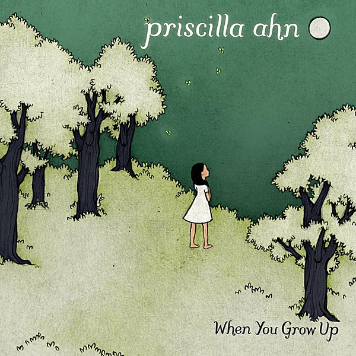

# When You Grow Up

By **Priscilla Ahn**

## Album Data

- **Catalog:** Beets
- **Format:** Digital, Album
- **Album:** When You Grow Up
- **Artist:** Priscilla Ahn
- **Albumartist:** Priscilla Ahn
- **Genre:** Unknown
- **MusicBrainz Album Artist ID:** [d4d3c818-005f-43bd-b0f8-89e74dfe4dca](https://musicbrainz.org/artist/d4d3c818-005f-43bd-b0f8-89e74dfe4dca)
- **MusicBrainz Album ID:** [bb0464e9-89fd-4fba-a913-a86cb4290f3b](https://musicbrainz.org/release/bb0464e9-89fd-4fba-a913-a86cb4290f3b)
- **MusicBrainz Release Group ID:** [0feedfbf-115d-4040-ba44-65eccd929f44](https://musicbrainz.org/release-group/0feedfbf-115d-4040-ba44-65eccd929f44)
- **Year:** 2011
- **Catalog #:** 5099963186826
- **Label:** Blue Note
- **Total Tracks:** 12

## Album Tracks

### Track 01 - When You Grow Up

- **Artist:** Priscilla Ahn
- **Format:** AAC
- **Genre:** Unknown
- **Length:** 3:03
- **MusicBrainz Track ID:** [db3518b2-fbdd-4e7a-98c7-bcd3c4161367](https://musicbrainz.org/recording/db3518b2-fbdd-4e7a-98c7-bcd3c4161367)
- **Title:** When You Grow Up
- **Track:** 01
- **Year:** 2011

### Track 02 - One Day I Will Do

- **Artist:** Priscilla Ahn
- **Format:** AAC
- **Genre:** Unknown
- **Length:** 4:16
- **MusicBrainz Track ID:** [37f94ae8-afb0-42e2-b132-259e2543a3a0](https://musicbrainz.org/recording/37f94ae8-afb0-42e2-b132-259e2543a3a0)
- **Title:** One Day I Will Do
- **Track:** 02
- **Year:** 2011

### Track 03 - Oo La La

- **Artist:** Priscilla Ahn
- **Format:** AAC
- **Genre:** Unknown
- **Length:** 3:13
- **MusicBrainz Track ID:** [454ea572-72a3-417f-94cb-dcfedb8ce303](https://musicbrainz.org/recording/454ea572-72a3-417f-94cb-dcfedb8ce303)
- **Title:** Oo La La
- **Track:** 03
- **Year:** 2011

### Track 04 - Vibe So Hot

- **Artist:** Priscilla Ahn
- **Format:** AAC
- **Genre:** Unknown
- **Length:** 2:25
- **MusicBrainz Track ID:** [8fc982a8-d232-4859-8fa9-277f79e5733e](https://musicbrainz.org/recording/8fc982a8-d232-4859-8fa9-277f79e5733e)
- **Title:** Vibe So Hot
- **Track:** 04
- **Year:** 2011

### Track 05 - City Lights (Pretty Lights)

- **Artist:** Priscilla Ahn
- **Format:** AAC
- **Genre:** Unknown
- **Length:** 3:23
- **MusicBrainz Track ID:** [1a68353c-e664-41a6-9ebb-e936ddeea2fe](https://musicbrainz.org/recording/1a68353c-e664-41a6-9ebb-e936ddeea2fe)
- **Title:** City Lights (Pretty Lights)
- **Track:** 05
- **Year:** 2011

### Track 06 - I Don't Have Time to Be in Love

- **Artist:** Priscilla Ahn
- **Format:** AAC
- **Genre:** Unknown
- **Length:** 3:26
- **MusicBrainz Track ID:** [d1cfb3ea-fa6b-45b0-966b-88e27ee48bba](https://musicbrainz.org/recording/d1cfb3ea-fa6b-45b0-966b-88e27ee48bba)
- **Title:** I Don't Have Time to Be in Love
- **Track:** 06
- **Year:** 2011

### Track 07 - Cry Baby

- **Artist:** Priscilla Ahn
- **Format:** AAC
- **Genre:** Unknown
- **Length:** 3:14
- **MusicBrainz Track ID:** [0df49dc4-b52a-44ec-9c9f-4a722c0843f5](https://musicbrainz.org/recording/0df49dc4-b52a-44ec-9c9f-4a722c0843f5)
- **Title:** Cry Baby
- **Track:** 07
- **Year:** 2011

### Track 08 - Lost Cause

- **Artist:** Priscilla Ahn
- **Format:** AAC
- **Genre:** Indie Folk
- **Length:** 4:09
- **MusicBrainz Track ID:** [e258e5b4-27fb-409f-ac6a-2da0d3c0a845](https://musicbrainz.org/recording/e258e5b4-27fb-409f-ac6a-2da0d3c0a845)
- **Title:** Lost Cause
- **Track:** 08
- **Year:** 2011

### Track 09 - Empty House

- **Artist:** Priscilla Ahn
- **Format:** AAC
- **Genre:** Unknown
- **Length:** 4:26
- **MusicBrainz Track ID:** [d9be43c5-ff02-46d0-a992-6219a6b157aa](https://musicbrainz.org/recording/d9be43c5-ff02-46d0-a992-6219a6b157aa)
- **Title:** Empty House
- **Track:** 09
- **Year:** 2011

### Track 10 - I Will Get Over You

- **Artist:** Priscilla Ahn
- **Format:** AAC
- **Genre:** Unknown
- **Length:** 3:42
- **MusicBrainz Track ID:** [929056d4-3ec2-4afd-9df7-355923159053](https://musicbrainz.org/recording/929056d4-3ec2-4afd-9df7-355923159053)
- **Title:** I Will Get Over You
- **Track:** 10
- **Year:** 2011

### Track 11 - Elf Song

- **Artist:** Priscilla Ahn
- **Format:** AAC
- **Genre:** Unknown
- **Length:** 4:16
- **MusicBrainz Track ID:** [d9461bac-d791-469d-ae23-d4cac249f53d](https://musicbrainz.org/recording/d9461bac-d791-469d-ae23-d4cac249f53d)
- **Title:** Elf Song
- **Track:** 11
- **Year:** 2011

### Track 12 - Torch Song

- **Artist:** Priscilla Ahn
- **Format:** AAC
- **Genre:** Downtempo
- **Length:** 5:24
- **MusicBrainz Track ID:** [0be44ffe-980b-4f57-8fc6-33043017f244](https://musicbrainz.org/recording/0be44ffe-980b-4f57-8fc6-33043017f244)
- **Title:** Torch Song
- **Track:** 12
- **Year:** 2011

## See also

- [A Good Day](A_Good_Day.md)
- [This Is Where We Are](This_Is_Where_We_Are.md)
- [Roon: A Good Day](../../Roon/Priscilla_Ahn/A_Good_Day.md)
