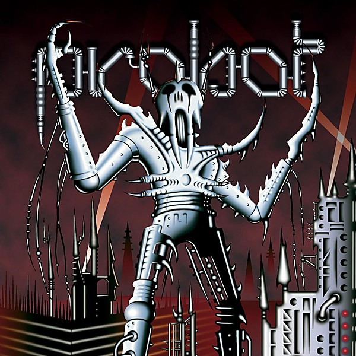

# Probot

By **Probot**

## Album Data

- **Catalog:** Beets
- **Format:** Digital, Album
- **Album:** Probot
- **Artist:** Probot
- **Albumartist:** Probot
- **Genre:** Crossover Thrash
- **MusicBrainz Album Artist ID:** [e61baf26-04fe-4f07-8f2a-c1ecbf7ca4c1](https://musicbrainz.org/artist/e61baf26-04fe-4f07-8f2a-c1ecbf7ca4c1)
- **MusicBrainz Album ID:** [2e0175f2-c4c9-48b8-b07a-1e88e9fcbf67](https://musicbrainz.org/release/2e0175f2-c4c9-48b8-b07a-1e88e9fcbf67)
- **MusicBrainz Release Group ID:** [ba3e45fd-8121-32dc-a4b5-e9b5385db86f](https://musicbrainz.org/release-group/ba3e45fd-8121-32dc-a4b5-e9b5385db86f)
- **Year:** 2004
- **Catalog #:** sunn30CD
- **Label:** Southern Lord
- **Total Tracks:** 11

## Album Tracks

### Track 05 - Silent Spring

- **Artist:** Probot w/ Kurt Brecht
- **Format:** ALAC
- **Genre:** Crossover Thrash
- **Length:** 3:27
- **MusicBrainz Track ID:** [42d7a23f-625f-4870-8aa4-d3867992aacb](https://musicbrainz.org/recording/42d7a23f-625f-4870-8aa4-d3867992aacb)
- **Title:** Silent Spring
- **Track:** 05
- **Year:** 2004

### Track 02 - Red War

- **Artist:** Probot w/ Max Cavalera
- **Format:** ALAC
- **Genre:** Crossover Thrash
- **Length:** 3:30
- **MusicBrainz Track ID:** [f01d2260-98d7-4492-b542-592a9cd2162a](https://musicbrainz.org/recording/f01d2260-98d7-4492-b542-592a9cd2162a)
- **Title:** Red War
- **Track:** 02
- **Year:** 2004

### Track 01 - Centuries of Sin

- **Artist:** Probot w/ Cronos
- **Format:** ALAC
- **Genre:** Crossover Thrash
- **Length:** 4:09
- **MusicBrainz Track ID:** [9bff9ab7-82c5-4f09-9f29-ad2e53f4abb3](https://musicbrainz.org/recording/9bff9ab7-82c5-4f09-9f29-ad2e53f4abb3)
- **Title:** Centuries of Sin
- **Track:** 01
- **Year:** 2004

### Track 04 - Access Babylon

- **Artist:** Probot w/ Mike Dean
- **Format:** ALAC
- **Genre:** Crossover Thrash
- **Length:** 1:24
- **MusicBrainz Track ID:** [3569f006-341d-4ac4-8f31-3e6fec2b7ae5](https://musicbrainz.org/recording/3569f006-341d-4ac4-8f31-3e6fec2b7ae5)
- **Title:** Access Babylon
- **Track:** 04
- **Year:** 2004

### Track 11 - Sweet Dreams / I Am the Warlock

- **Artist:** Probot w/ King Diamond / Probot w/ Jack Black
- **Format:** ALAC
- **Genre:** Crossover Thrash
- **Length:** 12:08
- **MusicBrainz Track ID:** [c99de0db-8e60-4fc9-8a77-7de10b88542b](https://musicbrainz.org/recording/c99de0db-8e60-4fc9-8a77-7de10b88542b)
- **Title:** Sweet Dreams / I Am the Warlock
- **Track:** 11
- **Year:** 2004

### Track 06 - Ice Cold Man

- **Artist:** Probot w/ Lee Dorrian
- **Format:** ALAC
- **Genre:** Crossover Thrash
- **Length:** 5:53
- **MusicBrainz Track ID:** [97af3955-48c3-4262-a79f-16b19cb5cb84](https://musicbrainz.org/recording/97af3955-48c3-4262-a79f-16b19cb5cb84)
- **Title:** Ice Cold Man
- **Track:** 06
- **Year:** 2004

### Track 03 - Shake Your Blood

- **Artist:** Probot w/ Lemmy Kilmister
- **Format:** ALAC
- **Genre:** Crossover Thrash
- **Length:** 2:59
- **MusicBrainz Track ID:** [ed4de001-2647-46f8-8417-fe4fb3a633fe](https://musicbrainz.org/recording/ed4de001-2647-46f8-8417-fe4fb3a633fe)
- **Title:** Shake Your Blood
- **Track:** 03
- **Year:** 2004

### Track 09 - Dictatosaurus

- **Artist:** Probot w/ Snake
- **Format:** ALAC
- **Genre:** Crossover Thrash
- **Length:** 3:52
- **MusicBrainz Track ID:** [68c0ac6f-fa4b-43d1-9bd7-52551dfb5f19](https://musicbrainz.org/recording/68c0ac6f-fa4b-43d1-9bd7-52551dfb5f19)
- **Title:** Dictatosaurus
- **Track:** 09
- **Year:** 2004

### Track 10 - My Tortured Soul

- **Artist:** Probot w/ Eric Wagner
- **Format:** ALAC
- **Genre:** Crossover Thrash
- **Length:** 5:00
- **MusicBrainz Track ID:** [4ce403cf-631e-47de-9cfa-ac81ed78d255](https://musicbrainz.org/recording/4ce403cf-631e-47de-9cfa-ac81ed78d255)
- **Title:** My Tortured Soul
- **Track:** 10
- **Year:** 2004

### Track 08 - Big Sky

- **Artist:** Probot w/ Thomas Gabriel Warrior
- **Format:** ALAC
- **Genre:** Crossover Thrash
- **Length:** 4:51
- **MusicBrainz Track ID:** [6203fe64-d968-4ce8-8d6a-6f409b01bd41](https://musicbrainz.org/recording/6203fe64-d968-4ce8-8d6a-6f409b01bd41)
- **Title:** Big Sky
- **Track:** 08
- **Year:** 2004

### Track 07 - The Emerald Law

- **Artist:** Probot w/ Wino
- **Format:** ALAC
- **Genre:** Crossover Thrash
- **Length:** 5:33
- **MusicBrainz Track ID:** [0be7f3a8-bec0-4666-a7a6-4aff352f3aca](https://musicbrainz.org/recording/0be7f3a8-bec0-4666-a7a6-4aff352f3aca)
- **Title:** The Emerald Law
- **Track:** 07
- **Year:** 2004

