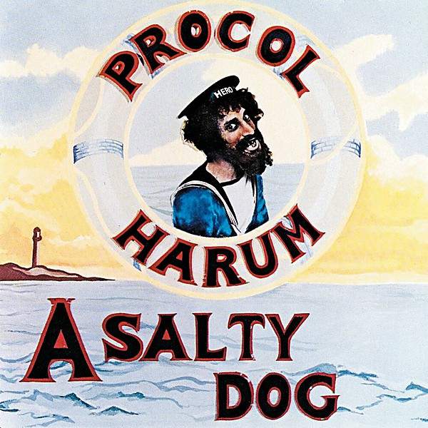

# A Salty Dog

By **Procol Harum**

## Album Data

- **Catalog:** Beets
- **Format:** Digital, Album
- **Album:** A Salty Dog
- **Artist:** Procol Harum
- **Albumartist:** Procol Harum
- **Genre:** Surf Rock
- **MusicBrainz Album Artist ID:** [44119570-4d53-46e7-a447-bd18608c28d8](https://musicbrainz.org/artist/44119570-4d53-46e7-a447-bd18608c28d8)
- **MusicBrainz Album ID:** [3e5a474a-3dac-38d7-8f13-322e8063ca16](https://musicbrainz.org/release/3e5a474a-3dac-38d7-8f13-322e8063ca16)
- **MusicBrainz Release Group ID:** [4eebdc43-00e0-3463-b7f8-206622427feb](https://musicbrainz.org/release-group/4eebdc43-00e0-3463-b7f8-206622427feb)
- **Year:** 1969
- **Catalog #:** 
- **Label:** 
- **Total Tracks:** 12

## Album Tracks

### Track 01 - Skip Softly (My Moonbeams) ("Top Gear" BBC Radio One session - 6th October 1968)

- **Artist:** Procol Harum
- **Format:** ALAC
- **Genre:** Psychedelic Rock
- **Length:** 3:47
- **MusicBrainz Track ID:** 
- **Title:** Skip Softly (My Moonbeams) ("Top Gear" BBC Radio One session - 6th October 1968)
- **Track:** 01
- **Year:** 2015

### Track 02 - Wish Me Well ("Top Gear" BBC Radio One session - 6th October 1968)

- **Artist:** Procol Harum
- **Format:** ALAC
- **Genre:** Psychedelic Rock
- **Length:** 3:41
- **MusicBrainz Track ID:** 
- **Title:** Wish Me Well ("Top Gear" BBC Radio One session - 6th October 1968)
- **Track:** 02
- **Year:** 2015

### Track 03 - Long Gone Geek ("Top Gear" BBC Radio One session - 6th October 1968)

- **Artist:** Procol Harum
- **Format:** ALAC
- **Genre:** Psychedelic Rock
- **Length:** 2:42
- **MusicBrainz Track ID:** 
- **Title:** Long Gone Geek ("Top Gear" BBC Radio One session - 6th October 1968)
- **Track:** 03
- **Year:** 2015

### Track 04 - Goin' Down Slow (Recorded live in the USA in April 1969)

- **Artist:** Procol Harum
- **Format:** ALAC
- **Genre:** Psychedelic Rock
- **Length:** 7:48
- **MusicBrainz Track ID:** 
- **Title:** Goin' Down Slow (Recorded live in the USA in April 1969)
- **Track:** 04
- **Year:** 2015

### Track 05 - Juicy John Pink (Recorded live in the USA in April 1969)

- **Artist:** Procol Harum
- **Format:** ALAC
- **Genre:** Psychedelic Rock
- **Length:** 2:38
- **MusicBrainz Track ID:** 
- **Title:** Juicy John Pink (Recorded live in the USA in April 1969)
- **Track:** 05
- **Year:** 2015

### Track 06 - Crucifiction Lane (Recorded live in the USA in April 1969)

- **Artist:** Procol Harum
- **Format:** ALAC
- **Genre:** Psychedelic Rock
- **Length:** 4:36
- **MusicBrainz Track ID:** 
- **Title:** Crucifiction Lane (Recorded live in the USA in April 1969)
- **Track:** 06
- **Year:** 2015

### Track 07 - Skip Softly My Moonbeans / Also Sprach Zarathustra (Recorded live in the USA in April 1969)

- **Artist:** Procol Harum
- **Format:** ALAC
- **Genre:** Psychedelic Rock
- **Length:** 5:25
- **MusicBrainz Track ID:** 
- **Title:** Skip Softly My Moonbeans / Also Sprach Zarathustra (Recorded live in the USA in April 1969)
- **Track:** 07
- **Year:** 2015

### Track 08 - The Milk of Human Kindness ("Symonds on Sunday" BBC Radio One session - 20th May 1969)

- **Artist:** Procol Harum
- **Format:** ALAC
- **Genre:** Psychedelic Rock
- **Length:** 3:39
- **MusicBrainz Track ID:** 
- **Title:** The Milk of Human Kindness ("Symonds on Sunday" BBC Radio One session - 20th May 1969)
- **Track:** 08
- **Year:** 2015

### Track 09 - Juicy John Pink ("Top Gear" BBC Radio One session - 27th May 1969)

- **Artist:** Procol Harum
- **Format:** ALAC
- **Genre:** Psychedelic Rock
- **Length:** 2:15
- **MusicBrainz Track ID:** 
- **Title:** Juicy John Pink ("Top Gear" BBC Radio One session - 27th May 1969)
- **Track:** 09
- **Year:** 2015

### Track 10 - A Salty Dog (mono single mix)

- **Artist:** Procol Harum
- **Format:** ALAC
- **Genre:** Psychedelic Rock
- **Length:** 4:36
- **MusicBrainz Track ID:** 
- **Title:** A Salty Dog (mono single mix)
- **Track:** 10
- **Year:** 2015

### Track 11 - Long Gone Geek

- **Artist:** Procol Harum
- **Format:** ALAC
- **Genre:** Progressive Rock
- **Length:** 3:10
- **MusicBrainz Track ID:** 
- **Title:** Long Gone Geek
- **Track:** 11
- **Year:** 2015

### Track 12 - The Milk of Human Kindness (Take 1 - raw backing track)

- **Artist:** Procol Harum
- **Format:** ALAC
- **Genre:** Psychedelic Rock
- **Length:** 3:57
- **MusicBrainz Track ID:** 
- **Title:** The Milk of Human Kindness (Take 1 - raw backing track)
- **Track:** 12
- **Year:** 2015

## See also

- [A Salty Dog (Deluxe Edition)](A_Salty_Dog_Deluxe_Edition.md)
- [Live](Live.md)
- [Procol Harum](Procol_Harum.md)
- [CD: Live In Concert With The Edmonton Symphony Orchestra](../../CD/Procol_Harum/Live_In_Concert_With_The_Edmonton_Symphony_Orchestra.md)
- [CD: ](../../CD/Procol_Harum/Procol_Harum.md)
- [Roon: A Salty Dog](../../Roon/Procol_Harum/A_Salty_Dog.md)
- [Roon: Exotic Birds and Fruit (Expanded Edition)](../../Roon/Procol_Harum/Exotic_Birds_and_Fruit_Expanded_Edition.md)
- [Roon: Grand Hotel (Remastered & Expanded Edition)](../../Roon/Procol_Harum/Grand_Hotel_Remastered_and_Expanded_Edition.md)
- [Roon: Live In Concert With The Edmonton Symphony Orchestra](../../Roon/Procol_Harum/Live_In_Concert_With_The_Edmonton_Symphony_Orchestra.md)
- [Roon: Procol Harum (2009 remaster)](../../Roon/Procol_Harum/Procol_Harum_2009_remaster.md)
- [Roon: Shine On Brightly](../../Roon/Procol_Harum/Shine_On_Brightly.md)
- [Roon: Something Magic (Expanded & Remastered Edition)](../../Roon/Procol_Harum/Something_Magic_Expanded_and_Remastered_Edition.md)
- [Vinyl: Live In Concert With The Edmonton Symphony Orchestra](../../Vinyl/Procol_Harum/Live_In_Concert_With_The_Edmonton_Symphony_Orchestra.md)
- [Vinyl: ](../../Vinyl/Procol_Harum/Procol_Harum.md)
