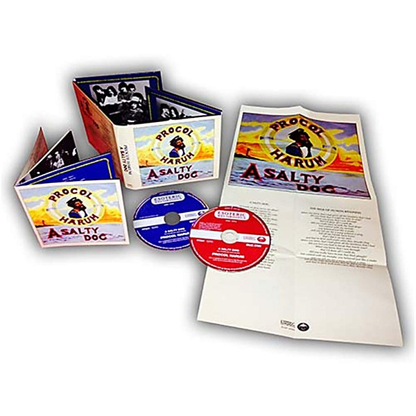

# A Salty Dog (Deluxe Edition)

By **Procol Harum**

## Album Data

- **Catalog:** Beets
- **Format:** Digital, Album
- **Album:** A Salty Dog (Deluxe Edition)
- **Artist:** Procol Harum
- **Albumartist:** Procol Harum
- **Genre:** Psychedelic Rock
- **MusicBrainz Album Artist ID:** 
- **MusicBrainz Album ID:** 
- **MusicBrainz Release Group ID:** 
- **Year:** 2015
- **Catalog #:** SALVOCD023
- **Label:** Salvo
- **Total Tracks:** 08

## Album Tracks

### Track 01 - Conquistador

- **Artist:** Procol Harum
- **Format:** AAC
- **Genre:** Psychedelic Rock
- **Length:** 5:01
- **MusicBrainz Track ID:** [e7036a88-e69a-4c17-92f0-4f6af01ef3d3](https://musicbrainz.org/recording/e7036a88-e69a-4c17-92f0-4f6af01ef3d3)
- **Title:** Conquistador
- **Track:** 01
- **Year:** 2009

### Track 02 - Whaling Stories

- **Artist:** Procol Harum
- **Format:** AAC
- **Genre:** Psychedelic Rock
- **Length:** 7:41
- **MusicBrainz Track ID:** [93df463c-5fdd-456d-8eb9-72661236fc41](https://musicbrainz.org/recording/93df463c-5fdd-456d-8eb9-72661236fc41)
- **Title:** Whaling Stories
- **Track:** 02
- **Year:** 2009

### Track 03 - A Salty Dog

- **Artist:** Procol Harum
- **Format:** AAC
- **Genre:** Progressive Rock
- **Length:** 5:34
- **MusicBrainz Track ID:** [b8869538-23f9-46eb-a031-eb83bba2bef3](https://musicbrainz.org/recording/b8869538-23f9-46eb-a031-eb83bba2bef3)
- **Title:** A Salty Dog
- **Track:** 03
- **Year:** 2009

### Track 04 - All This and More

- **Artist:** Procol Harum
- **Format:** AAC
- **Genre:** Psychedelic Rock
- **Length:** 4:29
- **MusicBrainz Track ID:** [76a3f609-7ce4-41ac-8064-b979ae6dea72](https://musicbrainz.org/recording/76a3f609-7ce4-41ac-8064-b979ae6dea72)
- **Title:** All This and More
- **Track:** 04
- **Year:** 2009

### Track 05 - In Held ’Twas in I

- **Artist:** Procol Harum
- **Format:** AAC
- **Genre:** Psychedelic Rock
- **Length:** 19:07
- **MusicBrainz Track ID:** [72266803-3683-4e50-ac78-299c4f15036f](https://musicbrainz.org/recording/72266803-3683-4e50-ac78-299c4f15036f)
- **Title:** In Held ’Twas in I
- **Track:** 05
- **Year:** 2009

### Track 06 - Luskus Delph

- **Artist:** Procol Harum
- **Format:** AAC
- **Genre:** Progressive Rock
- **Length:** 3:38
- **MusicBrainz Track ID:** [81c2245e-66bd-49b7-9f05-89e600b9fc3b](https://musicbrainz.org/recording/81c2245e-66bd-49b7-9f05-89e600b9fc3b)
- **Title:** Luskus Delph
- **Track:** 06
- **Year:** 2009

### Track 07 - Simple Sister (from rehearsal)

- **Artist:** Procol Harum
- **Format:** AAC
- **Genre:** Psychedelic Rock
- **Length:** 3:20
- **MusicBrainz Track ID:** [52213e17-6c86-4a4d-8ecb-f606e7fbd23d](https://musicbrainz.org/recording/52213e17-6c86-4a4d-8ecb-f606e7fbd23d)
- **Title:** Simple Sister (from rehearsal)
- **Track:** 07
- **Year:** 2009

### Track 08 - Shine on Brightly (from rehearsal)

- **Artist:** Procol Harum
- **Format:** AAC
- **Genre:** Psychedelic Rock
- **Length:** 4:04
- **MusicBrainz Track ID:** [afdcce8a-bd04-4996-ad77-48d4e9902abe](https://musicbrainz.org/recording/afdcce8a-bd04-4996-ad77-48d4e9902abe)
- **Title:** Shine on Brightly (from rehearsal)
- **Track:** 08
- **Year:** 2009

## See also

- [A Salty Dog](A_Salty_Dog.md)
- [Live](Live.md)
- [Procol Harum](Procol_Harum.md)
- [CD: Live In Concert With The Edmonton Symphony Orchestra](../../CD/Procol_Harum/Live_In_Concert_With_The_Edmonton_Symphony_Orchestra.md)
- [CD: ](../../CD/Procol_Harum/Procol_Harum.md)
- [Roon: A Salty Dog](../../Roon/Procol_Harum/A_Salty_Dog.md)
- [Roon: Exotic Birds and Fruit (Expanded Edition)](../../Roon/Procol_Harum/Exotic_Birds_and_Fruit_Expanded_Edition.md)
- [Roon: Grand Hotel (Remastered & Expanded Edition)](../../Roon/Procol_Harum/Grand_Hotel_Remastered_and_Expanded_Edition.md)
- [Roon: Live In Concert With The Edmonton Symphony Orchestra](../../Roon/Procol_Harum/Live_In_Concert_With_The_Edmonton_Symphony_Orchestra.md)
- [Roon: Procol Harum (2009 remaster)](../../Roon/Procol_Harum/Procol_Harum_2009_remaster.md)
- [Roon: Shine On Brightly](../../Roon/Procol_Harum/Shine_On_Brightly.md)
- [Roon: Something Magic (Expanded & Remastered Edition)](../../Roon/Procol_Harum/Something_Magic_Expanded_and_Remastered_Edition.md)
- [Vinyl: Live In Concert With The Edmonton Symphony Orchestra](../../Vinyl/Procol_Harum/Live_In_Concert_With_The_Edmonton_Symphony_Orchestra.md)
- [Vinyl: ](../../Vinyl/Procol_Harum/Procol_Harum.md)
