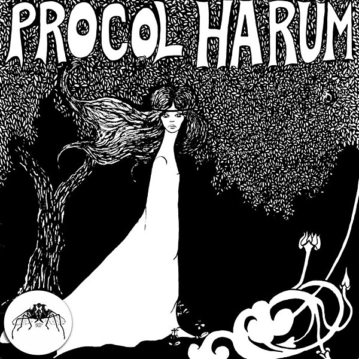

# Procol Harum

By Procol Harum

## Album Data

- Catalog: Beets
- Format: Digital, Album
- Album: Procol Harum
- Artist: Procol Harum
- Albumartist: Procol Harum
- Genre: Psychedelic Rock
- MusicBrainz Album Artist ID: 44119570-4d53-46e7-a447-bd18608c28d8
- MusicBrainz Album ID: b2849add-bea5-4314-8511-ef3698218b1f
- MusicBrainz Release Group ID: 59c4b156-e1f6-374c-a5e6-ea0ccd51d433
- Year: 1967

