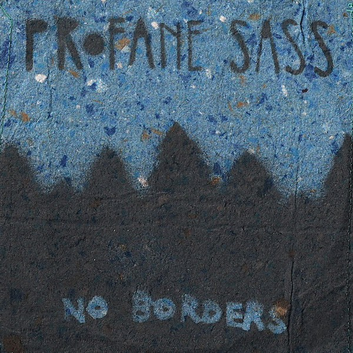

# Profane Sass

By **Profane Sass**

## Album Data

- **Catalog:** Beets
- **Format:** Digital, Album
- **Album:** Profane Sass
- **Artist:** Profane Sass
- **Albumartist:** Profane Sass
- **Genre:** Folk Punk
- **MusicBrainz Album Artist ID:** 
- **MusicBrainz Album ID:** 
- **MusicBrainz Release Group ID:** 
- **Year:** 2010
- **Catalog #:** 
- **Label:** 
- **Total Tracks:** 14

## Album Tracks

### Track 01 - Mexican Trains

- **Artist:** Profane Sass
- **Format:** MP3
- **Genre:** Folk Punk
- **Length:** 2:57
- **MusicBrainz Track ID:** 
- **Title:** Mexican Trains
- **Track:** 01
- **Year:** 2010

### Track 02 - Back To The Water

- **Artist:** Profane Sass
- **Format:** MP3
- **Genre:** Folk Punk
- **Length:** 2:23
- **MusicBrainz Track ID:** 
- **Title:** Back To The Water
- **Track:** 02
- **Year:** 2010

### Track 03 - Darlin' Corey

- **Artist:** Profane Sass
- **Format:** MP3
- **Genre:** Folk Punk
- **Length:** 3:59
- **MusicBrainz Track ID:** 
- **Title:** Darlin' Corey
- **Track:** 03
- **Year:** 2010

### Track 04 - Back To It

- **Artist:** Profane Sass
- **Format:** MP3
- **Genre:** Folk Punk
- **Length:** 3:19
- **MusicBrainz Track ID:** 
- **Title:** Back To It
- **Track:** 04
- **Year:** 2010

### Track 05 - Out To See

- **Artist:** Profane Sass
- **Format:** MP3
- **Genre:** Folk Punk
- **Length:** 2:45
- **MusicBrainz Track ID:** 
- **Title:** Out To See
- **Track:** 05
- **Year:** 2010

### Track 06 - Chocolate Bars

- **Artist:** Profane Sass
- **Format:** MP3
- **Genre:** Folk Punk
- **Length:** 2:07
- **MusicBrainz Track ID:** 
- **Title:** Chocolate Bars
- **Track:** 06
- **Year:** 2010

### Track 07 - Policia

- **Artist:** Profane Sass
- **Format:** MP3
- **Genre:** Folk Punk
- **Length:** 1:40
- **MusicBrainz Track ID:** 
- **Title:** Policia
- **Track:** 07
- **Year:** 2010

### Track 08 - We're Alive

- **Artist:** Profane Sass
- **Format:** MP3
- **Genre:** Folk Punk
- **Length:** 2:44
- **MusicBrainz Track ID:** 
- **Title:** We're Alive
- **Track:** 08
- **Year:** 2010

### Track 09 - Rabinal

- **Artist:** Profane Sass
- **Format:** MP3
- **Genre:** Folk Punk
- **Length:** 3:12
- **MusicBrainz Track ID:** 
- **Title:** Rabinal
- **Track:** 09
- **Year:** 2010

### Track 10 - In Motion

- **Artist:** Profane Sass
- **Format:** MP3
- **Genre:** Folk Punk
- **Length:** 4:03
- **MusicBrainz Track ID:** 
- **Title:** In Motion
- **Track:** 10
- **Year:** 2010

### Track 11 - Domesticated

- **Artist:** Profane Sass
- **Format:** MP3
- **Genre:** Folk Punk
- **Length:** 3:25
- **MusicBrainz Track ID:** 
- **Title:** Domesticated
- **Track:** 11
- **Year:** 2010

### Track 12 - Chairmen Meow

- **Artist:** Profane Sass
- **Format:** MP3
- **Genre:** Folk Punk
- **Length:** 1:51
- **MusicBrainz Track ID:** 
- **Title:** Chairmen Meow
- **Track:** 12
- **Year:** 2010

### Track 13 - Sun Don't Shine

- **Artist:** Profane Sass
- **Format:** MP3
- **Genre:** Folk Punk
- **Length:** 3:26
- **MusicBrainz Track ID:** 
- **Title:** Sun Don't Shine
- **Track:** 13
- **Year:** 2010

### Track 14 - No Ticket

- **Artist:** Profane Sass
- **Format:** MP3
- **Genre:** Folk Punk
- **Length:** 3:30
- **MusicBrainz Track ID:** 
- **Title:** No Ticket
- **Track:** 14
- **Year:** 2010

