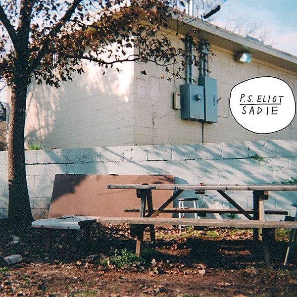

# Sadie

By **P.S. Eliot**

## Album Data

- **Catalog:** Beets
- **Format:** Digital, Album
- **Album:** Sadie
- **Artist:** P.s. Eliot
- **Albumartist:** P.S. Eliot
- **Genre:** Pop Punk
- **MusicBrainz Album Artist ID:** [97017fae-cdcd-47f1-843d-4a69a81675ed](https://musicbrainz.org/artist/97017fae-cdcd-47f1-843d-4a69a81675ed)
- **MusicBrainz Album ID:** [056576a1-c28c-4801-81f6-285f026a4dd0](https://musicbrainz.org/release/056576a1-c28c-4801-81f6-285f026a4dd0)
- **MusicBrainz Release Group ID:** [c9c7c6a7-4ada-4649-84b9-27b123159a57](https://musicbrainz.org/release-group/c9c7c6a7-4ada-4649-84b9-27b123159a57)
- **Year:** 2011
- **Catalog #:** 
- **Label:** Salinas Records
- **Total Tracks:** 13

## Album Tracks

### Track 01 - Talk

- **Artist:** P.S. Eliot
- **Format:** MP3
- **Genre:** Pop Punk
- **Length:** 2:24
- **MusicBrainz Track ID:** [b85a339c-9e31-4eae-982e-bd1cedf55d71](https://musicbrainz.org/recording/b85a339c-9e31-4eae-982e-bd1cedf55d71)
- **Title:** Talk
- **Track:** 01
- **Year:** 2011

### Track 02 - Cross Eyed

- **Artist:** P.S. Eliot
- **Format:** MP3
- **Genre:** Pop Punk
- **Length:** 4:31
- **MusicBrainz Track ID:** [374dd262-57e7-4773-a144-e7f38f15770d](https://musicbrainz.org/recording/374dd262-57e7-4773-a144-e7f38f15770d)
- **Title:** Cross Eyed
- **Track:** 02
- **Year:** 2011

### Track 03 - Sadie

- **Artist:** P.S. Eliot
- **Format:** MP3
- **Genre:** Pop Punk
- **Length:** 2:25
- **MusicBrainz Track ID:** [a286ac18-66cc-4a43-b634-c2b994c760cb](https://musicbrainz.org/recording/a286ac18-66cc-4a43-b634-c2b994c760cb)
- **Title:** Sadie
- **Track:** 03
- **Year:** 2011

### Track 04 - Asphalt

- **Artist:** P.S. Eliot
- **Format:** MP3
- **Genre:** Indie Rock
- **Length:** 2:59
- **MusicBrainz Track ID:** [507139a8-db62-46cc-87c0-6e9e07084e9a](https://musicbrainz.org/recording/507139a8-db62-46cc-87c0-6e9e07084e9a)
- **Title:** Asphalt
- **Track:** 04
- **Year:** 2011

### Track 05 - Pink Sheets

- **Artist:** P.S. Eliot
- **Format:** MP3
- **Genre:** Pop Punk
- **Length:** 3:11
- **MusicBrainz Track ID:** [ef3a8960-306c-4ccf-9565-3013bc18819a](https://musicbrainz.org/recording/ef3a8960-306c-4ccf-9565-3013bc18819a)
- **Title:** Pink Sheets
- **Track:** 05
- **Year:** 2011

### Track 06 - Untitled

- **Artist:** P.S. Eliot
- **Format:** MP3
- **Genre:** Pop Punk
- **Length:** 3:10
- **MusicBrainz Track ID:** [d6b262dc-8356-4a1c-a1f3-d077e8610edd](https://musicbrainz.org/recording/d6b262dc-8356-4a1c-a1f3-d077e8610edd)
- **Title:** Untitled
- **Track:** 06
- **Year:** 2011

### Track 07 - Shitty and Tragic

- **Artist:** P.S. Eliot
- **Format:** MP3
- **Genre:** Pop Punk
- **Length:** 3:44
- **MusicBrainz Track ID:** [9a950f38-e704-4f3b-b63b-8f54f0241b94](https://musicbrainz.org/recording/9a950f38-e704-4f3b-b63b-8f54f0241b94)
- **Title:** Shitty and Tragic
- **Track:** 07
- **Year:** 2011

### Track 08 - Jesus Christ

- **Artist:** P.S. Eliot
- **Format:** MP3
- **Genre:** Pop Punk
- **Length:** 2:23
- **MusicBrainz Track ID:** [e0ec5b21-59fe-4048-9fcf-a894e2c9cff9](https://musicbrainz.org/recording/e0ec5b21-59fe-4048-9fcf-a894e2c9cff9)
- **Title:** Jesus Christ
- **Track:** 08
- **Year:** 2011

### Track 09 - Peach

- **Artist:** P.S. Eliot
- **Format:** MP3
- **Genre:** Pop Punk
- **Length:** 2:46
- **MusicBrainz Track ID:** [7975cae2-dbca-48de-b4ed-952f3dc4ad46](https://musicbrainz.org/recording/7975cae2-dbca-48de-b4ed-952f3dc4ad46)
- **Title:** Peach
- **Track:** 09
- **Year:** 2011

### Track 10 - Diana

- **Artist:** P.S. Eliot
- **Format:** MP3
- **Genre:** Indie Rock
- **Length:** 5:12
- **MusicBrainz Track ID:** [13330385-4490-426e-88bd-71fc2e215a07](https://musicbrainz.org/recording/13330385-4490-426e-88bd-71fc2e215a07)
- **Title:** Diana
- **Track:** 10
- **Year:** 2011

### Track 11 - Dead Letters

- **Artist:** P.S. Eliot
- **Format:** MP3
- **Genre:** Indie Rock
- **Length:** 2:54
- **MusicBrainz Track ID:** [fa17f251-7ba8-450b-9f0b-678a4ebd8bad](https://musicbrainz.org/recording/fa17f251-7ba8-450b-9f0b-678a4ebd8bad)
- **Title:** Dead Letters
- **Track:** 11
- **Year:** 2011

### Track 12 - Mood Ring

- **Artist:** P.S. Eliot
- **Format:** MP3
- **Genre:** Pop Punk
- **Length:** 2:53
- **MusicBrainz Track ID:** [fa1763c2-4300-466d-8c8e-ec9f54411b6f](https://musicbrainz.org/recording/fa1763c2-4300-466d-8c8e-ec9f54411b6f)
- **Title:** Mood Ring
- **Track:** 12
- **Year:** 2011

### Track 13 - Watch on Mute

- **Artist:** P.S. Eliot
- **Format:** MP3
- **Genre:** Pop Punk
- **Length:** 1:48
- **MusicBrainz Track ID:** [49b9dcbd-57a2-47a6-8ede-453b401babb0](https://musicbrainz.org/recording/49b9dcbd-57a2-47a6-8ede-453b401babb0)
- **Title:** Watch on Mute
- **Track:** 13
- **Year:** 2011

