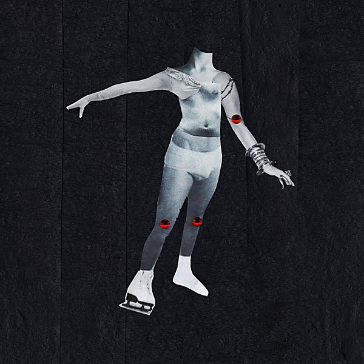

# Ugly Cherries

By **PWR BTTM**

## Album Data

- **Catalog:** Beets
- **Format:** Digital, Album
- **Album:** Ugly Cherries
- **Artist:** Pwr Bttm
- **Albumartist:** PWR BTTM
- **Genre:** Power Metal
- **MusicBrainz Album Artist ID:** 
- **MusicBrainz Album ID:** 
- **MusicBrainz Release Group ID:** 
- **Year:** 2016
- **Catalog #:** 
- **Label:** 
- **Total Tracks:** 00

## Album Tracks

### Track 01 - Short Lived Nightmare

- **Artist:** PWR BTTM
- **Format:** ALAC
- **Genre:** Country
- **Length:** 1:05
- **MusicBrainz Track ID:** 
- **Title:** Short Lived Nightmare
- **Track:** 01
- **Year:** 2016

### Track 02 - Dairy Queen

- **Artist:** PWR BTTM
- **Format:** ALAC
- **Genre:** Country
- **Length:** 2:30
- **MusicBrainz Track ID:** 
- **Title:** Dairy Queen
- **Track:** 02
- **Year:** 2016

### Track 03 - I Wanna Boi

- **Artist:** PWR BTTM
- **Format:** ALAC
- **Genre:** Country
- **Length:** 2:02
- **MusicBrainz Track ID:** 
- **Title:** I Wanna Boi
- **Track:** 03
- **Year:** 2016

### Track 04 - Ugly Cherries

- **Artist:** PWR BTTM
- **Format:** ALAC
- **Genre:** Country
- **Length:** 2:20
- **MusicBrainz Track ID:** 
- **Title:** Ugly Cherries
- **Track:** 04
- **Year:** 2016

### Track 05 - Serving Goffman

- **Artist:** PWR BTTM
- **Format:** ALAC
- **Genre:** Country
- **Length:** 2:19
- **MusicBrainz Track ID:** 
- **Title:** Serving Goffman
- **Track:** 05
- **Year:** 2016

### Track 06 - Nu 1

- **Artist:** PWR BTTM
- **Format:** ALAC
- **Genre:** Country
- **Length:** 2:02
- **MusicBrainz Track ID:** 
- **Title:** Nu 1
- **Track:** 06
- **Year:** 2016

### Track 07 - West Texas

- **Artist:** PWR BTTM
- **Format:** ALAC
- **Genre:** Country
- **Length:** 2:45
- **MusicBrainz Track ID:** 
- **Title:** West Texas
- **Track:** 07
- **Year:** 2016

### Track 08 - 1994

- **Artist:** PWR BTTM
- **Format:** ALAC
- **Genre:** Country
- **Length:** 2:27
- **MusicBrainz Track ID:** 
- **Title:** 1994
- **Track:** 08
- **Year:** 2016

### Track 09 - C U Around

- **Artist:** PWR BTTM
- **Format:** ALAC
- **Genre:** Country
- **Length:** 2:55
- **MusicBrainz Track ID:** 
- **Title:** C U Around
- **Track:** 09
- **Year:** 2016

### Track 10 - All The Boys

- **Artist:** PWR BTTM
- **Format:** ALAC
- **Genre:** Country
- **Length:** 2:25
- **MusicBrainz Track ID:** 
- **Title:** All The Boys
- **Track:** 10
- **Year:** 2016

### Track 11 - House in Virginia

- **Artist:** PWR BTTM
- **Format:** ALAC
- **Genre:** Country
- **Length:** 4:51
- **MusicBrainz Track ID:** 
- **Title:** House in Virginia
- **Track:** 11
- **Year:** 2016

### Track 12 - Projection (EU Bonus Track)

- **Artist:** PWR BTTM
- **Format:** ALAC
- **Genre:** Country
- **Length:** 2:45
- **MusicBrainz Track ID:** 
- **Title:** Projection (EU Bonus Track)
- **Track:** 12
- **Year:** 2016

### Track 13 - New Hampshire (EU Bonus Track)

- **Artist:** PWR BTTM
- **Format:** ALAC
- **Genre:** Country
- **Length:** 3:30
- **MusicBrainz Track ID:** 
- **Title:** New Hampshire (EU Bonus Track)
- **Track:** 13
- **Year:** 2016

## See also

- [Pageant](Pageant.md)
