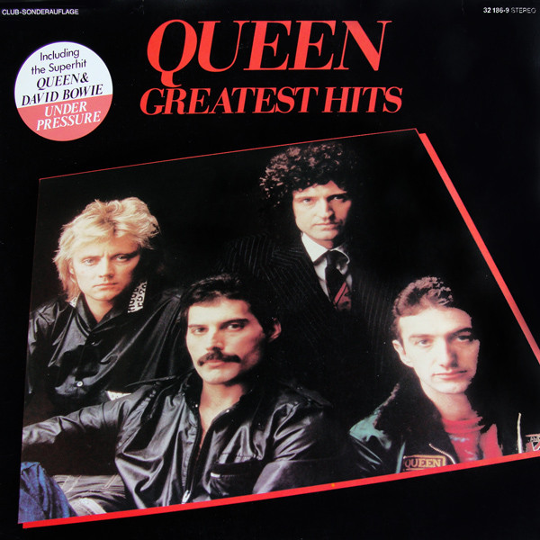

# Greatest Hits

By **Queen**

## Album Data

- **Catalog:** Beets
- **Format:** Digital, Album
- **Album:** Greatest Hits
- **Artist:** Queen
- **Albumartist:** Queen
- **Genre:** Glam Rock
- **MusicBrainz Album Artist ID:** 
- **MusicBrainz Album ID:** 
- **MusicBrainz Release Group ID:** 
- **Year:** 1977
- **Catalog #:** HR-61037-2
- **Label:** Hollywood Records
- **Total Tracks:** 12

## Album Tracks

### Track 01 - We Will Rock You

- **Artist:** Queen
- **Format:** MP3
- **Genre:** Hard Rock
- **Length:** 2:02
- **MusicBrainz Track ID:** [f8581c2b-61ac-465d-82ae-0fa2916a4799](https://musicbrainz.org/recording/f8581c2b-61ac-465d-82ae-0fa2916a4799)
- **Title:** We Will Rock You
- **Track:** 01
- **Year:** 1991

### Track 02 - We Are the Champions

- **Artist:** Queen
- **Format:** MP3
- **Genre:** Hard Rock
- **Length:** 3:00
- **MusicBrainz Track ID:** [3604eb06-4bc2-4416-9b31-ceadae51bc70](https://musicbrainz.org/recording/3604eb06-4bc2-4416-9b31-ceadae51bc70)
- **Title:** We Are the Champions
- **Track:** 02
- **Year:** 1991

### Track 03 - Sheer Heart Attack

- **Artist:** Queen
- **Format:** MP3
- **Genre:** Hard Rock
- **Length:** 3:25
- **MusicBrainz Track ID:** [dc7176c8-a050-4185-8e12-e22d6f97a952](https://musicbrainz.org/recording/dc7176c8-a050-4185-8e12-e22d6f97a952)
- **Title:** Sheer Heart Attack
- **Track:** 03
- **Year:** 1991

### Track 04 - All Dead, All Dead

- **Artist:** Queen
- **Format:** MP3
- **Genre:** Hard Rock
- **Length:** 3:10
- **MusicBrainz Track ID:** [c5985008-096e-44d6-b1f7-9c9aea78f046](https://musicbrainz.org/recording/c5985008-096e-44d6-b1f7-9c9aea78f046)
- **Title:** All Dead, All Dead
- **Track:** 04
- **Year:** 1991

### Track 05 - Spread Your Wings

- **Artist:** Queen
- **Format:** MP3
- **Genre:** Hard Rock
- **Length:** 4:34
- **MusicBrainz Track ID:** [940ca3f2-bf8d-4320-81ce-77dc74651d6e](https://musicbrainz.org/recording/940ca3f2-bf8d-4320-81ce-77dc74651d6e)
- **Title:** Spread Your Wings
- **Track:** 05
- **Year:** 1991

### Track 06 - Fight From the Inside

- **Artist:** Queen
- **Format:** MP3
- **Genre:** Hard Rock
- **Length:** 3:03
- **MusicBrainz Track ID:** [2e697661-f7de-44f9-a408-9c84b1d300c8](https://musicbrainz.org/recording/2e697661-f7de-44f9-a408-9c84b1d300c8)
- **Title:** Fight From the Inside
- **Track:** 06
- **Year:** 1991

### Track 07 - Get Down, Make Love

- **Artist:** Queen
- **Format:** MP3
- **Genre:** Hard Rock
- **Length:** 3:51
- **MusicBrainz Track ID:** [6d908173-3107-4bfc-9b45-c9effeb140a7](https://musicbrainz.org/recording/6d908173-3107-4bfc-9b45-c9effeb140a7)
- **Title:** Get Down, Make Love
- **Track:** 07
- **Year:** 1991

### Track 08 - Sleeping on the Sidewalk

- **Artist:** Queen
- **Format:** MP3
- **Genre:** Hard Rock
- **Length:** 3:06
- **MusicBrainz Track ID:** [87f3b43f-0e3b-4251-ad09-ed6c600a83c8](https://musicbrainz.org/recording/87f3b43f-0e3b-4251-ad09-ed6c600a83c8)
- **Title:** Sleeping on the Sidewalk
- **Track:** 08
- **Year:** 1991

### Track 09 - Who Needs You

- **Artist:** Queen
- **Format:** MP3
- **Genre:** Hard Rock
- **Length:** 3:05
- **MusicBrainz Track ID:** [02dec6e1-fa49-4812-bf24-906fc68eee47](https://musicbrainz.org/recording/02dec6e1-fa49-4812-bf24-906fc68eee47)
- **Title:** Who Needs You
- **Track:** 09
- **Year:** 1991

### Track 10 - It's Late

- **Artist:** Queen
- **Format:** MP3
- **Genre:** Hard Rock
- **Length:** 6:26
- **MusicBrainz Track ID:** [6f893408-be1f-4f95-9fdc-7ad6519bed11](https://musicbrainz.org/recording/6f893408-be1f-4f95-9fdc-7ad6519bed11)
- **Title:** It's Late
- **Track:** 10
- **Year:** 1991

### Track 11 - My Melancholy Blues

- **Artist:** Queen
- **Format:** MP3
- **Genre:** Soul
- **Length:** 3:29
- **MusicBrainz Track ID:** [a6d2dd8c-b40e-49d0-befc-e3568a0fd695](https://musicbrainz.org/recording/a6d2dd8c-b40e-49d0-befc-e3568a0fd695)
- **Title:** My Melancholy Blues
- **Track:** 11
- **Year:** 1991

### Track 12 - We Will Rock You (1991 Bonus Remix Ruined by Rick Rubin)

- **Artist:** Queen
- **Format:** MP3
- **Genre:** Pop Rock
- **Length:** 5:00
- **MusicBrainz Track ID:** [82320ce4-1690-4117-960b-b99dd104df0e](https://musicbrainz.org/recording/82320ce4-1690-4117-960b-b99dd104df0e)
- **Title:** We Will Rock You (1991 Bonus Remix Ruined by Rick Rubin)
- **Track:** 12
- **Year:** 1991

## See also

- [News Of The World (Deluxe Edition)](News_Of_The_World_Deluxe_Edition.md)
- [News of the World](News_of_the_World.md)
- [Queen II](Queen_II.md)
- [Roon: A Night at the Opera (Remastered 2011)](../../Roon/Queen/A_Night_at_the_Opera_Remastered_2011.md)
- [Roon: Greatest Hits](../../Roon/Queen/Greatest_Hits.md)
- [Roon: News Of The World (Deluxe Remastered Version)](../../Roon/Queen/News_Of_The_World_Deluxe_Remastered_Version.md)
- [Roon: News Of The World](../../Roon/Queen/News_Of_The_World.md)
- [Roon: Queen II (Remastered 2011)](../../Roon/Queen/Queen_II_Remastered_2011.md)
- [Vinyl: A Night At The Opera](../../Vinyl/Queen/A_Night_At_The_Opera.md)
- [Vinyl: Another One Bites The Dust](../../Vinyl/Queen/Another_One_Bites_The_Dust.md)
- [Vinyl: News Of The World](../../Vinyl/Queen/News_Of_The_World.md)
- [Vinyl: Queen II](../../Vinyl/Queen/Queen_II.md)
- [Vinyl: ](../../Vinyl/Queen/Queen_index.md)
- [Vinyl: Queen](../../Vinyl/Queen/Queen.md)
- [Vinyl: We Are The Champions](../../Vinyl/Queen/We_Are_The_Champions.md)
