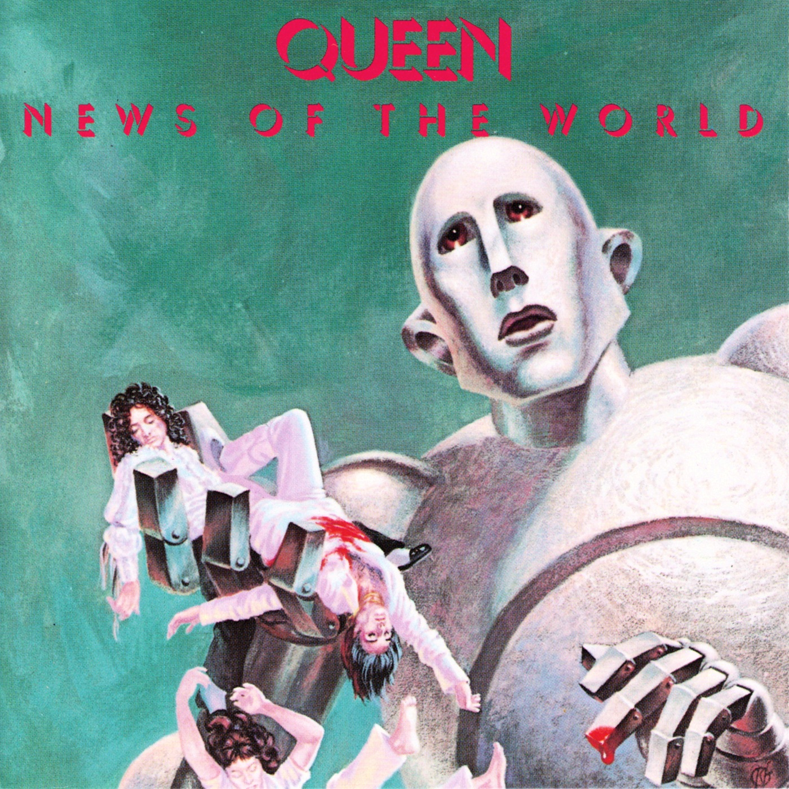

# News of the World

By **Queen**

## Album Data

- **Catalog:** Beets
- **Format:** Digital, Album
- **Album:** News of the World
- **Artist:** Queen
- **Albumartist:** Queen
- **Genre:** Pop Rock
- **MusicBrainz Album Artist ID:** [0383dadf-2a4e-4d10-a46a-e9e041da8eb3](https://musicbrainz.org/artist/0383dadf-2a4e-4d10-a46a-e9e041da8eb3)
- **MusicBrainz Album ID:** [0894f6af-ac4b-4f9d-b692-e5b0d2f1ee94](https://musicbrainz.org/release/0894f6af-ac4b-4f9d-b692-e5b0d2f1ee94)
- **MusicBrainz Release Group ID:** [c172ea98-3a82-3254-b8ad-25a4f465ba03](https://musicbrainz.org/release-group/c172ea98-3a82-3254-b8ad-25a4f465ba03)
- **Year:** 1991
- **Catalog #:** 
- **Label:** 
- **Total Tracks:** 11

## Album Tracks

### Track 01 - We Will Rock You (Remastered 2011)

- **Artist:** Queen
- **Format:** MP3
- **Genre:** Glam Rock
- **Length:** 2:02
- **MusicBrainz Track ID:** 
- **Title:** We Will Rock You (Remastered 2011)
- **Track:** 01
- **Year:** 2011

### Track 02 - We Are the Champions (Digital Remastered)

- **Artist:** Queen
- **Format:** MP3
- **Genre:** Hard Rock
- **Length:** 2:59
- **MusicBrainz Track ID:** [de93d6de-bb78-4f59-a2d7-6dea589303c5](https://musicbrainz.org/recording/de93d6de-bb78-4f59-a2d7-6dea589303c5)
- **Title:** We Are the Champions (Digital Remastered)
- **Track:** 02
- **Year:** 2011

### Track 04 - All Dead All Dead

- **Artist:** Queen
- **Format:** MP3
- **Genre:** Progressive Rock
- **Length:** 3:09
- **MusicBrainz Track ID:** [0efb14e7-1ee7-4ac4-b3b2-f335da5e1dad](https://musicbrainz.org/recording/0efb14e7-1ee7-4ac4-b3b2-f335da5e1dad)
- **Title:** All Dead All Dead
- **Track:** 04
- **Year:** 2011

### Track 07 - Get Down Make Love

- **Artist:** Queen
- **Format:** MP3
- **Genre:** Soul
- **Length:** 3:50
- **MusicBrainz Track ID:** [43258c27-8482-4274-bdc1-5bdd413e849c](https://musicbrainz.org/recording/43258c27-8482-4274-bdc1-5bdd413e849c)
- **Title:** Get Down Make Love
- **Track:** 07
- **Year:** 2011

### Track 10 - It’s Late

- **Artist:** Queen
- **Format:** MP3
- **Genre:** Hard Rock
- **Length:** 6:26
- **MusicBrainz Track ID:** [6e384eb9-7a5d-4f66-bff3-c70af1cfdd38](https://musicbrainz.org/recording/6e384eb9-7a5d-4f66-bff3-c70af1cfdd38)
- **Title:** It’s Late
- **Track:** 10
- **Year:** 2011

### Track 01 - Feelings Feelings (take 10, July 1977)

- **Artist:** Queen
- **Format:** MP3
- **Genre:** Hard Rock
- **Length:** 1:54
- **MusicBrainz Track ID:** [b34a6966-3d79-4ce9-bea0-72c3858785bd](https://musicbrainz.org/recording/b34a6966-3d79-4ce9-bea0-72c3858785bd)
- **Title:** Feelings Feelings (take 10, July 1977)
- **Track:** 01
- **Year:** 2011

### Track 02 - Spread Your Wings (BBC session, October 1977)

- **Artist:** Queen
- **Format:** MP3
- **Genre:** Hard Rock
- **Length:** 5:25
- **MusicBrainz Track ID:** [214fa952-8fcc-42de-b3c4-ce64dbfa1a85](https://musicbrainz.org/recording/214fa952-8fcc-42de-b3c4-ce64dbfa1a85)
- **Title:** Spread Your Wings (BBC session, October 1977)
- **Track:** 02
- **Year:** 2011

### Track 03 - My Melancholy Blues (BBC session, October 1977)

- **Artist:** Queen
- **Format:** MP3
- **Genre:** Hard Rock
- **Length:** 3:12
- **MusicBrainz Track ID:** [b0ee700e-512c-431b-bef2-228a1f165278](https://musicbrainz.org/recording/b0ee700e-512c-431b-bef2-228a1f165278)
- **Title:** My Melancholy Blues (BBC session, October 1977)
- **Track:** 03
- **Year:** 2011

### Track 04 - Sheer Heart Attack (live in Paris, February 1979)

- **Artist:** Queen
- **Format:** MP3
- **Genre:** Hard Rock
- **Length:** 3:34
- **MusicBrainz Track ID:** [b7b882fe-2aea-431d-a35e-cc00e68dc176](https://musicbrainz.org/recording/b7b882fe-2aea-431d-a35e-cc00e68dc176)
- **Title:** Sheer Heart Attack (live in Paris, February 1979)
- **Track:** 04
- **Year:** 2011

### Track 05 - We Will Rock You (fast, live in Tokyo, November 1982)

- **Artist:** Queen
- **Format:** MP3
- **Genre:** Hard Rock
- **Length:** 2:54
- **MusicBrainz Track ID:** [19025c3e-4e54-44a6-9018-7d51d26f8c61](https://musicbrainz.org/recording/19025c3e-4e54-44a6-9018-7d51d26f8c61)
- **Title:** We Will Rock You (fast, live in Tokyo, November 1982)
- **Track:** 05
- **Year:** 2011

## See also

- [Greatest Hits](Greatest_Hits.md)
- [News Of The World (Deluxe Edition)](News_Of_The_World_Deluxe_Edition.md)
- [Queen II](Queen_II.md)
- [Roon: A Night at the Opera (Remastered 2011)](../../Roon/Queen/A_Night_at_the_Opera_Remastered_2011.md)
- [Roon: Greatest Hits](../../Roon/Queen/Greatest_Hits.md)
- [Roon: News Of The World (Deluxe Remastered Version)](../../Roon/Queen/News_Of_The_World_Deluxe_Remastered_Version.md)
- [Roon: News Of The World](../../Roon/Queen/News_Of_The_World.md)
- [Roon: Queen II (Remastered 2011)](../../Roon/Queen/Queen_II_Remastered_2011.md)
- [Vinyl: A Night At The Opera](../../Vinyl/Queen/A_Night_At_The_Opera.md)
- [Vinyl: Another One Bites The Dust](../../Vinyl/Queen/Another_One_Bites_The_Dust.md)
- [Vinyl: News Of The World](../../Vinyl/Queen/News_Of_The_World.md)
- [Vinyl: Queen II](../../Vinyl/Queen/Queen_II.md)
- [Vinyl: ](../../Vinyl/Queen/Queen_index.md)
- [Vinyl: Queen](../../Vinyl/Queen/Queen.md)
- [Vinyl: We Are The Champions](../../Vinyl/Queen/We_Are_The_Champions.md)
