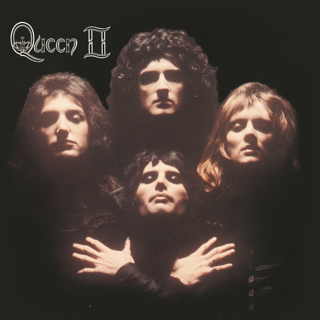

# Queen II

By **Queen**

## Album Data

- **Catalog:** Beets
- **Format:** Digital, Album
- **Album:** Queen II
- **Artist:** Queen
- **Albumartist:** Queen
- **Genre:** Progressive Rock
- **MusicBrainz Album Artist ID:** [0383dadf-2a4e-4d10-a46a-e9e041da8eb3](https://musicbrainz.org/artist/0383dadf-2a4e-4d10-a46a-e9e041da8eb3)
- **MusicBrainz Album ID:** [3b2ee17c-a984-4b82-996b-bc9031974c49](https://musicbrainz.org/release/3b2ee17c-a984-4b82-996b-bc9031974c49)
- **MusicBrainz Release Group ID:** [93d91bd6-1b55-3751-bca7-8b9d33beb7ef](https://musicbrainz.org/release-group/93d91bd6-1b55-3751-bca7-8b9d33beb7ef)
- **Year:** 2011
- **Catalog #:** D001364302
- **Label:** Hollywood Records
- **Total Tracks:** 11

## Album Tracks

### Track 01 - Procession

- **Artist:** Queen
- **Format:** MP3
- **Genre:** Hard Rock
- **Length:** 1:13
- **MusicBrainz Track ID:** [aa90019b-966f-4902-978f-1b4455a0f396](https://musicbrainz.org/recording/aa90019b-966f-4902-978f-1b4455a0f396)
- **Title:** Procession
- **Track:** 01
- **Year:** 2011

### Track 02 - Father to Son

- **Artist:** Queen
- **Format:** MP3
- **Genre:** Progressive Rock
- **Length:** 6:13
- **MusicBrainz Track ID:** [6ad8831f-77db-47dc-828b-bd62482e1047](https://musicbrainz.org/recording/6ad8831f-77db-47dc-828b-bd62482e1047)
- **Title:** Father to Son
- **Track:** 02
- **Year:** 2011

### Track 06 - Ogre Battle

- **Artist:** Queen
- **Format:** MP3
- **Genre:** Progressive Rock
- **Length:** 4:08
- **MusicBrainz Track ID:** [d46d3ef6-2f56-4a79-a3f9-6d3b4ec1d3e3](https://musicbrainz.org/recording/d46d3ef6-2f56-4a79-a3f9-6d3b4ec1d3e3)
- **Title:** Ogre Battle
- **Track:** 06
- **Year:** 2011

### Track 07 - The Fairy Feller’s Master‐Stroke

- **Artist:** Queen
- **Format:** MP3
- **Genre:** Progressive Rock
- **Length:** 2:41
- **MusicBrainz Track ID:** [8f6da9ea-54fd-43ea-abe3-82e99210be61](https://musicbrainz.org/recording/8f6da9ea-54fd-43ea-abe3-82e99210be61)
- **Title:** The Fairy Feller’s Master‐Stroke
- **Track:** 07
- **Year:** 2011

### Track 08 - Nevermore

- **Artist:** Queen
- **Format:** MP3
- **Genre:** Hard Rock
- **Length:** 1:18
- **MusicBrainz Track ID:** [702b4e3d-cb0e-4d22-841a-65c9a2936c3d](https://musicbrainz.org/recording/702b4e3d-cb0e-4d22-841a-65c9a2936c3d)
- **Title:** Nevermore
- **Track:** 08
- **Year:** 2011

### Track 09 - The March of the Black Queen

- **Artist:** Queen
- **Format:** MP3
- **Genre:** Progressive Rock
- **Length:** 6:32
- **MusicBrainz Track ID:** [33b91ac5-014d-417e-b74f-cf30757c54ca](https://musicbrainz.org/recording/33b91ac5-014d-417e-b74f-cf30757c54ca)
- **Title:** The March of the Black Queen
- **Track:** 09
- **Year:** 2011

### Track 10 - Funny How Love Is

- **Artist:** Queen
- **Format:** MP3
- **Genre:** Hard Rock
- **Length:** 2:49
- **MusicBrainz Track ID:** [6d7f5383-cfd2-49c1-9511-1f8b83a74c4b](https://musicbrainz.org/recording/6d7f5383-cfd2-49c1-9511-1f8b83a74c4b)
- **Title:** Funny How Love Is
- **Track:** 10
- **Year:** 2011

### Track 11 - Seven Seas of Rhye

- **Artist:** Queen
- **Format:** MP3
- **Genre:** Hard Rock
- **Length:** 2:49
- **MusicBrainz Track ID:** [8402fc0f-71b8-4773-ae7b-86bde5ac7b43](https://musicbrainz.org/recording/8402fc0f-71b8-4773-ae7b-86bde5ac7b43)
- **Title:** Seven Seas of Rhye
- **Track:** 11
- **Year:** 2011

## See also

- [Greatest Hits](Greatest_Hits.md)
- [News Of The World (Deluxe Edition)](News_Of_The_World_Deluxe_Edition.md)
- [News of the World](News_of_the_World.md)
- [Roon: A Night at the Opera (Remastered 2011)](../../Roon/Queen/A_Night_at_the_Opera_Remastered_2011.md)
- [Roon: Greatest Hits](../../Roon/Queen/Greatest_Hits.md)
- [Roon: News Of The World (Deluxe Remastered Version)](../../Roon/Queen/News_Of_The_World_Deluxe_Remastered_Version.md)
- [Roon: News Of The World](../../Roon/Queen/News_Of_The_World.md)
- [Roon: Queen II (Remastered 2011)](../../Roon/Queen/Queen_II_Remastered_2011.md)
- [Vinyl: A Night At The Opera](../../Vinyl/Queen/A_Night_At_The_Opera.md)
- [Vinyl: Another One Bites The Dust](../../Vinyl/Queen/Another_One_Bites_The_Dust.md)
- [Vinyl: News Of The World](../../Vinyl/Queen/News_Of_The_World.md)
- [Vinyl: Queen II](../../Vinyl/Queen/Queen_II.md)
- [Vinyl: ](../../Vinyl/Queen/Queen_index.md)
- [Vinyl: Queen](../../Vinyl/Queen/Queen.md)
- [Vinyl: We Are The Champions](../../Vinyl/Queen/We_Are_The_Champions.md)
