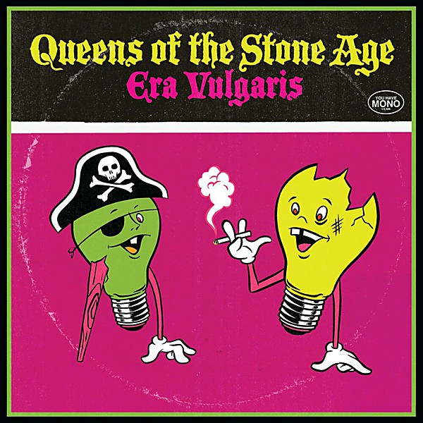

# Era Vulgaris

By **Queens of the Stone Age**

## Album Data

- **Catalog:** Beets
- **Format:** Digital, Album
- **Album:** Era Vulgaris
- **Artist:** Queens Of The Stone Age
- **Albumartist:** Queens of the Stone Age
- **Genre:** Stoner Rock
- **MusicBrainz Album Artist ID:** [7dc8f5bd-9d0b-4087-9f73-dc164950bbd8](https://musicbrainz.org/artist/7dc8f5bd-9d0b-4087-9f73-dc164950bbd8)
- **MusicBrainz Album ID:** [59e5a781-a03d-3f65-8ca6-537a27ef37cc](https://musicbrainz.org/release/59e5a781-a03d-3f65-8ca6-537a27ef37cc)
- **MusicBrainz Release Group ID:** [c349f4fb-19f3-3fc4-ad3d-3bea900e7cf2](https://musicbrainz.org/release-group/c349f4fb-19f3-3fc4-ad3d-3bea900e7cf2)
- **Year:** 2007
- **Catalog #:** B0004186-02
- **Label:** Interscope Records
- **Total Tracks:** 14

## Album Tracks

### Track 01 - This Lullaby

- **Artist:** Queens of the Stone Age
- **Format:** ALAC
- **Genre:** Stoner Rock
- **Length:** 1:22
- **MusicBrainz Track ID:** [d77650cc-1e4a-4038-81d9-e8f2af7d24e6](https://musicbrainz.org/recording/d77650cc-1e4a-4038-81d9-e8f2af7d24e6)
- **Title:** This Lullaby
- **Track:** 01
- **Year:** 2005

### Track 02 - Medication

- **Artist:** Queens of the Stone Age
- **Format:** ALAC
- **Genre:** Stoner Rock
- **Length:** 1:54
- **MusicBrainz Track ID:** [2af7ea58-df6b-4019-9ab4-29002c713d98](https://musicbrainz.org/recording/2af7ea58-df6b-4019-9ab4-29002c713d98)
- **Title:** Medication
- **Track:** 02
- **Year:** 2005

### Track 03 - Everybody Knows That You Are Insane

- **Artist:** Queens of the Stone Age
- **Format:** ALAC
- **Genre:** Stoner Rock
- **Length:** 4:14
- **MusicBrainz Track ID:** [4bad71e0-e4e5-475c-9723-d9144d3b9369](https://musicbrainz.org/recording/4bad71e0-e4e5-475c-9723-d9144d3b9369)
- **Title:** Everybody Knows That You Are Insane
- **Track:** 03
- **Year:** 2005

### Track 04 - Tangled Up in Plaid

- **Artist:** Queens of the Stone Age
- **Format:** ALAC
- **Genre:** Stoner Rock
- **Length:** 4:13
- **MusicBrainz Track ID:** [594b68f5-356c-4cae-a32e-4564a512c58f](https://musicbrainz.org/recording/594b68f5-356c-4cae-a32e-4564a512c58f)
- **Title:** Tangled Up in Plaid
- **Track:** 04
- **Year:** 2005

### Track 05 - Burn the Witch

- **Artist:** Queens of the Stone Age
- **Format:** ALAC
- **Genre:** Stoner Rock
- **Length:** 3:35
- **MusicBrainz Track ID:** [08d44803-d714-4f1a-85b6-8401cb48355a](https://musicbrainz.org/recording/08d44803-d714-4f1a-85b6-8401cb48355a)
- **Title:** Burn the Witch
- **Track:** 05
- **Year:** 2005

### Track 06 - In My Head

- **Artist:** Queens of the Stone Age
- **Format:** ALAC
- **Genre:** Stoner Rock
- **Length:** 4:01
- **MusicBrainz Track ID:** [1e49899b-fe32-4aca-b77b-877d3ec62ff3](https://musicbrainz.org/recording/1e49899b-fe32-4aca-b77b-877d3ec62ff3)
- **Title:** In My Head
- **Track:** 06
- **Year:** 2005

### Track 07 - Little Sister

- **Artist:** Queens of the Stone Age
- **Format:** ALAC
- **Genre:** Stoner Rock
- **Length:** 2:54
- **MusicBrainz Track ID:** [778f9f94-269c-46f7-9458-6668d658047a](https://musicbrainz.org/recording/778f9f94-269c-46f7-9458-6668d658047a)
- **Title:** Little Sister
- **Track:** 07
- **Year:** 2005

### Track 08 - I Never Came

- **Artist:** Queens of the Stone Age
- **Format:** ALAC
- **Genre:** Stoner Rock
- **Length:** 4:48
- **MusicBrainz Track ID:** [43dc751d-887e-462f-8ff0-387de06acc42](https://musicbrainz.org/recording/43dc751d-887e-462f-8ff0-387de06acc42)
- **Title:** I Never Came
- **Track:** 08
- **Year:** 2005

### Track 09 - Someone’s in the Wolf

- **Artist:** Queens of the Stone Age
- **Format:** ALAC
- **Genre:** Stoner Rock
- **Length:** 7:15
- **MusicBrainz Track ID:** [3bac9403-d1b3-4490-9a42-143a708634f5](https://musicbrainz.org/recording/3bac9403-d1b3-4490-9a42-143a708634f5)
- **Title:** Someone’s in the Wolf
- **Track:** 09
- **Year:** 2005

### Track 10 - The Blood Is Love

- **Artist:** Queens of the Stone Age
- **Format:** ALAC
- **Genre:** Stoner Rock
- **Length:** 6:37
- **MusicBrainz Track ID:** [031ac688-36e4-4bc4-8b73-efc480a63e04](https://musicbrainz.org/recording/031ac688-36e4-4bc4-8b73-efc480a63e04)
- **Title:** The Blood Is Love
- **Track:** 10
- **Year:** 2005

### Track 11 - Skin on Skin

- **Artist:** Queens of the Stone Age
- **Format:** ALAC
- **Genre:** Stoner Metal
- **Length:** 3:42
- **MusicBrainz Track ID:** [9a443c11-df46-4d75-9c70-94175235da00](https://musicbrainz.org/recording/9a443c11-df46-4d75-9c70-94175235da00)
- **Title:** Skin on Skin
- **Track:** 11
- **Year:** 2005

### Track 12 - Broken Box

- **Artist:** Queens of the Stone Age
- **Format:** ALAC
- **Genre:** Stoner Rock
- **Length:** 3:02
- **MusicBrainz Track ID:** [a8e8f737-0107-4116-bd5b-9f12e7bfd95a](https://musicbrainz.org/recording/a8e8f737-0107-4116-bd5b-9f12e7bfd95a)
- **Title:** Broken Box
- **Track:** 12
- **Year:** 2005

### Track 13 - “You Got a Killer Scene There, Man…”

- **Artist:** Queens of the Stone Age
- **Format:** ALAC
- **Genre:** Stoner Rock
- **Length:** 4:56
- **MusicBrainz Track ID:** [33e39752-94a1-42c9-975e-843e65712ef2](https://musicbrainz.org/recording/33e39752-94a1-42c9-975e-843e65712ef2)
- **Title:** “You Got a Killer Scene There, Man…”
- **Track:** 13
- **Year:** 2005

### Track 14 - Long Slow Goodbye / Hidden Finale

- **Artist:** Queens of the Stone Age
- **Format:** ALAC
- **Genre:** Alternative Rock
- **Length:** 6:53
- **MusicBrainz Track ID:** [79e246f9-d2a1-4b8c-8af5-432155209cca](https://musicbrainz.org/recording/79e246f9-d2a1-4b8c-8af5-432155209cca)
- **Title:** Long Slow Goodbye / Hidden Finale
- **Track:** 14
- **Year:** 2005

## See also

- […Like Clockwork](…Like_Clockwork.md)
- [Lullabies to Paralyze](Lullabies_to_Paralyze.md)
- [Vinyl: ...Like Clockwork](../../Vinyl/Queens_Of_The_Stone_Age/Like_Clockwork.md)
- [Vinyl: ](../../Vinyl/Queens_Of_The_Stone_Age/Queens_Of_The_Stone_Age.md)
