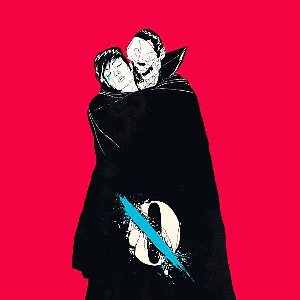

# …Like Clockwork

By **Queens of the Stone Age**

## Album Data

- **Catalog:** Beets
- **Format:** Digital, Album
- **Album:** …Like Clockwork
- **Artist:** Queens Of The Stone Age
- **Albumartist:** Queens of the Stone Age
- **Genre:** Stoner Rock
- **MusicBrainz Album Artist ID:** [7dc8f5bd-9d0b-4087-9f73-dc164950bbd8](https://musicbrainz.org/artist/7dc8f5bd-9d0b-4087-9f73-dc164950bbd8)
- **MusicBrainz Album ID:** [96a359ac-6bb0-4f15-a2d6-9657bbc7b9b6](https://musicbrainz.org/release/96a359ac-6bb0-4f15-a2d6-9657bbc7b9b6)
- **MusicBrainz Release Group ID:** [c92f73ee-527f-42ed-a556-fd615941e214](https://musicbrainz.org/release-group/c92f73ee-527f-42ed-a556-fd615941e214)
- **Year:** 2013
- **Catalog #:** OLE-1040-6
- **Label:** Matador
- **Total Tracks:** 10

## Album Tracks

### Track 01 - Keep Your Eyes Peeled

- **Artist:** Queens of the Stone Age
- **Format:** AAC
- **Genre:** Stoner Rock
- **Length:** 5:04
- **MusicBrainz Track ID:** [4233d11e-b025-49a7-8927-e6dc3edfd4ca](https://musicbrainz.org/recording/4233d11e-b025-49a7-8927-e6dc3edfd4ca)
- **Title:** Keep Your Eyes Peeled
- **Track:** 01
- **Year:** 2013

### Track 02 - I Sat by the Ocean

- **Artist:** Queens of the Stone Age
- **Format:** AAC
- **Genre:** Stoner Rock
- **Length:** 3:55
- **MusicBrainz Track ID:** [678e49b8-3e6c-4a7e-8c66-7b38533dfc94](https://musicbrainz.org/recording/678e49b8-3e6c-4a7e-8c66-7b38533dfc94)
- **Title:** I Sat by the Ocean
- **Track:** 02
- **Year:** 2013

### Track 03 - The Vampyre of Time and Memory

- **Artist:** Queens of the Stone Age
- **Format:** AAC
- **Genre:** Stoner Rock
- **Length:** 3:34
- **MusicBrainz Track ID:** [88a9bea5-5eca-43a7-b52f-84684a507ca1](https://musicbrainz.org/recording/88a9bea5-5eca-43a7-b52f-84684a507ca1)
- **Title:** The Vampyre of Time and Memory
- **Track:** 03
- **Year:** 2013

### Track 04 - If I Had a Tail

- **Artist:** Queens of the Stone Age
- **Format:** AAC
- **Genre:** Stoner Rock
- **Length:** 4:55
- **MusicBrainz Track ID:** [2c41c983-274e-48e8-8f22-b8403fabef9a](https://musicbrainz.org/recording/2c41c983-274e-48e8-8f22-b8403fabef9a)
- **Title:** If I Had a Tail
- **Track:** 04
- **Year:** 2013

### Track 05 - My God Is the Sun

- **Artist:** Queens of the Stone Age
- **Format:** AAC
- **Genre:** Stoner Rock
- **Length:** 3:55
- **MusicBrainz Track ID:** [20945610-1f22-4a41-832f-f23d9280a047](https://musicbrainz.org/recording/20945610-1f22-4a41-832f-f23d9280a047)
- **Title:** My God Is the Sun
- **Track:** 05
- **Year:** 2013

### Track 06 - Kalopsia

- **Artist:** Queens of the Stone Age
- **Format:** AAC
- **Genre:** Stoner Rock
- **Length:** 4:38
- **MusicBrainz Track ID:** [10215909-a5f9-43b3-a851-db95174ec17a](https://musicbrainz.org/recording/10215909-a5f9-43b3-a851-db95174ec17a)
- **Title:** Kalopsia
- **Track:** 06
- **Year:** 2013

### Track 07 - Fairweather Friends

- **Artist:** Queens of the Stone Age
- **Format:** AAC
- **Genre:** Stoner Rock
- **Length:** 3:43
- **MusicBrainz Track ID:** [5a87d31f-e380-48a4-b3d4-82d71b674165](https://musicbrainz.org/recording/5a87d31f-e380-48a4-b3d4-82d71b674165)
- **Title:** Fairweather Friends
- **Track:** 07
- **Year:** 2013

### Track 08 - Smooth Sailing

- **Artist:** Queens of the Stone Age
- **Format:** AAC
- **Genre:** Stoner Rock
- **Length:** 4:51
- **MusicBrainz Track ID:** [bd86b071-f471-4490-a807-e763fffe4dc9](https://musicbrainz.org/recording/bd86b071-f471-4490-a807-e763fffe4dc9)
- **Title:** Smooth Sailing
- **Track:** 08
- **Year:** 2013

### Track 09 - I Appear Missing

- **Artist:** Queens of the Stone Age
- **Format:** AAC
- **Genre:** Stoner Rock
- **Length:** 6:00
- **MusicBrainz Track ID:** [2cdeb1e2-1419-4159-bfe7-dfe4642127b5](https://musicbrainz.org/recording/2cdeb1e2-1419-4159-bfe7-dfe4642127b5)
- **Title:** I Appear Missing
- **Track:** 09
- **Year:** 2013

### Track 10 - …Like Clockwork

- **Artist:** Queens of the Stone Age
- **Format:** AAC
- **Genre:** Stoner Rock
- **Length:** 5:24
- **MusicBrainz Track ID:** [ead6491f-cf97-429d-9cdc-6417dfc5ce48](https://musicbrainz.org/recording/ead6491f-cf97-429d-9cdc-6417dfc5ce48)
- **Title:** …Like Clockwork
- **Track:** 10
- **Year:** 2013

## See also

- [Era Vulgaris](Era_Vulgaris.md)
- [Lullabies to Paralyze](Lullabies_to_Paralyze.md)
- [Vinyl: ...Like Clockwork](../../Vinyl/Queens_Of_The_Stone_Age/Like_Clockwork.md)
- [Vinyl: ](../../Vinyl/Queens_Of_The_Stone_Age/Queens_Of_The_Stone_Age.md)
